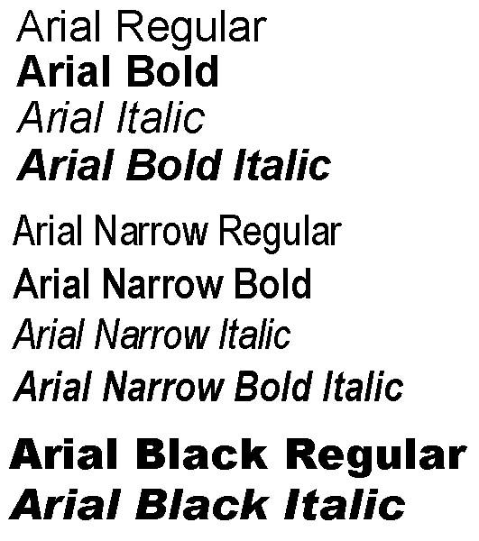
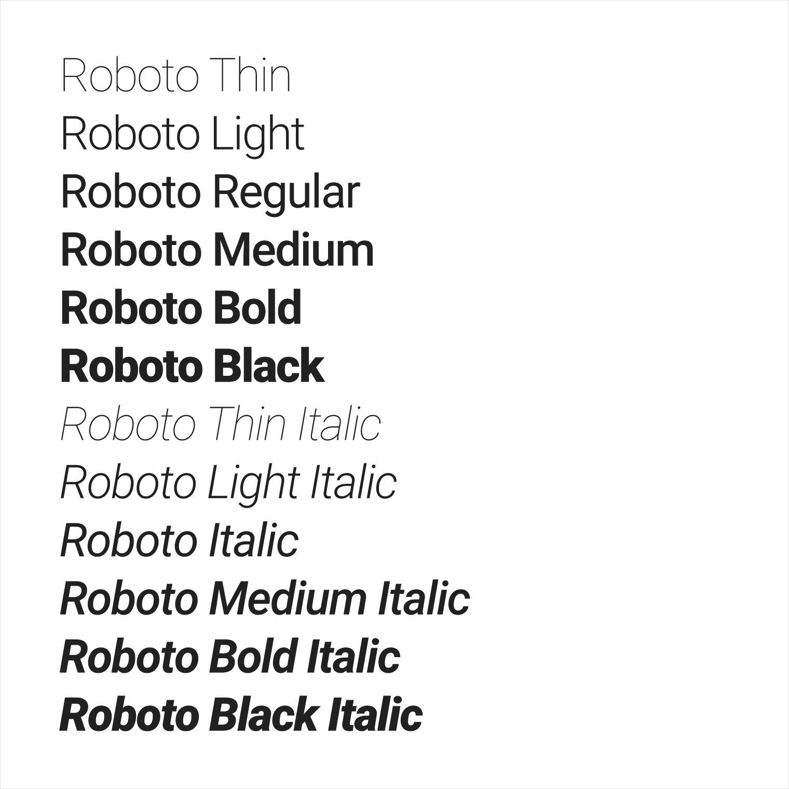
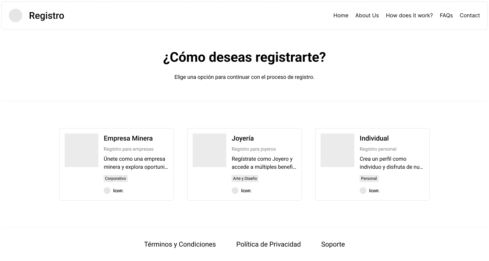
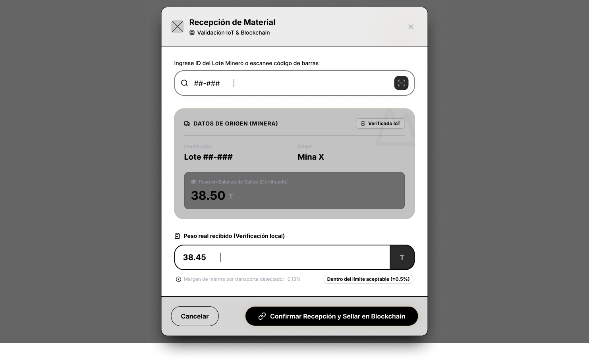
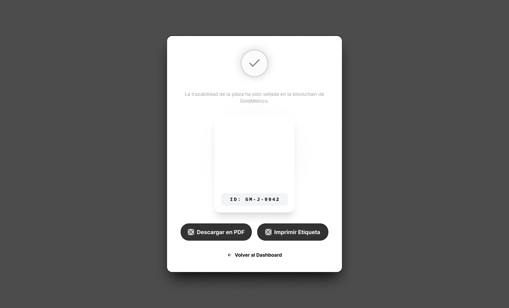
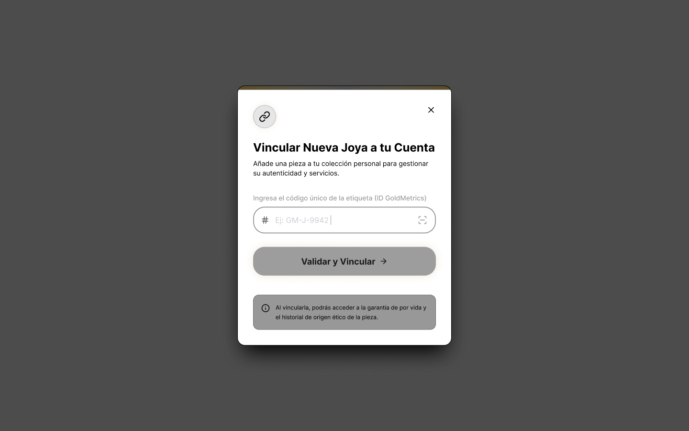
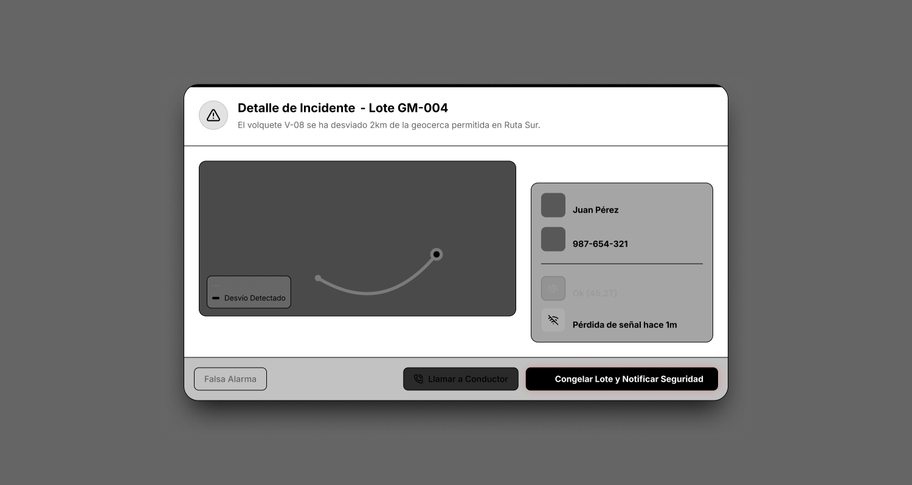
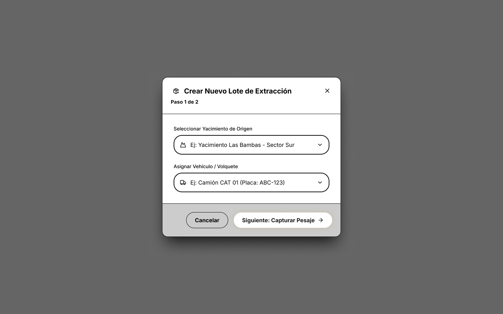
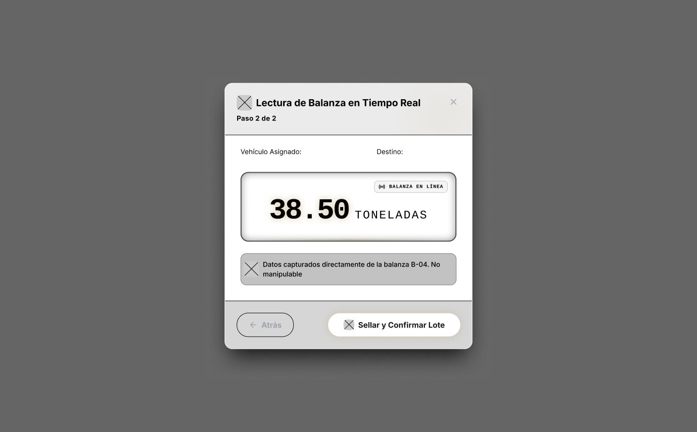
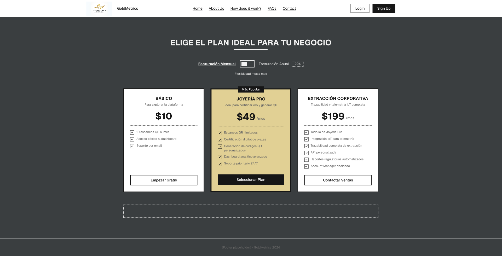

# CAPÍTULO IV: PRODUCT DESIGN

## 4.1. Style Guidelines

### 4.1.1. General Style Guidelines
El diseño de la plataforma GoldMetrics se desarrolla en base a los principios obtenidos durante el proceso de Lean UX, considerando las necesidades de los idstintos segmentos de usuarios: empresas minera, joyerías y consumidores finales.
En ese sentido, se establecen los siguientes lineamientos generales:
- La interfaz del sistema debe ser clara, intuitiva y orientada a la eficiencia, permitiendo a los usuarios acceder rápidamente a información crítica.
- Se empleará un lenaguaje formal pero comprensible, evitando, evitando tecnicismos innecesarios, con el objetivo de facilitar la interacción d eusuarios con distintos niveles de experiencia tecnológica.
- El sistema prioriza la visualización de información en tiempo real, respondiendo a la problemática identificada de falta de control y monitorio en la trazabilidad de minerales.
- Se garantiza la consistencia visual y funcional en todos los módulos del sistema, asegurando una experiencia homogénea.
- Se promoverá la transparencia de la información, permitiendo a los usuarios validar el origen y recorrido de los minerales.
- El diseño estará enfocado en reducir la carga cognitiva, mostrando únicamente información relevante según el rol del usuario.

### 4.1.2. Web Style Guidelines
Los lineamientos visuales de GoldMetrics están orientados a facilitar la interpretación de datos complejos en entornos operativos, asegurando usabilidad y accesibilidad.
- Paleta de colores:
  - **Gris oscuro (#3A3E40):** representa estabilidad, tecnología y entornos industriales. Se utiliza como color principal en barras de navegación y encabezados.  

  - **Dorado claro (#E1D094):** evoca el valor del mineral (oro) y aporta identidad visual. Puede usarse en elementos destacados.  

  - **Dorado medio (#B4944E):** refuerza la identidad minera del sistema, ideal para botones principales o indicadores importantes.  

  - **Dorado oscuro (#9E8354):** utilizado para variaciones de estado o elementos secundarios dentro de la misma gama cromática.  

  - **Blanco grisáceo (#F2F2F2):** empleado como fondo principal para mantener claridad visual y legibilidad.  

  - **Verde (#28A745):** indica estados correctos o funcionamiento adecuado del sistema.  

  - **Rojo (#DC3545):** representa fallas, errores o alertas críticas.  

  - **Amarillo (#FFC107):** indica advertencias o estados intermedios, como mantenimiento próximo.
- Tipografía:
  - Se utilizarán fuentes sans-serif (Como Arial o Roboto por su alta legibilidad).

| Arial | Roboto |
|---|---|
|  |  |

- Componentes de interfaz:
  - Dashboards con gráficos (líneas, barras, indicadores) para representar información operativa.
  - Tarjetas (cards) para mostrar métricas clave como estado de maquinaria y ubicación.
  - Botones con acciones claras y visibles.
- Diseño responsive:
  - El sistema será adaptable a diferentes dispositivos, permitiendo su uso tanto en campo como en oficina.
- Accesibilidad:
  - Uso adecuado de contraste de colores.
  - Indicadores visuales que faciliten la interpretación rápida de la información.

## 4.2. Information Architecture
La arquitectura de la información de GoldMetrics ha sido definida con el objetivo de optimizar el acceso, organización y comprensión de la información, en función de las necesidades identificadas en el proceso de Lean UX.

### 4.2.1. Organization Systems
El sistema organiza la información mediante diferentes enfoques complementarios:
- Organización jerárquica:
  - Un dashboard principal como punto de entrada.
  - Módulos específicos: Trazabilidad, Mantenimiento y Reportes.
- Organización por roles:
  - Empresas mineras: gestión operativa y monitoreo
- Consumidores: consulta de información del producto
Este enfoque responde directamente a la segmentación de usuarios definida en el proyecto.
- Organización por procesos:
  - Extracción --> Transporte --> Procesamiento --> Comercialización
  Permite representar el cilo de vida del mineral.
- Organización por daots:
  - Flota de maquinaria
  - Ubicación
  - Estado operativo
  - Historial de eventos

Facilitando el análisis y la toma de decisiones
### 4.2.2. Labeling Systems
El sistema utiliza etiquetas claras, consistentes y orientadas al usuario:
- Dashboard
- Trazabilidad
- Mantenimiento
- Reportes
- Certificados
- Historial
- Ubicación en tiempo real

Estas etiquetas han sido definidas para facilitar la comprensión y navegación, evitando terminología técnica innecesaria

### 4.2.3. SEO Tags and Meta Tags
Para mejorar la visibilidad y estructuración del sistema web, se implementan las siguientes prácticas:

- `<title>`: Goldmetrics - Plataforma de trazabilidad minera  
- `<meta name="description">`: Plataforma que permite monitorear, analizar y validar minerales en tiempo real mediante IoT e inteligencia artificial.  
- `<meta name="keywords">`: trazabilidad minera, monitoreo de minerales, IoT minería, minería Perú  

**Adicionalmente:**

- Uso adecuado de encabezados:
  - `<h1>`
  - `<h2>`
  - `<h3>`

- URLs estructuradas:
  - `/dashboard`
  - `/trazabilidad`
  - `/mantenimiento`
  - `/reportes`

### 4.2.4. Searching Systems
El sistema incorpora mecanismos de búsqueda que permiten acceder rápidamente a información específica:

- **Búsqueda por:**
  - ID del mineral  
  - Código QR  
  - Unidad de maquinaria  
  - Ubicación  

- **Filtros avanzados:**
  - Fecha  
  - Estado (activo, en mantenimiento, falla)  
  - Tipo de mineral  

- **Resultados en tiempo real**, facilitando la toma de decisiones operativas.

### 4.2.5. Navigation Systems
La navegación del sistema está diseñada para ser clara, eficiente y orientada a las necesidades del usuario:

- **Menú principal:**
  - Dashboard  
  - Trazabilidad  
  - Mantenimiento  
  - Reportes  

- **Navegación por flujo:**
  - Seguimiento del mineral a lo largo de su ciclo de vida.  

- **Navegación contextual:**
  - Acceso a información detallada desde dashboards y gráficos.  

- **Elementos de apoyo:**
  - Breadcrumbs (ej: Dashboard > Mantenimiento > Unidad)  
  - Botones de acceso rápido  

Asimismo, el sistema permite visualizar información relacionada al mantenimiento de maquinaria, incluyendo detección de fallas, análisis de patrones y generación de reportes, lo cual refuerza la funcionalidad operativa del sistema.

## 4.3. Landing Page UI Design

### 4.3.1. Landing Page Wireframe

### 4.3.2. Landing Page Mock-up

## 4.4. Web Applications UX/UI Design

### 4.4.1. Web Applications Wireframes

### 4.4.2. Web Applications Wireflow Diagrams

### 4.4.2. Web Applications Mock-ups

### 4.4.3. Web Applications User Flow Diagrams
### Happy Path 1 – Joyería: Validación de lote y registro de joya

**Flujo principal:**

1. Joyero ingresa al sistema  
2. Accede a “Validar Lote”  
3. Ingresa ID del lote  

4. El sistema muestra:
   - Peso registrado  
   - Origen   

5. El joyero realiza el pesaje físico del material  

**Decisión:**
- ¿El peso coincide (dentro de tolerancia)?  
  - No → Cancelar
  - Sí → Continuar  

6. Confirmar recepción  
7. El sistema registra el evento en blockchain  

8. El joyero registra nueva joya:
   - Nombre
   - Descripción  

9. Publicar certificado digital  
10. Generar código QR de la joya

## 4.5. Web Applications Prototyping

## 4.6. Domain-Driven Software Architecture

### 4.6.1. Design-Level EventStorming

### 4.6.2. Software Architecture Context Diagram

### 4.6.3. Software Architecture Container Diagrams

### 4.6.4. Software Architecture Components Diagrams

## 4.7. Software Object-Oriented Design

### 4.7.1. Class Diagrams

## 4.8. Database Design

### 4.8.1. Database Diagrams