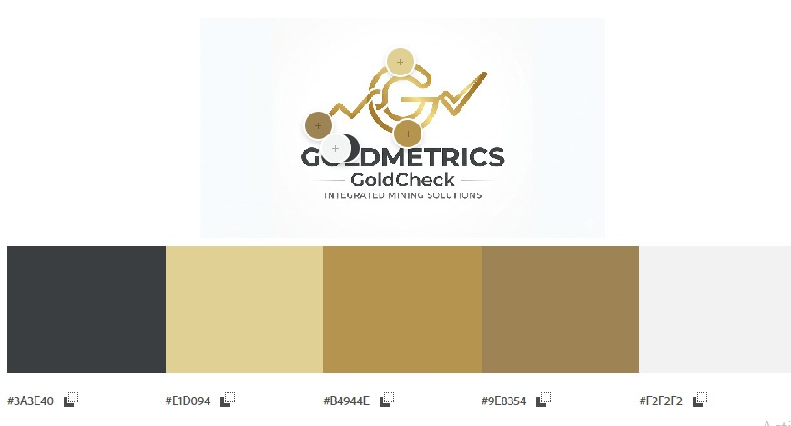

# CAPÍTULO IV: PRODUCT DESIGN

## 4.1. Style Guidelines

### 4.1.1. General Style Guidelines
El diseño de la plataforma GoldMetrics se desarrolla en base a los principios obtenidos durante el proceso de Lean UX, considerando las necesidades de los idstintos segmentos de usuarios: empresas minera, joyerías y consumidores finales.
En ese sentido, se establecen los siguientes lineamientos generales:
- La interfaz del sistema debe ser clara, intuitiva y orientada a la eficiencia, permitiendo a los usuarios acceder rápidamente a información crítica.
- Se empleará un lenaguaje formal pero comprensible, evitando, evitando tecnicismos innecesarios, con el objetivo de facilitar la interacción d eusuarios con distintos niveles de experiencia tecnológica.
- El sistema prioriza la visualización de información en tiempo real, respondiendo a la problemática identificada de falta de control y monitorio en la trazabilidad de minerales.
- Se garantiza la consistencia visual y funcional en todos los módulos del sistema, asegurando una experiencia homogénea.
- Se promoverá la transparencia de la información, permitiendo a los usuarios validar el origen y recorrido de los minerales.
- El diseño estará enfocado en reducir la carga cognitiva, mostrando únicamente información relevante según el rol del usuario.

### 4.1.2. Web Style Guidelines
Los lineamientos visuales de GoldMetrics están orientados a facilitar la interpretación de datos complejos en entornos operativos, asegurando usabilidad y accesibilidad.

- **Paleta de colores:**

  - **Gunmetal (#3A3E40):** utilizado como color base del sistema, principalmente en fondos, secciones principales y áreas oscuras como el hero y algunas vistas internas. Permite resaltar los elementos visuales y transmitir un entorno tecnológico e industrial.

  - **Vanilla Custard (#E1D094):** empleado en secciones destacadas como fondos de cierre (footer) y áreas informativas. Aporta contraste visual y refuerza la identidad asociada al valor del mineral.

  - **Camel (#B4944E):** utilizado en botones principales (Login, Sign Up), tarjetas y elementos interactivos. Funciona como color de acción dentro de la interfaz.

  - **Faded Copper (#9E8354):** aplicado en elementos secundarios como bordes, contenedores y variaciones de tarjetas, manteniendo consistencia dentro de la gama cromática.

  - **White Smoke (#F2F2F2):** utilizado en barras de navegación, formularios y fondos claros, facilitando la legibilidad del contenido y generando contraste con los tonos oscuros.

- Tipografía:
  - Se utilizarán fuentes sans-serif (Como Arial o Roboto por su alta legibilidad).

| Arial | Roboto |
|---|---|
|  |  |

- Componentes de interfaz:
  - Dashboards con gráficos (líneas, barras, indicadores) para representar información operativa.
  - Tarjetas (cards) para mostrar métricas clave como estado de maquinaria y ubicación.
  - Botones con acciones claras y visibles.
- Diseño responsive:
  - El sistema será adaptable a diferentes dispositivos, permitiendo su uso tanto en campo como en oficina.
- Accesibilidad:
  - Uso adecuado de contraste de colores.
  - Indicadores visuales que faciliten la interpretación rápida de la información.

## 4.2. Information Architecture

### 4.2.1. Organization Systems

### 4.2.2. Labeling Systems

### 4.2.3. SEO Tags and Meta Tags

### 4.2.4. Searching Systems

### 4.2.5. Navigation Systems

## 4.3. Landing Page UI Design

### 4.3.1. Landing Page Wireframe

### 4.3.2. Landing Page Mock-up

## 4.4. Web Applications UX/UI Design

### 4.4.1. Web Applications Wireframes

### 4.4.2. Web Applications Wireflow Diagrams

### 4.4.2. Web Applications Mock-ups

### 4.4.3. Web Applications User Flow Diagrams

## 4.5. Web Applications Prototyping

## 4.6. Domain-Driven Software Architecture

### 4.6.1. Design-Level EventStorming

### 4.6.2. Software Architecture Context Diagram

### 4.6.3. Software Architecture Container Diagrams

### 4.6.4. Software Architecture Components Diagrams

## 4.7. Software Object-Oriented Design

### 4.7.1. Class Diagrams

## 4.8. Database Design

### 4.8.1. Database Diagrams