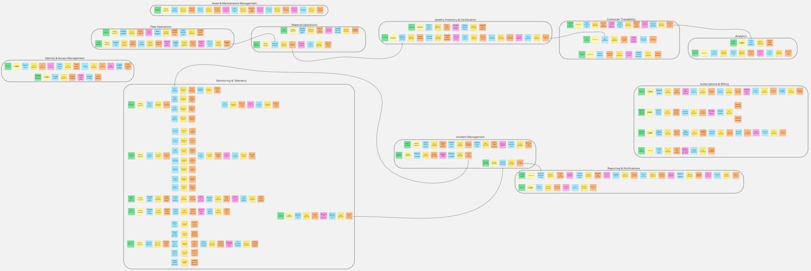

# CAPÍTULO IV: PRODUCT DESIGN

## 4.1. Style Guidelines

### 4.1.1. General Style Guidelines

### 4.1.2. Web Style Guidelines

## 4.2. Information Architecture

### 4.2.1. Organization Systems

### 4.2.2. Labeling Systems

### 4.2.3. SEO Tags and Meta Tags

### 4.2.4. Searching Systems

### 4.2.5. Navigation Systems

## 4.3. Landing Page UI Design

### 4.3.1. Landing Page Wireframe

### 4.3.2. Landing Page Mock-up

## 4.4. Web Applications UX/UI Design

### 4.4.1. Web Applications Wireframes

### 4.4.2. Web Applications Wireflow Diagrams

### 4.4.2. Web Applications Mock-ups

### 4.4.3. Web Applications User Flow Diagrams

## 4.5. Web Applications Prototyping

## 4.6. Domain-Driven Software Architecture
GoldMetrics utiliza el enfoque de Domain-Driven Design (DDD) con el fin de facilitar la colaboración entre developers y expertos en el sector. Para esto, el sistema utiliza una organización entre 11 Bounded Context independientes de manera que logramos separar claramente las responsabilidades. Con esto también resaltamos las funcionalidades clave para hacer del proyecto altamente escalable de manera que se pueda incrementar la eficiencia de  procesos como el mantenimiento o la escalación. 

A continuación se muestran y describen los Bounded Context que forman la solución:
| Bounded Context | Descripción |
| :--- | :--- |
| **Fleet Operations** | Inicio del ciclo de transporte. |
| **Material Operations** | Clasificación y descarga de materiales. |
| **Jewelry Inventory & Certification** | Guardado en inventario de joyería y certificación de materiales. |
| **Consumer Traceability** | Trazabilidad y soporte para el consumidor. |
| **Monitoring & Telemetry** | Monitoreo y gestion de anomalias. |
| **Analytics** | Análisis de ruta, impulsa la trazabilidad. |
| **Incident Management** | Gestion de incidentes. |
| **Reporting & Notifications** | Reportes de accidentes y notificaciones. |
| **Asset & Maintenance Management** | Gestion de mantenimiento de operativo minero. |
| **Identity & Access Management** | Autenticación e inicio de sesión. |
| **Subscriptions & Billing** | Gestión de planes, acceso escalonado a funcionalidades y facturación. |
### 4.6.1. Design-Level EventStorming
**EventStorming**

Para visualizar el EventStorming de mejor manera recomendamos ingresar al siguiente link:
[Visualizar EventStorming en Miro](https://miro.com/app/board/uXjVJeWDqwE=/?share_link_id=757586972674)
### 4.6.2. Software Architecture Context Diagram

### 4.6.3. Software Architecture Container Diagrams

### 4.6.4. Software Architecture Components Diagrams

## 4.7. Software Object-Oriented Design

### 4.7.1. Class Diagrams

## 4.8. Database Design

### 4.8.1. Database Diagrams