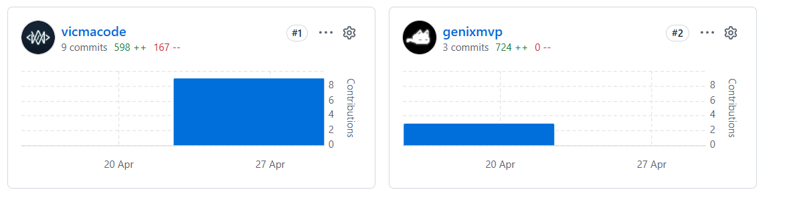
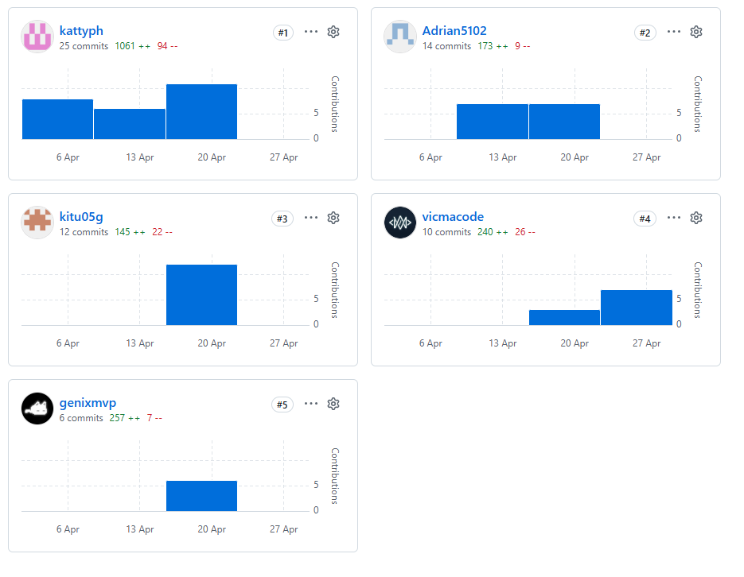

# CAPÍTULO V: Product Implementation, Validation & Deployment

## 5.1. Software Configuration Management

**-Project Management:**
1. Herramienta: Trello
Propósito: Gestión de tareas, planificación de sprints y seguimiento del progreso del equipo mediante tableros Kanban. 

**-Requirements Management:**
1. Herramienta: UXPressia
Propósito: Creación de artefactos de needfinding como User Personas, User Journey Maps y Empathy Maps para comprender las necesidades del usuario.
2. Herramienta: Miro
Propósito: Desarrollo de Event Storming (Big Picture y Process Level) para el modelado de procesos y definición del alcance del sistema.
3. Herramienta: Gherkin
Propósito: Definición de criterios de aceptación y escenarios de prueba en formato Given–When–Then.

**-Product UX/UI Design:**
1. Herramienta: Figma
Propósito: Diseño de wireframes y mockups de la interfaz del sistema, incluyendo la landing page.

**-Software Development:**
1. Herramienta: Visual Studio Code
Propósito: Entorno de desarrollo utilizado para la programación del sistema.
2. Herramienta: GitHub
Propósito: Control de versiones y trabajo colaborativo mediante repositorios, commits y ramas. Cada miembro del equipo clonará el repositorio para desarrollar de manera distribuida sus features.
3. Tecnología Frontend: Vue.js  
Lenguaje: JavaScript  
Propósito: Desarrollo de interfaces web interactivas y responsivas del sistema, permitiendo una experiencia de usuario dinámica mediante componentes reutilizables.
4. Tecnología Backend:
Lenguaje: C#  
Propósito: Desarrollo de la lógica del servidor, implementación de servicios RESTful, manejo de peticiones HTTP y comunicación con la base de datos.
5. Base de Datos: Microsoft SQL Server  
Propósito: Almacenamiento, gestión y consulta eficiente de la información del sistema, garantizando integridad y consistencia de los datos.
6. Herramienta: WebStorm  
Propósito: Entorno de desarrollo especializado para aplicaciones JavaScript y TypeScript, utilizado como soporte para el desarrollo frontend junto con Vue.js.

**-Software Deployment:**
1. Herramienta: GitHub Pages
Propósito: Despliegue de la solución de cada producto digital de OpalTrace desde nuestro repositorio de Github.

**-Software Documentation:**
1. Herramienta: Markdown
Propósito: Documentación técnica del proyecto (README y documentación del código).
2. Herramienta: Structurizr
Propósito: Elaboración de diagramas de arquitectura del sistema utilizando el modelo C4 (contexto, contenedores, componentes y código).

### 5.1.2. Source Code Management
Para el control de versiones y la organización ordenada del código de nuestro proyecto GoldCheck, el equipo utiliza GitHub como plataforma principal. GitHub nos permite almacenar código fuente de la Landing Page, Front-End, Back-End llevar un registro histórico de cambios, colaborar de manera estructurada y garantizar trazabilidad durante todo el ciclo de desarrollo. Por ende, creamos la organización Minex-Organization, que incluye los siguientes repositorios:
| Solución  | Nombre del repositorio  |  Enlace  |
|---|---|---|
| report | goldcheck-report  | https://github.com/upc-pre-202610-1asi0730-11863-GoldMetri/goldcheck-report.git |
| website  | goldcheck-website  |  https://github.com/upc-pre-202610-1asi0730-11863-GoldMetri/goldcheck-website.git |
| webapp  |  goldcheck-webapp  | https://github.com/upc-pre-202610-1asi0730-11863-GoldMetri/goldcheck-webapp.git |
| platform  | goldcheck-platform   | https://github.com/upc-pre-202610-1asi0730-11863-GoldMetri/goldcheck-platform.git   |

NNuestro equipo de trabajo ha adoptado el flujo GitFlow, basado en el artículo “A successful Git branching model” de Vincent Driessen. La organización del repositorio se estructura en dos ramas principales y permanentes: master, que contiene las versiones estables listas para entrega, y develop, que funciona como la rama de integración continua del desarrollo. A partir de la rama develop, se crean ramas de tipo feature siguiendo la nomenclatura feature/chapter-#-description, por ejemplo: feature/chapter-ii-interviews. Estas ramas permiten que cada miembro del equipo desarrolle funcionalidades o secciones específicas de manera aislada. En casos donde un integrante desarrolla un capítulo completo, se utiliza una convención como feature/chapter-#-content. Una vez finalizado el trabajo, estas ramas se integran nuevamente en develop, asegurando una consolidación ordenada de los avances.

Cuando el producto se aproxima a una fecha de entrega, se genera una rama release a partir de develop. En esta etapa se realizan ajustes menores, como corrección de errores o mejoras finales. Posteriormente, la rama release se fusiona tanto en master como en develop, garantizando que los cambios aplicados se mantengan en futuras iteraciones del proyecto. En cuanto a la gestión de versiones, se utiliza Semantic Versioning mediante ramas con el formato release/vX.Y.Z. Asimismo, las correcciones críticas se gestionan a través de ramas hotfix, con la nomenclatura hotfix/vX.Y.Z, permitiendo resolver errores urgentes directamente sobre la versión en producción.

Adicionalmente, el equipo aplica la convención Conventional Commits, la cual estandariza los mensajes de confirmación para mejorar la trazabilidad y comprensión de los cambios. Cada commit sigue una estructura clara, por ejemplo:

git commit -m "docs(chapter-#): add ..."

Este enfoque facilita la generación automática de historiales de cambios y permite mantener un registro organizado y semántico del desarrollo.

En síntesis, cada nueva funcionalidad se desarrolla en una rama feature, las versiones listas para entrega se gestionan mediante release branches, y las correcciones urgentes a través de hotfix branches. Todo ello, junto con el uso de Conventional Commits, asegura un flujo de trabajo estructurado, colaborativo y alineado con buenas prácticas para el desarrollo del proyecto GoldCheck.

**Repositorio report**

**Repositorio  website**

**Repositorio webapp**

**Repositorio platform**

### 5.1.3. Source Code Style Guide & Conventions
Como norma general, todo el código desarrollado en GoldCheck deberá estar completamente redactado en inglés, incluyendo nombres de variables, funciones, clases, archivos y comentarios, esto garantiza consistencia, mantenibilidad y alineación con estándares internacionales. Asimismo, el equipo adopta convenciones basadas en guías reconocidas como Google Style Guide, Microsoft C# Guidelines y Gherkin Best Practices, adaptadas al contexto del dominio minero y de trazabilidad definido en el Ubiquitous Language del proyecto.

1. Principios Generales
- Uso obligatorio del idioma inglés en todo el código.
- Nombres descriptivos alineados al dominio (ubiquitous language), por ejemplo: haulTruck, payload, traceabilityData, oreBatch
- Evitar ambigüedad: los nombres deben reflejar claramente su propósito.
- Priorizar automatización sobre procesos manuales (alineado a insights del proyecto).
2. HTML
- Uso de etiquetas y atributos en minúsculas
`<section id="traceability-report"></section>`
- Cerrar correctamente todos los elementos
`
Gold traceability data
`
- Uso de comillas dobles para atributos
`<button class="primary-button"></button>`
- Incluir atributos de accesibilidad (alt, width, height)
``
- Sangría de 2 espacios
3. CSS
- Uso de kebab-case para clases e IDs
`.traceability-card {}`
`.mineral-data {}`
- Uso opcional de BEM para componentes complejos
`.traceability-card__status--active {}`
- Omitir unidades en valores cero
`margin: 0;`
- Ordenar propiedades (alfabético o por bloques)
- Separar bloques con líneas en blanco para legibilidad
4. JavaScript
- Uso de camelCase para variables y funciones
`function calculatePayload() {}`
- Declaración de variables con const y let
`const payloadWeight = 120;`
`let cycleTime = 0;`
- Uso de ES6+ (arrow functions, destructuring, etc.)
- Manejo de errores
`try {`
`  processTelemetryData();`
`} catch (error) {`
`  console.error(error);`
`}`
- Evitar funciones largas (máx. 20–30 líneas)
5. C# (.NET / Backend)
- PascalCase para clases y métodos
`public class TraceabilityService {`
`    public void CalculateProduction() { }`
`}`
- camelCase para variables y parámetros
`int payloadWeight;`
- UPPER_SNAKE_CASE para constantes
`const int MAX_PAYLOAD = 400;`
- Sangría de 4 espacios (sin tabs)
- Principios clave: Single Responsibility, código modular Y comentarios claros y concisos
6. Gherkin (BDD)

Se utilizará Gherkin para definir escenarios de negocio relacionados a trazabilidad minera y validación de oro.

- Estructura obligatoria: Given – When – Then
- Lenguaje entendible para negocio (no técnico)
`Feature: Gold Traceability Verification`
`Scenario: Verify origin of gold`
`Given a user scans a QR code`
`When the system retrieves traceability data`
`Then the user should see the origin mine and certification`
- Uso de Scenario Outline cuando aplique
- Escenarios claros, cortos y orientados a valor

7. Uso del Ubiquitous Language
Todos los términos del dominio deben respetar el lenguaje definido en el sistema para asegurar consistencia entre negocio y tecnología, para que tanto desarrolladores como stakeholders hablen el mismo idioma dentro del sistema..

Ejemplos aplicados:

`HaulTruck`
`Payload`
`Traceability`
`Ore`
`Refinery`
`Jeweler`
`EthicalGold`
`Telemetry`

Ejemplo en código:

`const haulTruckPayload = calculatePayload(haulTruckData);`

### 5.1.4. Software Deployment Configuration
- Creación de la Website (Landing Page):
1. Se crea un repositorio (goldcheck-website) desde GoldMetri-organization

2. Agregar a los miembros del equipo

3. Habilitar GitHub Pages en branch master y ruta "/(root)"

- Creación de WebApp
1. Creación del repositorio (goldcheck-webapp) dentro de la organización GoldMetri-organization

2. Agregar a los miembros del equipo

- Creación de Platform
1. Creación del repositorio (goldcheck-platform) dentro de la organización GoldMetri-organization

2. Agregar a los miembros del equipo

## 5.2. Landing Page, Services & Applications Implementation

### 5.2.1. Sprint 1

#### 5.2.1.1. Sprint Planning 1

El Sprint 1 está dedicado exclusivamente a establecer la presencia digital de la startup mediante el diseño, desarrollo y despliegue de la primera versión del Landing Page de GoldCheck.

| Campo | Detalle |
|:------|:--------|
| **Sprint #** | Sprint 1 |
| **Date** | `2026-04-15` |
| **Time** | `6:00 pm` |
| **Location** | Reunión virtual por Discord |
| **Prepared By** | `Philco Mota, Katty` |
| **Attendees** | Armestar Felipa, Adrian / García Paredes, Victor / Navarro Aldoradin, Carolina / Philco Mota, Katty / Tuesta Girón, Kiara |
| **Sprint 0 Review Summary** | Se definieron los perfiles de la startup, la problemática del sector minero y los segmentos objetivos (Empresas mineras, joyerías y consumidores finales). Se establecieron los repositorios y la organización en GitHub. |
| **Sprint 0 Retrospective Summary** | El equipo coincide en la necesidad de mejorar la comunicación asíncrona y respetar los tiempos de revisión de Pull Requests. |
| **Sprint 1 Goal** | **Our focus is on** delivering the first functional version of the Goldmetrics Landing Page. **We believe it delivers** a clear presentation of our value proposition regarding mineral traceability **to** our target segments (miners, jewelers, consumers). **This will be confirmed when** visitors can access the live website and understand the problem we solve and the features we offer. |
| **Sprint 1 Velocity** | 20 Story Points |
| **Sum of Story Points** | `16` |

#### 5.2.1.2. Aspect Leaders and Collaborators

Para este primer Sprint enfocado en el Landing Page y la configuración inicial de los proyectos, la distribución de liderazgo (L) y colaboración (C) es la siguiente:

| Team Member (Last Name, First Name) | GitHub Username | UI/UX Design (Figma) | Landing Page Layout (HTML/CSS) | Landing Page Interactivity (JS) | DevOps & Deployment |
|:-----------------------------------:|:---------------:|:-------------:|:-------------:|:-------------:|:-------------:|
| Armestar Felipa, Adrian Andres | `Adrian5102` | C | L | C | C |
| García Paredes, Victor Manuel | `vicmacode` | C | L | L | C |
| Navarro Aldoradin, Carolina Celeste | `genixmvp` | L | L | L | C |
| Philco Mota, Katty Yolanda | `kattyph` | C | C | C | L |
| Tuesta Girón, Kiara Lucia | `kitu05g` | L | C | L | C |

> **L** = Leader &nbsp;|&nbsp; **C** = Collaborator

#### 5.2.1.3. Sprint Backlog 1

El objetivo principal de este Sprint es contar con un sitio web estático desplegado que presente a Goldmetrics y sus beneficios.

| Sprint # | | | | | | | |
|:--------:|---|---|---|---|---|---|---|
| **Sprint 1** | **User Story** | | **Work-Item / Task** | | | | |
| | **ID** | **Título** | **ID** | **Título** | **Descripción** | **Estimación (h)** | **Asignado a** | **Estado** |
| | US01 | Visualizar propuesta de valor | T01 | Diseñar UI en Figma | Elaborar los mockups de la sección Hero y features del LP. | 4 | Navarro, Carolina | Done |
| | US01 | Visualizar propuesta de valor | T02 | Maquetar HTML/CSS base | Convertir el diseño de Figma a código HTML5 y CSS3 semántico. | 5 | Armestar, Adrian | Done |
| | US02 | Visualizar los segmentos | T03 | Programar vistas interactivas | Agregar dinamismo a las tarjetas de segmentos con JavaScript. | 3 | Tuesta, Kiara | Done |
| | US03 | Contactar al equipo | T04 | Maquetar Footer y Contacto | Implementar la sección de contacto y redes sociales. | 3 | García, Victor | Done |
| | *Task* | Configurar Repositorios | T05 | Setup GitHub y Despliegue | Inicializar los repos en GitHub y conectar Vercel al Landing Page. | 2 | Philco, Katty | Done |

#### 5.2.1.4. Development Evidence for Sprint Review

Durante el Sprint 1, el equipo se enfocó en establecer la base técnica de BrandRadar mediante el uso de estándares web modernos: HTML5 para la estructura y CSS3 para el diseño visual. Se priorizó una arquitectura de estilos modular, donde cada componente de la Landing Page cuenta con su propia hoja de estilos, facilitando el trabajo paralelo y evitando conflictos en el código.

| Repository | Branch | Commit ID | Commit Message | Commit Message Body | Committed on (Date) |
|:----------:|:------:|:---------:|:--------------:|:-------------------:|:-------------------:|
| `goldmetrics/website` | `main` | `14ca4e3` | `feat: add hero section` | `Implemented responsive hero section with main CTA` | `2026-04-25` |
| `goldmetrics/website` | `develop` | ` a1b2c3d` | `feat: add user segments cards` | `Created cards for miners, jewelers and consumers` | `2026-04-25` |
| `goldmetrics/website` | `main` | `9f8e7d6` | `style: update color palette` | `Applied Goldmetrics brand colors to the layout` | `2026-04-25` |

---

#### 5.2.1.5. Execution Evidence for Sprint Review

En este primer Sprint se ha logrado el diseño y codificación del Landing Page estático, el cual incluye las secciones de "Hero", "Beneficios/Características" y "Público Objetivo" (empresas mineras, joyerías y consumidores). La interfaz es 100% responsiva (adaptable a dispositivos móviles y escritorio).

**URL del Landing Page Desplegado:** [https://vocal-sunburst-4c90ad.netlify.app/](`[URL]`)

#### 5.2.1.6. Services Documentation Evidence for Sprint Review

> *Para el Sprint 1, enfocado estrictamente en la implementación y despliegue del Landing Page, esta sección no aplica. La documentación de los Web Services mediante OpenAPI / Swagger se implementará en los sprints posteriores.*

#### 5.2.1.7. Software Deployment Evidence for Sprint Review

Durante el Sprint 1 se realizó el despliegue exitoso del Landing Page utilizando la plataforma Netifly.
1. Se creó una cuenta en la plataforma utilizando el correo del equipo.
2. Se vinculó la cuenta con la organización de GitHub de Goldmetrics.
3. Se importó el repositorio `goldmetrics-website`.
4. Se configuró el autodespliegue asociado a la rama `main`.

#### 5.2.1.8. Team Collaboration Insights during Sprint

Durante este sprint, la colaboración se gestionó íntegramente a través de GitHub. Se utilizaron Pull Requests (PRs) para integrar el trabajo de la rama `develop` a `main`.

<<<<<<< HEAD

## Anexos
Vídeo Exposición: https://upcedupe-my.sharepoint.com/:v:/g/personal/u202416107_upc_edu_pe/IQDMT9TjIRw1RLKM_7j2hos-AfLlqFAwuKrcE9YKUDOwdWI?e=055arn&nav=eyJyZWZlcnJhbEluZm8iOnsicmVmZXJyYWxBcHAiOiJTdHJlYW1XZWJBcHAiLCJyZWZlcnJhbFZpZXciOiJTaGFyZURpYWxvZy1MaW5rIiwicmVmZXJyYWxBcHBQbGF0Zm9ybSI6IldlYiIsInJlZmVycmFsTW9kZSI6InZpZXcifX0%3D
=======
>LANDING PAGE: 

>REPORT:

>>>>>>> cb66ab435faa1d5e0617dc17860327cd788a8ad9
