<!-- Cover -->

 

# UNIVERSIDAD PERUANA DE CIENCIAS APLICADAS

***Ingeniería de Software***

**Curso:** 1ASI0730 | Aplicaciones Web
**NRC:** 12053
**Ciclo:** 5  
**Docente:** Efraín Ricardo Bautista Ubillús  

## **"Informe de trabajo: AV1"**

#### *Startup:* GoldMetrics

#### *Producto:* GoldCheck

***Relación de integrantes:***

| INTEGRANTES | CÓDIGO |
| :---: | :---: |
| Armestar Felipa, Adrian Andres | U202410084 |
| García Paredes, Victor Manuel | U202012001 |
| Navarro Aldoradin, Carolina Celeste  | U20241B962 |
| Philco Mota, Katty Yolanda | U202416107 |
| Tuesta Girón, Kiara Lucia | U20251i477 |

<!-- Cover -->

 <strong>Mayo, 2026</strong>

## REGISTRO DE VERSIONES DEL INFORME

| Versión |   Fecha    | Autor | Descripción de modificación |
| :---: |:----------:| :--- | :--- |
| 0.1.0 | 25/04/2026 | Armestar Felipa, Adrian Andres | AV1 — Commit inicial del informe; estructura base del repositorio y organización de carpetas. Incorporación del Capítulo I: Startup Profile, Lean UX Process (1.2.2.1–1.2.2.4) y Segmentos Objetivo (1.3). Adición de Domain-Driven Software Architecture (4.6), Design-Level EventStorming (4.6.1) y diagramas C4: Context (4.6.2), Container (4.6.3) y Components (4.6.4). *(develop · feature/chapter-i-content · feature/chapter-i-student-profile · feature/domain-driven-software-architecture)* |
| 0.2.0 | 26/04/2026 | García Paredes, Victor Manuel | AV1 — Incorporación del Capítulo III: User Stories con Acceptance Criteria (3.1), Impact Mapping (3.2) y Product Backlog con estimación y priorización (3.3). Sprint 1 completo: Sprint Planning (5.2.1.1), Aspect Leaders and Collaborators (5.2.1.2), Sprint Backlog (5.2.1.3), Development Evidence (5.2.1.4), Execution Evidence (5.2.1.5), Services Documentation Evidence (5.2.1.6), Software Deployment Evidence (5.2.1.7) y Team Collaboration Insights (5.2.1.8). *(feature/chapter3-content · feature/chapter-v-software-configuration)* |
| 0.3.0 | 24/04/2026 | Navarro Aldoradin, Carolina Celeste | AV1 — Incorporación del análisis competitivo (2.1.1) con Competitive Analysis Landscape y SWOT, estrategias y tácticas frente a competidores (2.1.2), Big Picture EventStorming (2.4) y Ubiquitous Language (2.5). Landing Page Wireframe (4.3.1), Landing Page Mock-up (4.3.2), Web Applications Prototyping (4.5) y Class Diagrams (4.7.1). *(feature/chapter2-content · feature/chapter-iv-evenstorming · feature/chapteriv-class-diagrams)* |
| 0.4.0 | 18/04/2026 | Philco Mota, Katty Yolanda | AV1 — Incorporación de análisis de entrevistas por segmento (2.2.3), User Personas (2.3.1), User Task Matrix (2.3.2), User Journey Mapping (2.3.3) y Empathy Mapping (2.3.4). Database Diagrams (4.8.1), Software Development Environment Configuration (5.1.1), Source Code Management (5.1.2), Source Code Style Guide y Conventions (5.1.3) y Software Deployment Configuration (5.1.4). *(feature/chapter-ii-interviews · feature/chapter-iv-database · feature/student-outcome)* |
| 0.5.0 | 24/04/2026 | Tuesta Girón, Kiara Lucia | AV1 — Incorporación de Style Guidelines general y web (4.1–4.1.2), Information Architecture: Organization Systems (4.2.1), Labeling Systems (4.2.2), SEO Tags y Meta Tags (4.2.3), Searching Systems (4.2.4) y Navigation Systems (4.2.5). Web Applications Wireframes (4.4.1), Wireflow Diagrams (4.4.2), Mock-ups (4.4.3) y User Flow Diagrams (4.4.4). *(feature/chapter-iv-style-guidelines · feature/chapter-iv-information-architecture · feature/cap-iv-web-applications-ux-ui-design)* |
| 1.0.0 | 25/23/2026 | Armestar Felipa, Adrian Andres García Paredes, Victor Manuel Navarro Aldoradin, Carolina Celeste Philco Mota, Katty Yolanda Tuesta Girón, Kiara Lucia | AV1 — Consolidación y entrega del AV1. Integración de todos los capítulos (I al V, Sprint 1) en rama develop. Primera versión del Landing Page desplegada. Student Outcome y Project Report Collaboration Insights completados. Versión exportada a PDF para entrega formal. *(develop → pre-main · release)* |
| 1.1.0 | 13/28/2026 | Armestar Felipa, Adrian Andres | Corrección AV1 — Corrección de la estructura orientada a objetos en Class Diagrams. Actualización del contenido de la Landing Page para reflejar correctamente el modelo de negocio de GoldMetrics y despliegue de la versión corregida. *(feature/chapteriv-class-diagrams · feature/domain-driven-software-architecture · develop)* |
| 1.2.0 | 13/28/2026 | García Paredes, Victor Manuel | Corrección AV1 — Actualización del Lean UX Hypothesis Statements con valores concretos y medibles (1.2.2.3). Adición de Technical Stories en User Stories (3.1) con criterios de aceptación en formato Gherkin para los endpoints del RESTful API. *(feature/chapter3-content · feature/chapter-i-content)* |
| 1.3.0 | 13/28/2026 | Philco Mota, Katty Yolanda | Corrección AV1 — Correcciones generales de formato en el informe. Ajuste del PDF exportado para correcta visualización de User Task Matrix y diagramas Wireflow. Revisión de convenciones en Source Code Style Guide (5.1.3). *(feature/chapter-iv-database · develop)* |
| 1.4.0 | 13/10/2026 | García Paredes, Victor Manuel | TB1 — Implementación de fake API con MockAPI para soporte del Frontend Web Application en el Sprint 2. Configuración de endpoints simulados para los bounded contexts de trazabilidad y gestión de activos. *(feature/chapter-v-software-configuration · develop)* |
| 1.5.0 | 13/12/2026 | Philco Mota, Katty Yolanda Tuesta Girón, Kiara Lucia | TB1 — Implementación del Frontend Web Application: desarrollo de vistas principales con Vue Framework y PrimeVue integradas con MockAPI. Corrección de diagramas de clases (4.7.1) y diagramas de base de datos (4.8.1) para refinamiento del modelo orientado al dominio. Corrección de wireframes y user flows observados en el AV1 (4.4.1–4.4.4). *(feature/cap-iv-web-applications-ux-ui-design · feature/chapteriv-class-diagrams · feature/chapter-iv-database · develop)* |
| 1.6.0 | 13/14/2026 | Navarro Aldoradin, Carolina Celeste | TB1 — Despliegue de la primera versión de Frontend Web Applications. Documentación del Sprint 2: Sprint Planning 2 (5.2.2.1), Aspect Leaders and Collaborators (5.2.2.2), Sprint Backlog 2 (5.2.2.3), Development Evidence (5.2.2.4), Execution Evidence (5.2.2.5), Services Documentation Evidence (5.2.2.6), Software Deployment Evidence (5.2.2.7) y Team Collaboration Insights (5.2.2.8). *(feature/cap-iv-web-applications-ux-ui-design · develop)* |
| 2.0.0 | 13/14/2026 | Armestar Felipa, Adrian Andres García Paredes, Victor Manuel Navarro Aldoradin, Carolina Celeste Philco Mota, Katty Yolanda Tuesta Girón, Kiara Lucia | TB1 — Consolidación y entrega del TB1. Integración de Sprint 2 completo, Frontend Web Applications desplegado, correcciones de artefactos del AV1 y versión final de todos los capítulos. Actualización del Student Outcome, Project Report Collaboration Insights y Registro de Versiones. Versión exportada a PDF para entrega formal. *(develop → pre-main · release)* |

## Project Report Collaboration Insights

El repositorio del informe del proyecto se encuentra en la organización de GitHub del equipo,
en el siguiente enlace:

**Report:** https://github.com/upc-pre-202610-1asi0730-12053-goldmetri/goldcheck-report

---

### AV1

Durante el desarrollo del AV1, el equipo utilizó GitHub como plataforma principal para
la gestión y colaboración del informe. Cada integrante trabajó sobre ramas individuales
siguiendo la convención `feature/chapter-#-description`, integrando sus avances mediante
Pull Requests hacia la rama `develop`. Las contribuciones abarcan la redacción de los
cinco capítulos del informe, incluyendo el perfil del startup, el análisis de requisitos,
la especificación de requerimientos, el diseño del producto y la implementación del
Sprint 1.

A continuación se presentan las evidencias de colaboración en el repositorio del informe
para esta entrega:

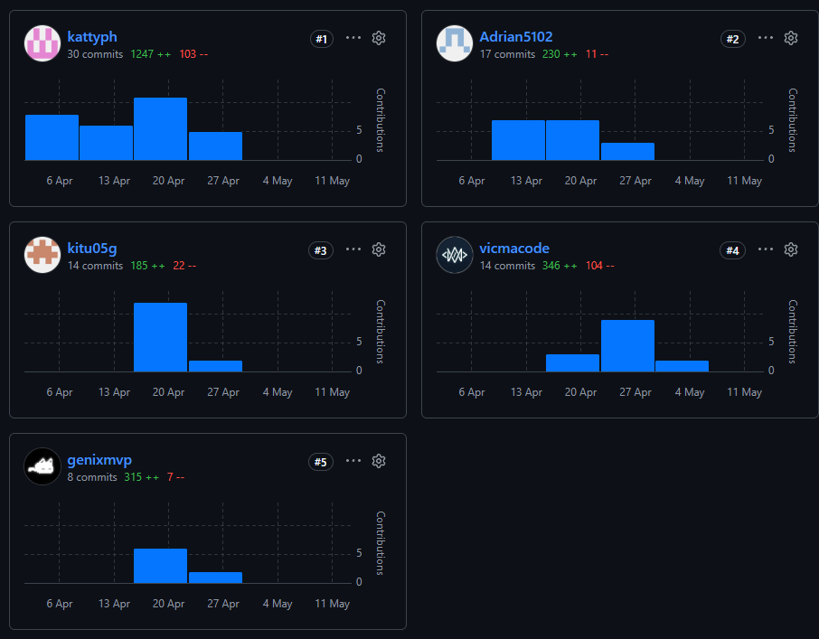

---

### TB1

Durante el TB1, la colaboración del equipo se extendió a cinco repositorios de la
organización GitHub: el repositorio del informe (`goldcheck-report`), el sitio web
estático (`goldcheck-website`), la aplicación web frontend (`goldcheck-webapp`),
el mock API backend (`goldcheck-mockapi`) y el repositorio de plataforma
(`goldcheck-platform`). Cada integrante participó en las correcciones del AV1,
el desarrollo de la Landing Page y la implementación del frontend organizado por
Bounded Contexts, siguiendo el flujo GitFlow con ramas `feature/`, `develop` y `main`.

Los repositorios involucrados en esta entrega son:

- **Report:** https://github.com/upc-pre-202610-1asi0730-12053-goldmetri/goldcheck-report
- **Website:** https://github.com/upc-pre-202610-1asi0730-12053-goldmetri/goldcheck-website
- **Web App:** https://github.com/upc-pre-202610-1asi0730-12053-goldmetri/goldcheck-webapp
- **Mock API:** https://github.com/upc-pre-202610-1asi0730-12053-goldmetri/goldcheck-mockapi
- **Platform:** https://github.com/upc-pre-202610-1asi0730-12053-goldmetri/goldcheck-platform

A continuación se presentan las evidencias de colaboración por repositorio:

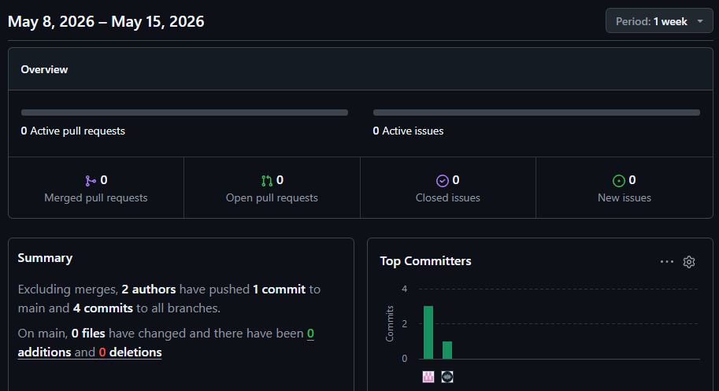

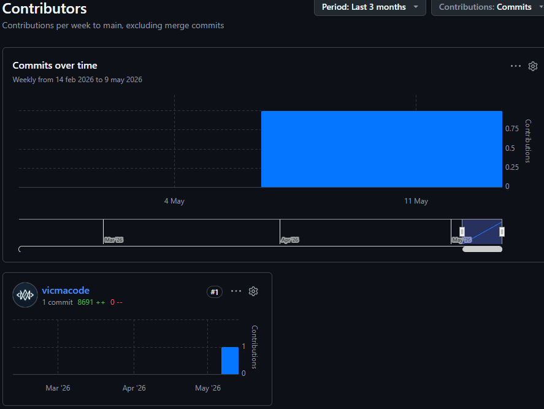

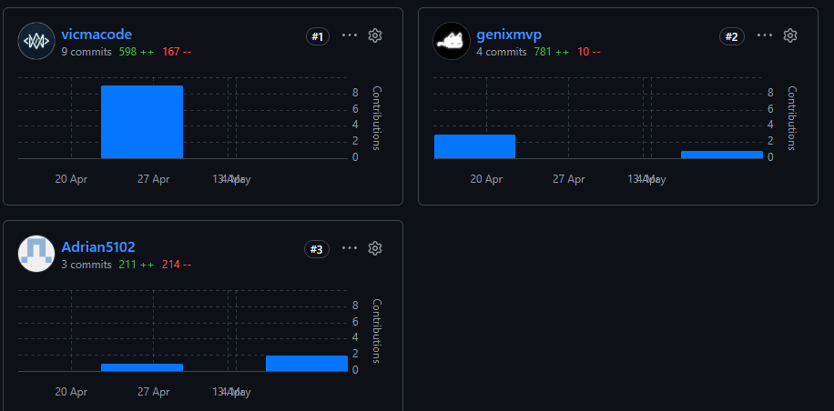

## CONTENIDO

[REGISTRO DE VERSIONES DEL INFORME](#registro-de-versiones-del-informe)

[PROJECT REPORT COLLABORATION INSIGHTS](#project-report-collaboration-insights)

[STUDENT OUTCOME](#student-outcome)

[CAPÍTULO I: INTRODUCCIÓN](#capítulo-i-introducción)

- [1.1. Startup Profile](#11-startup-profile)
  - [1.1.1. Descripción del Startup](#111-descripción-del-startup)
  - [1.1.2. Perfiles de integrantes del equipo](#112-perfiles-de-integrantes-del-equipo)

- [1.2. Solution Profile](#12-solution-profile)
  - [1.2.1. Antecedentes y problemática](#121-antecedentes-y-problemática)
  - [1.2.2. Lean UX Process](#122-lean-ux-process)
    - [1.2.2.1. Lean UX Problem Statements](#1221-lean-ux-problem-statements)
    - [1.2.2.2. Lean UX Assumptions](#1222-lean-ux-assumptions)
    - [1.2.2.3. Lean UX Hypothesis Statements](#1223-lean-ux-hypothesis-statements)
    - [1.2.2.4. Lean UX Canvas](#1224-lean-ux-canvas)

- [1.3. Segmentos Objetivo](#13-segmentos-objetivo)

---

[CAPÍTULO II: REQUIREMENTS ELICITATION & ANALYSIS](#capítulo-ii-requirements-elicitation--analysis)

- [2.1. Competidores](#21-competidores)
  - [2.1.1. Análisis competitivo](#211-análisis-competitivo)
  - [2.1.2. Estrategias y tácticas frente a competidores](#212-estrategias-y-tácticas-frente-a-competidores)

- [2.2. Entrevistas](#22-entrevistas)
  - [2.2.1. Diseño de entrevistas](#221-diseño-de-entrevistas)
  - [2.2.2. Registro de entrevistas](#222-registro-de-entrevistas)
  - [2.2.3. Análisis de entrevistas](#223-análisis-de-entrevistas)

- [2.3. Needfinding](#23-needfinding)
  - [2.3.1. User Personas](#231-user-personas)
  - [2.3.2. User Task Matrix](#232-user-task-matrix)
  - [2.3.3. User Journey Mapping](#233-user-journey-mapping)
  - [2.3.4. Empathy Mapping](#234-empathy-mapping)

- [2.4. Big Picture EventStorming](#24-big-picture-eventstorming)
- [2.5. Ubiquitous Language](#25-ubiquitous-language)

---

[CAPÍTULO III: REQUIREMENTS SPECIFICATION](#capítulo-iii-requirements-specification)

- [3.1. User Stories](#31-user-stories)
- [3.2. Impact Mapping](#32-impact-mapping)
- [3.3. Product Backlog](#33-product-backlog)

---

[CAPÍTULO IV: PRODUCT DESIGN](#capítulo-iv-product-design)

- [4.1. Style Guidelines](#41-style-guidelines)
  - [4.1.1. General Style Guidelines](#411-general-style-guidelines)
  - [4.1.2. Web Style Guidelines](#412-web-style-guidelines)

- [4.2. Information Architecture](#42-information-architecture)
  - [4.2.1. Organization Systems](#421-organization-systems)
  - [4.2.2. Labeling Systems](#422-labeling-systems)
  - [4.2.3. SEO Tags and Meta Tags](#423-seo-tags-and-meta-tags)
  - [4.2.4. Searching Systems](#424-searching-systems)
  - [4.2.5. Navigation Systems](#425-navigation-systems)

- [4.3. Landing Page UI Design](#43-landing-page-ui-design)
  - [4.3.1. Landing Page Wireframe](#431-landing-page-wireframe)
  - [4.3.2. Landing Page Mock-up](#432-landing-page-mock-up)

- [4.4. Web Applications UX/UI Design](#44-web-applications-uxui-design)
  - [4.4.1. Web Applications Wireframes](#441-web-applications-wireframes)
  - [4.4.2. Web Applications Wireflow Diagrams](#442-web-applications-wireflow-diagrams)
  - [4.4.2. Web Applications Mock-ups](#442-web-applications-mock-ups)
  - [4.4.3. Web Applications User Flow Diagrams](#443-web-applications-user-flow-diagrams)

- [4.5. Web Applications Prototyping](#45-web-applications-prototyping)

- [4.6. Domain-Driven Software Architecture](#46-domain-driven-software-architecture)
  - [4.6.1. Design-Level EventStorming](#461-design-level-eventstorming)
  - [4.6.2. Software Architecture Context Diagram](#462-software-architecture-context-diagram)
  - [4.6.3. Software Architecture Container Diagrams](#463-software-architecture-container-diagrams)
  - [4.6.4. Software Architecture Components Diagrams](#464-software-architecture-components-diagrams)

- [4.7. Software Object-Oriented Design](#47-software-object-oriented-design)
  - [4.7.1. Class Diagrams](#471-class-diagrams)

- [4.8. Database Design](#48-database-design)
  - [4.8.1. Database Diagrams](#481-database-diagrams)

---

[CAPÍTULO V: PRODUCT IMPLEMENTATION, VALIDATION & DEPLOYMENT](#capítulo-v-product-implementation-validation--deployment)

- [5.1. Software Configuration Management](#51-software-configuration-management)
  - [5.1.1. Software Development Environment Configuration](#511-software-development-environment-configuration)
  - [5.1.2. Source Code Management](#512-source-code-management)
  - [5.1.3. Source Code Style Guide & Conventions](#513-source-code-style-guide--conventions)
  - [5.1.4. Software Deployment Configuration](#514-software-deployment-configuration)

- [5.2. Landing Page, Services & Applications Implementation](#52-landing-page-services--applications-implementation)
  - [5.2.1. Sprint 1](#521-sprint-1)
    - [5.2.1.1. Sprint Planning 1](#5211-sprint-planning-1)
    - [5.2.1.2. Aspect Leaders and Collaborators](#5212-aspect-leaders-and-collaborators)
    - [5.2.1.3. Sprint Backlog 1](#5213-sprint-backlog-1)
    - [5.2.1.4. Development Evidence for Sprint Review](#5214-development-evidence-for-sprint-review)
    - [5.2.1.5. Execution Evidence for Sprint Review](#5215-execution-evidence-for-sprint-review)
    - [5.2.1.6. Services Documentation Evidence for Sprint Review](#5216-services-documentation-evidence-for-sprint-review)
    - [5.2.1.7. Software Deployment Evidence for Sprint Review](#5217-software-deployment-evidence-for-sprint-review)
    - [5.2.1.8. Team Collaboration Insights during Sprint](#5218-team-collaboration-insights-during-sprint)

- [5.3. Validation Interviews](#53-validation-interviews)
  - [5.3.1. Diseño de Entrevistas](#531-diseño-de-entrevistas)
  - [5.3.2. Registro de Entrevistas](#532-registro-de-entrevistas)
  - [5.3.3. Evaluaciones según heurísticas](#533-evaluaciones-según-heurísticas)

- [5.4. Video About-the-Product](#54-video-about-the-product)

- [Anexos Importantes](#55-anexos-importantes)
- [Conclusiones](#55-Conclusiones)
- [Bibliografia](#55-Bibliografia)

# STUDENT OUTCOME

| Criterio específico | Acciones realizadas | Conclusiones |
|---|---|---|
| Trabaja en equipo para proporcionar liderazgo en forma conjunta. | **Navarro Aldoradin, Carolina Celeste** **AV1:** Lideró el diseño de la Landing Page (Wireframe y Mock-up), guiando las decisiones visuales del equipo para estos componentes. **TB1:** Lideró las correcciones del AV1 relacionadas a la arquitectura visual del proyecto, coordinando mejoras en los diagramas de contenedores y componentes del frontend, y guiando al equipo en el desarrollo de la Landing Page desplegada.  **Philco Mota, Katty Yolanda** **AV1:** Lideró la sección de Needfinding (User Personas, User Task Matrix, User Journey Mapping y Empathy Mapping), orientando al equipo en la comprensión del problema y las necesidades de los usuarios. **TB1:** Lideró la revisión y corrección de los artefactos de Needfinding del AV1, asegurando la coherencia entre los perfiles de usuario y las funcionalidades implementadas en el frontend durante el TB1.  **Armestar Felipa, Adrián Andres** **AV1:** Lideró la elaboración de la arquitectura de software orientada al dominio (Domain-Driven Software Architecture: Design-Level EventStorming, diagramas de Contexto, Contenedores y Componentes) y el Software Object-Oriented Design, guiando las decisiones técnicas del equipo. **TB1:** Lideró las correcciones de la arquitectura C4 del AV1 y guió al equipo en las decisiones técnicas del desarrollo del frontend, asegurando que la implementación respetara los bounded contexts definidos en el diseño.  **García Paredes, Victor Manuel** **AV1:** Lideró la elaboración de los Requirements Specification (User Stories, Impact Mapping y Product Backlog) coordinando la definición de requisitos y el diseño de datos del proyecto. **TB1:** Lideró la actualización del Product Backlog y la priorización de las correcciones del AV1, coordinando qué funcionalidades del frontend debían completarse dentro del Sprint del TB1.  **Tuesta Girón, Kiara Lucia** **AV1:** Lideró el diseño UX/UI de las Web Applications (Wireframes, Wireflow Diagrams, Mock-ups y User Flow Diagrams), guiando las decisiones visuales del equipo para estos componentes. **TB1:** Lideró la implementación de las vistas del frontend, guiando al equipo en la traducción de los Mock-ups del AV1 a componentes Vue funcionales y asegurando la consistencia visual del producto. | **AV1:** El equipo demostró liderazgo distribuido durante el AV1, asignando responsables claros para cada área del proyecto. Cada integrante asumió su rol de liderazgo, facilitando la toma de decisiones y el avance estructurado del trabajo.  **TB1:** En el TB1, cada integrante extendió su rol de liderazgo hacia la corrección del AV1 y el desarrollo concreto de la Landing Page y el frontend, consolidando un avance técnico estructurado y alineado con los objetivos del producto. |
| Crea un entorno colaborativo e inclusivo, establece metas, planifica tareas y cumple objetivos. | **Tuesta Girón, Kiara Lucia** **AV1:** Colaboró en el diseño, registro y análisis de entrevistas junto al equipo, y cumplió con la entrega de los artefactos de diseño UI/UX dentro del plazo establecido para el Sprint 1. **TB1:** Participó activamente en las correcciones del AV1 y colaboró en el desarrollo de las vistas del frontend, cumpliendo con la implementación de los componentes UI asignados dentro del plazo del TB1.  **Philco Mota, Katty Yolanda** **AV1:** Participó activamente en las sesiones de entrevistas y en la elaboración de los artefactos de Needfinding, contribuyendo a la construcción de una visión compartida de los usuarios. **TB1:** Colaboró en la revisión de los artefactos del AV1 y participó en el desarrollo del frontend, contribuyendo a mantener la coherencia entre el análisis de usuarios y las funcionalidades implementadas.  **Navarro Aldoradin, Carolina Celeste** **AV1:** Colaboró en la configuración del entorno de desarrollo y en el Source Code Management, cumpliendo con la entrega de los diagramas de arquitectura planificados para el Sprint 1. **TB1:** Participó en las correcciones del AV1 y colaboró en el desarrollo y despliegue de la Landing Page, asegurando el correcto funcionamiento del entorno de desarrollo compartido durante el TB1.  **García Paredes, Victor Manuel** **AV1:** Participó en la planificación del Sprint 1 y en la construcción del Product Backlog, estableciendo metas claras mediante User Stories priorizadas y cumpliendo con los entregables asignados. **TB1:** Colaboró en la corrección de los requisitos del AV1 y participó en la planificación del Sprint del TB1, estableciendo metas claras para el desarrollo del frontend y cumpliendo con los entregables definidos en el backlog.  **Armestar Felipa, Adrián Andres** **AV1:** Colaboró en la definición del problema y la propuesta de solución junto al equipo, estableciendo objetivos iniciales y cumpliendo con la redacción del Capítulo I dentro del plazo establecido. **TB1:** Colaboró en las correcciones técnicas del AV1 y participó activamente en el desarrollo del frontend, cumpliendo con la implementación de los módulos asignados y contribuyendo al cumplimiento de los objetivos del TB1 dentro del plazo establecido. | **AV1:** El equipo trabajó de manera colaborativa e inclusiva, participando activamente en las actividades de investigación y planificación. Se establecieron objetivos claros, se distribuyeron las tareas según las fortalezas de cada integrante y se cumplieron los entregables dentro del plazo definido.  **TB1:** En el TB1 se integraron las correcciones del AV1 con el desarrollo de la Landing Page y el frontend, manteniendo una distribución equitativa de tareas, comunicación constante y cumplimiento de los entregables dentro de los plazos definidos. |

# CAPÍTULO I: INTRODUCCIÓN {#capitulo-i-introduccion}

## 1.1. Startup Profile

### 1.1.1. Descripción del Startup

Nuestra start up "Goldmetrics" está enfocada en el sector minero ya que se busca monitorear, analizar y validar el recorrido de los minerales desde su extracción hasta el producto final. Logramos esto al desarrollar una plataforma de trazabilidad de minerales implementando tecnología IoT, soluciones Web e Inteligencia Artificial.

La solución permite a las empresas mineras mejorar la eficiencia y la logística al reducir pérdidas y mejorar la gestión de las operaciones al usar datos en tiempo real. De la misma manera, brinda a las joyerías las herramientas necesarias para validar el origen de los minerales para que estos puedan vender productos de calidad.

Goldmetrics le garantiza al usuario la autenticidad del producto al permitir la transparencia de la información de estos, lo cual promueve una compra consciente y sobre todo ética.

Misión: Desarrollar tecnologías que permitan rastrear, analizar y certificar el recorrido de los minerales, garantizando la autenticidad de los productos y promoviendo la responsabilidad social.

Visión: Gold Metrics busca posicionarse como la plataforma líder en trazabilidad minera de América Latina conectando tanto a empresas como a consumidores con información confiable y verificable.

### 1.1.2. Perfiles de integrantes del equipo

| Integrantes | Descripción |
| :--- | :--- |
| | **Nombres y Apellidos:** Adrian Andres Armestar Felipa   **Código:** U202410084   **Carrera:** Ingenieria de Software   Soy una persona confiable, adaptable y responsable en cuanto a las entregas de los trabajos. Me especializo en el lenguaje C++ pero también tengo conocimientos acerca de base de datos y JavaScript. Poseo una mentalidad de mejora continua, donde busco aprender y mejorar mis habilidades. Del mismo modo, busco trabajar de manera constante y con una adecuada gestión del tiempo. |
|  |**Nombres y Apellidos:** García Paredes, Victor Manuel    **Código:** U202012001   **Carrera:** Ingenieria de Software Estudiante de la carrera de ingeniería de software con sólidos conocimientos en desarrollo de aplicaciones, estructuras de datos y programación orientada a objetos. Tengo experiencia en el uso de C++, así como en la gestión de proyectos mediante herramientas como Git y GitHub para el control de versiones. También tengo un conocimiento basico sobre Python, MSSQL y MongoDB. Me caracterizo por ser una persona responsable, con iniciativa para el aprendizaje autónomo, y con habilidades para el trabajo en equipo y la comunicación efectiva de ideas.|
| | **Nombres y Apellidos:** Carolina Celeste Navarro Aldoradin   **Código:** U20241b962   **Carrera:** Ingenieria de Software   Soy una persona resiliente, analítica y creativa. Tengo conocimientos en el lenguaje C++, Python, Javascript, SQL y Vercel, así como conocimientos en telemetría y IoT industrial. Poseo habilidades de gestión del tiempo y gestión de proyectos y estoy enfocada en la resolución de problemas y optimización de procesos.
|  | **Nombres y Apellidos:** Katty Yolanda Philco Mota   **Código:** U202416107  **Carrera:** Ingeniería de Software  Soy una persona organizada, responsable y comprometida con mi crecimiento académico. Cuento con conocimientos en programación, especialmente en C++, así como en estructuras de datos, algoritmos y desarrollo de soluciones tecnológicas orientadas a proyectos reales. Me destaco por mi capacidad de análisis, resiliencia frente a los desafíos y disposición para el trabajo en equipo. Me interesa el desarrollo de proyectos innovadores que generen impacto, manteniendo siempre una actitud de aprendizaje constante y mejora continua.|
||**Nombres y Apellidos:** Kiara Lucia Tuesta Girón   **Código:** U20251I2025   **Carrera:** Ingenieria de Software Tengo 20 años y me interesa el desarrollo de aplicaciones. He trabajado con lenguajes como C++ y C#, y también tengo experiencia usando SQL para bases de datos. En trabajos en equipo me gusta participar activamente, aportar ideas y ayudar a que el grupo avance.|

## 1.1. Solution Profile

Somos GoldMetrics, una startup integrado por estudiantes de la carrera de Ingeniería de Software de la Universidad Peruana de Ciencias Aplicadas. Nuestra startup se centra en la industria minera, con el objetivo de monitorear, examinar y certificar el camino de los minerales desde su extracción hasta el producto final. Esto se logra mediante el desarrollo de una plataforma que permite la trazabilidad de minerales, utilizando tecnología IoT, soluciones web e inteligencia artificial.

**Misión:** Desarrollar tecnologías de vanguardia que permitan rastrear, examinar y validar el trayecto de los minerales, asegurando la autenticidad de los productos y promoviendo activamente la responsabilidad social en la industria.

**Visión:** Consolidarnos como la empresa líder en trazabilidad minera en América Latina, conectando a toda la cadena de valor: desde la mina hasta el consumidor; con información confiable, inmutable y verificable.

### 1.2.1. Antecedentes y problemática

#### What?

El problema se centra en la falta de trazabilidad confiable de minerales en el Perú, lo cual impide reconocer el origen, autenticidad y recorrido de materiales como oro u otros metales.

Según la directora ejecutiva de la Sociedad Nacional de Minería, Angela Grossheim, rastrear el origen de minerales, especialmente el oro, es difícil debido al mercado informal mezclándose con el mercado formal (DesdeAdentro, 2025). Esto indica que en el sector hay incertidumbre sobre si los minerales provienen de fuentes legales, del mismo modo en el que se pueden manipular los datos de los productos lo cual incrementa el riesgo de pérdidas y/o fraude.

#### Who?

Alrededor de esta problemática se pueden identificar varios involucrados, principalmente a las empresas mineras, pues estas presentan dificultades para mantener un control claro de sus operaciones logísticas. Lo cual termina en ineficiencia operativa, fallas en las maquinarias y sobre todo pérdidas económicas y de material.

Por su lado, otros actores involucrados serían las joyerías y los consumidores finales, puesto que estos buscan adquirir productos auténticos y que estos posean un origen ético. Sin embargo, al no contar con datos confiables se genera una desconfianza en el mercado alrededor del verdadero valor de ciertos productos.

#### Where?

Este problema se presenta alrededor del sector minero, como en las zonas de extracción, las etapas de transporte, el almacenamiento, procesamiento y comercialización de los minerales.

#### When?

La problemática sucede en momentos como el transporte, procesamiento y transferencia de los minerales.

#### Why?

Este problema surge por la poca implementación de tecnologías para el monitoreo y control de los minerales, siendo que varias empresas siguen usando registros manuales cuyos datos pueden ser fácilmente manipulados.

#### How?

El problema ocurre debido a la falta de seguimiento de los minerales, por lo que nuestros usuarios utilizarán la solución cuando necesiten asegurar el control y validación de los minerales.

#### How much?

Esta problemática tiene impactos en varios sectores, especialmente el económico. Según el fiscal coordinado de las Fiscalías Especializadas en Materia Ambiental, Frank Almanza, afirmó que las pérdidas económicas por minería ilegal equivale al 2,5% del PBI (Canchari, 2025). Gracias a esto, podemos deducir que la falta de trazabilidad afecta no solo a los ingresos de las empresas, sino que afecta a la economía nacional, resaltando lo importante que es el buscar una solución a dicha problemática.

### 1.2.2. Lean UX Process

#### 1.2.2.1. Lean UX Problem Statements
**Problem Statement 1 (Empresas Mineras)**

El estado actual del sector minero peruano depende en gran medida de procesos manuales y reportes empíricos, lo que genera una falta de trazabilidad confiable desde la zona de extracción hasta la comercialización. 

Hemos observado que las empresas mineras sufren ineficiencias operativas y pérdidas económicas equivalentes a millones de soles anuales debido a la dificultad para monitorear en tiempo real el traslado y procesamiento de los minerales en sus rutas logísticas. 

Nuestra solución abordará esta oportunidad desarrollando una plataforma Web que automatice el registro de pesajes y geolocalización. 

Las restricciones bajo las cuales operamos incluyen la baja conectividad a internet en zonas de extracción profunda y la alta confidencialidad que exigen las mineras sobre sus datos de producción.

**Problem Statement 2 (Joyerías)**
El estado actual del mercado de joyería en el Perú carece de mecanismos formales, accesibles e inmutables para certificar el origen de los minerales con los que se fabrican sus piezas.

Hemos observado que las tiendas y distribuidores de joyas enfrentan dificultades para garantizar el origen ético y la autenticidad de sus productos, lo que frena sus ventas frente a consumidores cada vez más exigentes e informados.

Nuestra solución abordará esta oportunidad mediante un sistema que permita a las joyerías emitir certificados digitales (vía códigos QR) respaldados por datos trazables desde la mina.

Las restricciones bajo las cuales operamos son la resistencia al cambio tecnológico por parte de joyeros tradicionales y la dependencia de la data inicial ingresada correctamente por las mineras.

**Problem Statement 3 (Consumidores Finales)**
El estado actual del mercado de consumo muestra a compradores cada vez más preocupados por el impacto ambiental y social de los productos que adquieren.

Hemos observado que el consumidor final no tiene una forma confiable ni rápida de verificar si las joyas que compra provienen de fuentes responsables, lo que genera dudas al momento de realizar compras de alto valor.

Nuestra solución abordará esta oportunidad ofreciendo acceso transparente a la "hoja de vida" del producto escaneando un código QR generado por nuestra plataforma.

Las restricciones bajo las cuales operamos incluyen la necesidad de que el usuario tenga un smartphone con conexión a internet y la voluntad de interactuar con el código QR antes o después de su compra.

#### 1.2.2.2. Lean UX Assumptions

**Business Assumptions:**
- Creemos que nuestros usuarios necesitan tener una herramienta con la que puedan validar el recorrido de los minerales.
- Estas necesidades se pueden satisfacer con una solucion web que brinde informacion detallada sobre los minerales tratados.
- Nuestros clientes iniciales seran las empresas, joyerias y los usuarios finales.
- El valor mas importante que un cliente quiere de nuestros servicios es la trazabilidad de los minerales, incluyendo informacion desde su origen.
- El cliente tambien va a obtener reduccion de perdidas y apoyo en las decisiones logísticas.
- Vamos a obtener la mayoria de los clientes mediante alianzas con empresas relacionadas al sector minero al igual que marketing B2B y demostraciones del sistema en eventos del sector.
- Vamos a obtener ingresos mediante suscripciones mensuales las cuales dependan de un numero de productos analizados preestablecido.
- Nuestra competencia en el mercado seran soluciones que monitoreen los minerales de manera incompleta con software caro y poco flexible.
- Vamos a tener ventaja frente a nuestra competencia debido a la integración de tecnologías IoT, IA y WEB en el enfoque de la trazabilidad del mineral.
- El mayor riesgo del servicio es la adaptación del sistema en productos ya existentes y errores manuales al momento de registrar datos.
- Lo resolveremos realizando interfaces simple y sesiones de entrenamiento simulando casos reales.

**User Assumptions:**
- ¿Quien es el usuario?
Los usuarios son empresas mineras que necesiten gestionar los bienes obtenidos. Tambien estan, las joyerías que requieran validar dichos insumos. Finalmente son los usuarios finales que esten interesados en conocer el origen de los productos y evitar ser estafados en el proceso.
- ¿Que problemas tiene nuestro producto que resolver?
Nuestro producto tiene que resolver las dificultades en el monitoreo de los minerales, al igual que necesita verificar tanto la autenticidad como el origen etico de estos.
- ¿Que caracteristicas son importantes?
Se incluye el registro y monitoreo en tiempo real del traslado de los minerales, en estos registros estará información como el peso del mineral, la cantidad de este, las condiciones del envió y la verificación de la carga y de la descarga. Del mismo modo es necesaria la generacion de reportes especificando quien superviso, quien manipulo, cuando y donde.
- ¿Donde encaja nuestro producto en su trabajo o vida?
El producto encaja en la gestión operativa y en la logística de las empresas mineras para que estas puedan tener un mejor control sobre los minerales obtenidos. También encaja tanto en tiendas como en consumidores pues estos pueden validar y verificar información sobre los productos.
- ¿Cuando y como es nuestro producto usado?
Se utiliza durante todo el proceso del ámbito minero, llendo desde la extracción, incluyendo el traslado, el deposito o el procesamiento hasta la venta final. El producto puede ser usado mediante una plataforma web en cualquier momento siendo limitado por el rol del usuario.
- ¿Como debe verse nuestro producto y como debe comportarse?
Debe ser intuitiva mediante el uso de dashboards, de esta manera brindara una navegación sencilla a los usuarios mientras brinda información confiable y lo suficientemente rápida como para estar a tiempo real.

#### 1.2.2.3. Lean UX Hypothesis Statements

**Hipótesis 1:**

**Creemos** que una plataforma que permita monitorear en tiempo real los minerales ayudará a reducir las pérdidas de las empresas.
**Sabremos que** hemos tenido éxito 
**Cuando** los reportes de las empresas mineras piloto muestren una reducción de mermas de al menos un 15% durante los primeros 3 meses de uso, y logremos suscribir a 5 empresas mineras a nuestro plan B2B.

**Hipótesis 2:**

**Creemos** que una plataforma que pueda certificar la autenticidad de los minerales ayudará a mejorar la confianza entre tiendas y consumidores.
**Sabremos que** hemos tenido éxito 
**Cuando** las joyerías afiliadas reporten un incremento del 20% en las ventas de joyas certificadas respecto a su inventario regular, y logremos emitir 500 certificados QR en el primer semestre.

**Hipótesis 3:**

**Creemos que** una plataforma que permita al usuario observar la hoja de vida de los productos en venta logrará fomentar decisiones de compra responsables.
**Sabremos que** hemos tenido éxito 
**Cuando** alcancemos más de 2,000 escaneos de códigos QR por mes en los productos afiliados y el tiempo promedio de sesión en la vista de trazabilidad sea superior a 1 minuto y 30 segundos.

#### 1.2.2.4. Lean UX Canvas

## 1.3. Segmentos Objetivo

### Segmento 1: Empresas mineras

#### Descripción general:

Se refiere a las empresas que se dedican a la extracción de los minerales que terminan siendo procesados en productos pero que tienen problemas en la trazabilidad de sus operaciones.

#### Perfil Operativo:
Incluye a ingenieros y supervisores de entre 30 a 60 años que trabajan en las zonas mineras del Perú.

#### Datos del sector:
Según Canchari (2025), los problemas de trazabilidad y control en el sector minero genera mas de 22 mil millones de soles como perdidas al año.

#### Necesidad:
Este segmento necesita herramientas tecnológicas que permita el monitoreo en tiempo real para optimizar la logística en el ámbito minero.

### Segmento 2: Joyerías 

#### Descripción general:
Se refiere a empresas que venden productos cuyo material principal son los minerales pero que tienen dificultades al momento de garantizar el origen de dichos productos.

#### Perfil Operativo:
Incluye a dueños y gerentes de dichas tiendas cuya edad varia entre 26 a 60 años ubicados en zonas comerciales del Perú.

#### Datos del sector:
Según el presidente de la Sociedad Nacional de Mineria, Petroleo y Energia, Victor Gobitz, la minería ilegal implementa más del millón de onzas de oro al mercado (Cruz, 2024). Esta alarmante cantidad significa que existe una alta probabilidad de que las joyerías vendan productos con una trazabilidad inexistente.

#### Necesidad:
Este segmento necesita herramientas tecnológicas que permitan validar el origen del mineral para ofrecer una certificación confiable a los clientes.

### Segmento 3: Consumidores finales

#### Descripción general:
Se refiere a personas que compran productos como joyas.

#### Perfil Operativo:
Incluye adultos jóvenes de entre 18 a 25 años con un interés en el consumo responsable.

#### Datos del sector:
Según el Anuario Minero 2024 del Minem, el Perú produjo 100 mil toneladas de oro, pero exporto 200 mil (Nuñez, 2025). Esto indica que alrededor de 100 mil toneladas de oro ilegales pueden ser exportadas mediante canales formales los cuales terminan siendo compradas por los consumidores.

#### Necesidad:
Este segmento necesita herramientas que les permita acceder a la información del producto de manera sencilla para poder reconocer su origen y autenticidad.

# CAPÍTULO II: REQUIREMENTS ELICITATION & ANALYSIS

## 2.1. Competidores

### 2.1.1. Análisis competitivo

<table border="1">
<!-- Encabezado Superior -->
<tr>
<th colspan="5"><b>Competitive Analysis Landscape</b></th>
<th colspan="4"></th>
</tr>
<tr>
<td width="20%">¿Por qué llevar a cabo este análisis?</td>
<td colspan="5">Identificar brechas en el mercado de trazabilidad minera y posicionar a GoldMetrics frente a soluciones telemáticas y plataformas OEM.</td>
</tr>

<!-- Encabezado de Columnas -->

<tr>
<td colspan="2"> <b>Competidores</b> </td>
<td>
    
    <b>GoldMetrics</b>
</td>
<td> 

  <b>Competidor 1: Geotab (Minería)</b>
</td>
<td>
 

 

<b>Competidor 2: Caterpillar MineStar / Modular (Komatsu)</b></td>
<td>

 

 
<b>Competidor 3: Circulor / Tracemark / MineHub</b></td>
</tr>

<!-- Sección Perfil -->

<tr>
<td rowspan="2" style="vertical-align: middle; transform: rotate(-90deg);"><b>Perfil</b></td>
<td>Overview</td>
<td>Plataforma de inteligencia de datos especializada en optimización de activos mineros.</td>
<td>Líder mundial en telemática y gestión de flotas con hardware robusto.</td>
<td>Sistemas de gestión de flota (FMS) integrados directamente en la maquinaria.</td>
<td>Plataformas enfocadas en cumplimiento ESG y trazabilidad de cadena de suministro (Blockchain).</td>
</tr>
<tr>
<td>Ventaja competitiva</td>
<td>Agilidad en integración de datos y visualización personalizada de KPIs operativos.</td>
<td>Ecosistema masivo de datos y compatibilidad multimarca mediante hardware plug-and-play.</td>
<td>Control total del hardware de la máquina y automatización profunda del ciclo de carga.</td>
<td>Especialización en normativas de sostenibilidad y "pasaporte digital" de minerales.</td>
</tr>

<!-- Sección Marketing -->

<tr>
<td rowspan="2" style="vertical-align: middle; transform: rotate(-90deg);"><b>Perfil de Marketing</b></td>
<td>Mercado objetivo</td>
<td>Minas medianas y grandes que buscan optimizar costos operativos.</td>
<td>Empresas de logística minera y flotas de transporte terrestre.</td>
<td>Grandes corporaciones mineras con flotas monomarca o de alto tonelaje.</td>
<td>Empresas mineras enfocadas en exportación a Europa/EE.UU. y cumplimiento ético.</td>
</tr>
<tr>
<td>Estrategias de marketing</td>
<td>Venta consultiva enfocada en eficiencia y retorno de inversión (ROI).</td>
<td>Alianzas con revendedores globales y marketplace de aplicaciones.</td>
<td>Venta directa integrada en la compra de activos (maquinaria pesada).</td>
<td>Marketing de reputación, transparencia y cumplimiento de estándares globales (LME).</td>
</tr>
<tr>
<td rowspan="3" style="vertical-align: middle; transform: rotate(-90deg);"><b>Perfil de Producto</b></td>
<td>Productos & Servicios</td>
<td>Dashboards analíticos, monitoreo en tiempo real y reportes automáticos.</td>
<td>Dispositivos GO9, software MyGeotab y análisis de comportamiento de conducción.</td>
<td>Sistemas de guiado GPS, gestión de fatiga y autonomía de camiones.</td>
<td>Software de seguimiento de activos mediante tecnología de registro distribuido.</td>
</tr>
<tr>
<td>Precios & Costos</td>
<td>SaaS (Suscripción mensual) escalable por número de activos.</td>
<td>Costo de hardware inicial + suscripción mensual por dispositivo.</td>
<td>Capex elevado (Licenciamiento perpetuo o incluido en el activo) + soporte.</td>
<td>Suscripciones corporativas premium basadas en volumen de material trazado.</td>
</tr>
<tr>
<td>Canales de distribución (Web y/o Móvil)</td>
<td>Web App y notificaciones móviles integradas.</td>
<td>Plataforma Web, Apps móviles y APIs para integración externa.</td>
<td>Sistemas embebidos en cabina y centros de control locales (on-premise).</td>
<td>Plataformas Cloud (Web) con acceso para múltiples actores de la cadena.</td>
</tr>
<tr>
<td rowspan="4" style="vertical-align: middle; transform: rotate(-90deg);"><b>Análisis SWOT</b></td>
<td>Fortalezas</td>
<td>Flexibilidad y enfoque en el usuario final.</td>
<td>Escalabilidad y robustez del hardware probado.</td>
<td>Integración técnica inigualable con el motor y sistemas del equipo.</td>
<td>Posicionamiento único en el nicho de "Minería Verde".</td>
</tr>
<tr>
<td>Debilidades</td>
<td>Menor reconocimiento de marca frente a gigantes.</td>
<td>Instalación de hardware físico requerida en cada unidad.</td>
<td>Sistemas cerrados y muy costosos para flotas mixtas.</td>
<td>Complejidad en la implementación con proveedores externos.</td>
</tr>
<tr>
<td>Oportunidades</td>
<td>Expansión a minería artesanal o pequeña escala desatendida.</td>
<td>Integración con vehículos eléctricos mineros.</td>
<td>Dominio del mercado de camiones autónomos.</td>
<td>Nuevas regulaciones ambientales estrictas a nivel mundial.</td>
</tr>
<tr>
<td>Amenazas</td>
<td>Consolidación de competidores grandes adquiriendo startups.</td>
<td>Commoditización de los servicios básicos de GPS.</td>
<td>Resistencia de las minas a cambiar sistemas ya instalados de fábrica.</td>
<td>Cambios rápidos en los protocolos tecnológicos de trazabilidad.</td>
</tr>
</table>

### 2.1.2. Estrategias y tácticas frente a competidores
- **Estrategia Defensiva: Neutralizar las Fortalezas de los Competidores**
Enfoque: Si no puedes vencer su hardware, integra su data.
  - ***Táctica de "Capa Superior" (vs. OEMs/Geotab)***: No intentes competir fabricando hardware más robusto que Caterpillar o Geotab. Posiciona a GoldMetrics como la plataforma agnóstica que consolida los datos de ambas fuentes en un solo dashboard.
  - ***Táctica de Alianzas Técnicas***: Desarrollar APIs abiertas y conectores pre-configurados para que el cliente sienta que GoldMetrics "desbloquea" el valor de la maquinaria que ya compró, en lugar de ser un sistema que compite con el fabricante.

2. **Estrategia Ofensiva: Explotar las Debilidades de la Competencia**
Enfoque: Agilidad vs. Burocracia y Flexibilidad vs. Rigidez.
   - ***Táctica de Flotas Mixtas (vs. OEMs)***: Los OEMs suelen fallar cuando una mina tiene camiones Komatsu y palas Caterpillar. Ataca este punto crítico ofreciendo una visión 360° que los fabricantes no pueden (o no quieren) dar por proteger su ecosistema cerrado.
   - ***Táctica de "Cero Fricción" (vs. Geotab)***: Mientras Geotab requiere tiempos de instalación física y configuración de hardware, implementa un modelo de ingesta de datos vía API (Cloud-to-Cloud) para que el cliente vea resultados en días, no meses.
   - ***Táctica de Precios SaaS (vs. Alto Capex de OEMs)***: Elimina la barrera del "pago inicial millonario". Implementa una estructura de costos operativos (OpEx) que permita a minas medianas acceder a tecnología de punta sin comprometer su flujo de caja.

3. **Estrategia de Oportunidad: Liderar en Trazabilidad y ESG**
Enfoque: Simplificar lo complejo.

   - ***Táctica "ESG-Light":*** Las plataformas como Circulor son extremadamente complejas. Crea un módulo de Reportabilidad Automática de Carbono que tome los datos de consumo de combustible ya existentes en GoldMetrics y los transforme en reportes de cumplimiento para inversionistas con un solo clic.
   - ***Táctica de Nicho (Minería de Media Escala):*** Mientras los grandes se pelean por las "Tier 1" (BHP, Rio Tinto), enfócate en capturar el mercado de minería mediana que está siendo presionada por regulaciones ambientales pero no tiene el presupuesto para soluciones a medida de millones de dólares.

4. **Estrategia de Mitigación de Amenazas: Construcción de Foso (Moat)**
Enfoque: Blindar la relación con el cliente.
  - ***Táctica de Éxito del Cliente (High-Touch):*** Los gigantes ofrecen soporte mediante tickets y call centers. GoldMetrics debe ofrecer Consultoría de Optimización incluida en la suscripción, donde un experto analice los KPIs junto al jefe de mina mensualmente para asegurar el ROI.
  - ***Táctica de Modularidad:*** Para evitar que un competidor grande te desplace por precio, permite que el cliente compre solo el módulo que necesita (ej. solo "Gestión de Neumáticos" o solo "Consumo de Diésel"). Una vez dentro de su ecosistema, la expansión es mucho más natural.

## 2.2. Entrevistas

### 2.2.1. Diseño de entrevistas

  **Primer Segmento:** A continuación, se presentan las preguntas dirigidas al segmento de empresas mineras, conformado por profesionales y organizaciones responsables de la extracción, transporte y gestión de minerales. Este segmento se encarga de la obtención y movilización de los recursos, enfrentando desafíos relacionados con el control y la trazabilidad.

  - **Preguntas principales:**
1.	¿Cómo registran actualmente el traslado de minerales?
2.	¿Existen problemas de pérdida o falta de control?
3.	¿Cuál es tu principal objetivo en la gestión de materiales o minerales?
4.	¿Qué herramientas usan para monitoreo?
5.	¿Qué tan común es la falta de trazabilidad?
6.	¿Qué impacto tiene en costos o producción?
7.	¿Crees útil un sistema que rastree minerales desde la extracción?
8.	¿Qué información sería clave para ustedes?
9.	¿Qué tan frecuente es la ocurrencia de fallas durante la obtención de minerales?
10.	¿Cómo identifican actualmente los errores o fallas en la extracción de minerales?

- **Preguntas complementarias**
1.	¿Cuál es tu edad?
2.	¿En qué distrito o zona vives?
3.	¿Cuál es tu estado civil?
4.	¿Qué dispositivos utilizas con mayor frecuencia en tu trabajo?
5.	¿Utilizas aplicaciones o sistemas digitales en tus labores diarias? ¿Cuáles?
6.	¿Qué rol desempeñas dentro del sector minero?
7.	¿Qué es lo que más te frustra del proceso actual de control o traslado de minerales?

 **Segundo Segmento:** A continuación, se presentan las preguntas dirigidas al segmento de joyerías, integrado por personas que trabajan en la fabricación y comercialización de productos elaborados con minerales. Estas empresas pueden operar tanto con materiales provenientes de proveedores como con insumos proporcionados directamente por los clientes.

  - **Preguntas principales:**
1.	¿Cómo verificas la autenticidad de las joyas que vendes?
2.	¿Has tenido problemas con proveedores o materiales falsos?
3.	¿Qué tan importante es para tus clientes saber el origen de una joya?
4.	¿Llevas algún registro del origen de tus productos?
5.	¿Tus clientes te piden certificación o pruebas de autenticidad?
6.	¿Cómo generas confianza al vender?
7.	¿Qué problemas has tenido con la trazabilidad o calidad del material?
8.	¿Has perdido ventas por falta de confianza del cliente?
9.	¿Qué haces cuando un cliente trae su propio material (oro u otros minerales)?
10.	¿Cómo manejas o comunicas la autenticidad cuando el material es proporcionado por el cliente?

- **Preguntas complementarias**
1.	¿Cuál es tu edad?
2.	¿En qué distrito o zona vives?
3.	¿Cuál es tu estado civil?
4.	¿Qué rol desempeñas dentro de la joyería?
5.	¿Usas sistemas digitales para gestionar ventas o inventario?
6.	¿Qué es lo más difícil al trabajar con materiales proporcionados por proveedores o clientes?

**Tercer Segmento:** A continuación, se presentan las preguntas dirigidas al segmento de usuarios consumidor, es decir, personas que adquieren productos fabricados con minerales, como joyas. Este segmento se caracteriza por su creciente interés en la autenticidad, la transparencia y el origen ético de los productos que consume.

  - **Preguntas principales:**
1.	¿Con qué frecuencia compras joyas?
2.	¿Qué factores consideras al comprar (precio, marca, material, etc.)?
3.	¿Te preocupa si una joya es auténtica?
4.	¿Cómo sabes si una joya es real?
5.	¿Te importa el origen del producto (si es ético o no)?
6.	¿Pagarías más por una joya certificada como ética?
7.	¿Qué tanta confianza tienes en la información que brindan las marcas sobre sus productos?
8.	¿Te gustaría poder verificar por ti mismo el origen de un producto mediante una app o código QR?
9.	¿Qué tipo de información te gustaría conocer antes de comprar una joya o producto mineral?
10.	 ¿Dejarías de comprar una marca si supieras que sus productos provienen de explotación laboral o prácticas poco éticas?

- **Preguntas complementarias**
1.	¿Cuál es tu edad?
2.	¿En qué distrito o zona vives?
3.	¿Cuál es tu estado civil?
4.	¿Qué dispositivos utilizas con mayor frecuencia (celular, laptop, etc.)?
5.	¿Qué opinas de productos con certificaciones como “cruelty-free” o “eco-friendly”?
6.	¿Qué buscas principalmente al comprar una joya o producto (ej. calidad, estatus, significado, inversión)?

### 2.2.2. Registro de entrevistas
| Segmento: Empresas Mineras | Entrevista #1 |
| --- | --- |
| Nombres y Apellidos | Maximiliano Lopez Melgarejo|
| Edad | 22 años |
| Distrito | Callao |
| Ocupación | Especialista en mecatrónica de camiones mineros |
| Timming inicio |00:00:00 - 00:11:29 |
| Duración | 11 minutos y 38 segundos|
| URL |https://upcedupe-my.sharepoint.com/:v:/g/personal/u202416107_upc_edu_pe/IQALz-3qssjESZ1UptetozBUAfBFYqCG-yNQA-sl2rIA2CY?e=YGfOIJ |
| Screenshot |  |
| Resumen | El entrevistado es Maximiliano Lopez Melgarejo, un joven de 22 años residente en el Callao, especializado en mecatrónica de camiones mineros. Su trabajo se enfoca en el mantenimiento de equipos pesados utilizando tecnologías como sensores, cámaras y módulos electrónicos que permiten monitorear en tiempo real el rendimiento, condiciones del vehículo y carga transportada. En el proceso de traslado de minerales, destaca la importancia del control de carga, ya que exceder los límites establecidos puede generar riesgos operativos, pérdidas económicas e incluso accidentes. Además, menciona que uno de los principales problemas es la pérdida de material durante el trasbordo entre camiones, lo que afecta la eficiencia del proceso. Respecto a la trazabilidad, señala que existe una ruptura en la cadena una vez que el mineral es vendido a terceros, perdiéndose el seguimiento hasta el consumidor final. También enfatiza que cualquier sistema de monitoreo debe garantizar la confidencialidad de los datos, ya que la información sobre extracción y producción es altamente sensible para las empresas. Finalmente, indica que las fallas se gestionan mediante sistemas de monitoreo y mantenimiento preventivo, aunque las paradas por reparación representan un alto costo operativo. En este contexto, resalta la necesidad de equilibrar la continuidad de la producción con la seguridad y el buen estado de los equipos. |

| Segmento: Empresas Mineras | Entrevista #2 |
| --- | --- |
| Nombres y Apellidos | Lynn Marin |
| Edad |30 años|
| Distrito |  San Miguel |
| Ocupación | Ingeniera mecatrónica |
| Timming inicio | 00:11:29 - 00:29:02 |
| Duración | 17 minutos y 37 segundos|
| URL | https://upcedupe-my.sharepoint.com/:v:/g/personal/u202416107_upc_edu_pe/IQALz-3qssjESZ1UptetozBUAfBFYqCG-yNQA-sl2rIA2CY?e=YGfOIJ |
| Screenshot |  |
| Resumen | La entrevistada es una ingeniera mecatrónica de 30 años que trabaja en un laboratorio de electrónica en Ferreyros, enfocada en la confiabilidad del armado y mantenimiento de motores para minería. Su labor está altamente vinculada al uso de tecnologías avanzadas, como sensores, actuadores y sistemas digitales para el monitoreo y análisis de datos en tiempo real.En cuanto a la gestión y monitoreo, utiliza herramientas como el software Tracking para rastrear componentes, así como plataformas como Smarty y Daris, que permiten recolectar información técnica y controlar equipos de forma remota. Su principal objetivo es maximizar la vida útil de los motores, asegurar su confiabilidad y reducir los tiempos de entrega, todo bajo un enfoque orientado a resultados económicos medibles. Respecto a la trazabilidad, destaca que es un elemento clave en procesos complejos, permitiendo conocer el estado, ubicación e historial de los componentes en todo momento. Sin embargo, señala que las empresas mineras son cautelosas al compartir esta información por motivos de confidencialidad y competencia. Además, enfatiza la importancia de analizar datos históricos y en tiempo real para implementar mantenimiento predictivo y evitar fallas recurrentes. En conclusión, identifica como principal frustración la dependencia de registros manuales, los cuales generan pérdida de tiempo y menor eficiencia operativa. En este sentido, promueve la automatización mediante sensores y sistemas integrados que permitan capturar datos de manera automática, optimizando los procesos y mejorando la toma de decisiones. |

| Segmento: Empresas Mineras | Entrevista #3 |
| --- | --- |
| Nombres y Apellidos | Max Alonso Yapo Figueroa|
| Edad | 31 años |
| Distrito | Arequipa (Cercado)|
| Ocupación | Ingeniero metalurgista |
| Timming inicio |00.29:02 - 00:35:29 |
| Duración | 6 minutos y 27 segundos|
| URL |https://upcedupe-my.sharepoint.com/:v:/g/personal/u202416107_upc_edu_pe/IQALz-3qssjESZ1UptetozBUAfBFYqCG-yNQA-sl2rIA2CY?e=YGfOIJ |
| Screenshot | |
| Resumen | El entrevistado es un profesional de 31 años, residente en Arequipa, que se desempeña como jefe de metalurgia y operaciones. En su trabajo utiliza principalmente el celular y la laptop, además de herramientas especializadas como Molycop. Actualmente, el registro del traslado de minerales se realiza mediante plantillas de Excel, complementadas con personal encargado del seguimiento desde la mina hasta la planta. Sin embargo, este proceso presenta limitaciones, ya que el control es en gran parte empírico, lo que genera errores en el pesaje de los volquetes y en las balanzas. Estos errores, aunque inicialmente pequeños, se acumulan con el tiempo y generan cuellos de botella operativos, afectando la precisión de los datos. Si bien existe un monitoreo constante mediante personal distribuido en la ruta, la trazabilidad no siempre es completamente precisa. Respecto a las fallas, suelen ser de nivel leve a moderado y están relacionadas con factores operativos. Además, el registro de incidentes se realiza de forma manual (en papel), utilizando dispositivos digitales solo para comunicación, lo que limita la eficiencia del proceso. Finalmente, el entrevistado considera que la implementación de un sistema digital de rastreo desde la extracción sería altamente beneficiosa, destaca la importancia de contar con información precisa sobre la ubicación del mineral y el tonelaje exacto, ya que los errores en estos datos afectan directamente el control del concentrado y la toma de decisiones en la planta.|

| Segmento: Joyerías | Entrevista #1 |
| --- | --- |
| Nombres y Apellidos | Yesiliany Canchica Muñoz |
| Edad | 21 años |
| Distrito | Surquillo |
| Ocupación | Secretaria de Joyería |
| Timming inicio |00:35:29 - 00:40:20 |
| Duración | 4 minutos y 50 segundos|
| URL | https://upcedupe-my.sharepoint.com/:v:/g/personal/u202416107_upc_edu_pe/IQALz-3qssjESZ1UptetozBUAfBFYqCG-yNQA-sl2rIA2CY?e=YGfOIJ|
| Screenshot | |
| Resumen | La entrevistada es una joven de 21 años que reside en Surquillo, ella trabaja como secretaria en una joyería desempeñando funciones operativas dentro del negocio. La gestión de inventarios se realiza de manera manual, ellos no realizan digitalización para los procesos internos del negocio. Respecto al control de calidad, la empresa utiliza tanto métodos tradicionales como tecnológicos para verificar la autenticidad del oro, como la prueba del ácido nítrico y máquinas de medición de quilataje. Sin embargo, uno de los principales desafíos identificados es el trabajo con materiales proporcionados por los clientes, puesto que si el oro no posee la calidad adecuada, el proceso de refinamiento implica una merma significativa pudiendo perderse hasta 1.5 gramos por cada 5 gramos iniciales. Respecto a la trazabilidad, la joyería mantiene relaciones de confianza con proveedores desde hace más de 10 años lo que garantiza la autenticidad del material adquirido. Por otro lado, los clientes valoran altamente el origen de las joyas y suelen exigir certificaciones especialmente en piezas con piedras preciosas. Finalmente, ella menciona que la confianza del cliente se construye a través de la transparencia, informando sobre la calidad real de las piezas y sus posibles riesgos. En síntesis, se observa un entorno de trabajo tradicional, enfocado en la experiencia y la calidad con oportunidades de mejora en la incorporación de herramientas digitales para la gestión. |

| Segmento: Joyerías | Entrevista #2 |
| --- | --- |
| Nombres y Apellidos | Ginny Céspedes Mundaca |
| Edad | 54 años |
| Distrito | Tarapoto, San Martin |
| Ocupación | Dueña de Joyería|
| Timming inicio | 00:40:20 - 00:48:54 |
| Duración | 08 minutos y 34 segundos|
| URL |https://upcedupe-my.sharepoint.com/:v:/g/personal/u202416107_upc_edu_pe/IQALz-3qssjESZ1UptetozBUAfBFYqCG-yNQA-sl2rIA2CY?e=YGfOIJ |
| Screenshot | |
| Resumen |La entrevistada es la propietaria de una joyería en Tarapoto con aproximadamente 26 años de experiencia en el rubro. Trabaja junto a su esposo, quien es el orfebre del negocio, y basa gran parte de la verificación de autenticidad en su conocimiento técnico y experiencia. No utilizan sistemas digitales ni llevan un registro formal del origen de los materiales, lo que evidencia un manejo tradicional del negocio. En cuanto a la autenticidad y calidad, confían plenamente en la experiencia del orfebre para identificar materiales genuinos, lo que les ha permitido evitar problemas con proveedores. Sin embargo, reconocen que muchos consumidores sí son engañados en el mercado informal, lo que refuerza la importancia del conocimiento técnico en el sector. Respecto a la trazabilidad, los clientes no suelen exigir certificaciones ni información sobre el origen de las joyas, ya que la confianza se basa principalmente en la trayectoria del negocio y la garantía de calidad (oro de 18 quilates). No obstante, la entrevistada considera que implementar herramientas como códigos QR o sellos de certificación sería una oportunidad para diferenciarse y generar mayor confianza. Finalmente, uno de los principales desafíos es la informalidad del mercado, ya que adquirir oro con documentación legal eleva considerablemente los costos, reduciendo la competitividad y los márgenes de ganancia. Esto obliga al negocio a recurrir a proveedores informales, lo que limita la trazabilidad completa del material a pesar de mantener estándares de calidad en el producto final. |

| Segmento: Joyerías | Entrevista #3 |
| --- | --- |
| Nombres y Apellidos | Vicky Ríos Macedo |
| Edad | 42 años |
| Distrito | Tarapoto, San Martin |
| Ocupación | Dueña de Joyería |
| Timming inicio |00:48:54 - 01:03:25 |
| Duración | 14 minutos y 32 segundos |
| URL | https://upcedupe-my.sharepoint.com/:v:/g/personal/u202416107_upc_edu_pe/IQALz-3qssjESZ1UptetozBUAfBFYqCG-yNQA-sl2rIA2CY?e=YGfOIJ|
| Screenshot | |
| Resumen |La entrevistada es Vicky, una emprendedora del rubro de joyería de acero en Tarapoto. Su negocio se basa en la reventa de productos, y utiliza herramientas digitales básicas como videollamadas para coordinar con proveedores y medios de pago electrónicos. No cuenta con sistemas formales de gestión ni registros detallados del origen de los productos, lo que evidencia un manejo operativo simple. En cuanto a la autenticidad y calidad, la validación se realiza a través del uso personal. Tanto ella como su hija prueban los productos para asegurar que no pierdan brillo, no se oxiden y no causen alergias. La confianza hacia los clientes se construye mediante esta experiencia directa y ofreciendo garantías de cambio o devolución, más que a través de certificaciones formales. Respecto a la trazabilidad, existe un conocimiento limitado sobre el origen de los productos, ya que solo identifica que provienen de China y se distribuyen desde Lima. Los clientes, por su parte, no suelen exigir información sobre procedencia o certificaciones, priorizando más bien la estética, el precio accesible y la durabilidad del producto. Finalmente, la entrevistada muestra interés en la implementación de herramientas tecnológicas como códigos de trazabilidad, considerándolas una oportunidad para diferenciar su negocio. Esto refleja una apertura hacia la innovación, aunque actualmente el sector en el que opera no exige altos niveles de transparencia en comparación con otros rubros. |

| Segmento: Usuario consumidor | Entrevista #1 |
| --- | --- |
| Nombres y Apellidos | Carla Gallardo Morales |
| Edad | 19 años |
| Distrito | La Molina |
| Ocupación | Estudiante universitaria |
| Timming inicio |01:03:25 - 01:08:09 |
| Duración | 4 minutos y 44 segundos |
| URL | https://upcedupe-my.sharepoint.com/:v:/g/personal/u202416107_upc_edu_pe/IQALz-3qssjESZ1UptetozBUAfBFYqCG-yNQA-sl2rIA2CY?e=YGfOIJ|
| Screenshot |  |
| Resumen | Carla Gallardo es una joven de 19 años que reside en La Molina, soltera y estudiante universitaria. Ella usa principalmente el celular y la computadora para sus actividades académicas, lo que evidencia un perfil digital activo. Su frecuencia de compra de joyas es baja, adquiriendo principalmente accesorios de acero y comprando oro o plata  cada tres años aproximadamente. Al comprar una joya, sus principales criterios son la autenticidad del material, el diseño, la marca y el precio, muestra una alta preocupación por la autenticidad, aunque reconoce tener poco conocimiento técnico, lo que genera desconfianza hacia mecanismos tradicionales como los sellos de quilataje, ya que pueden ser falsificados. Asimismo, ella también valora el origen ético de los productos, tiene una postura positiva hacia certificaciones como “cruelty-free” y afirma que estaría dispuesta a pagar más por una joya que garantice tanto autenticidad como condiciones laborales justas. Además, señala que dejaría de consumir una marca si descubre prácticas de explotación laboral. Antes de realizar una compra le gustaría tener información clara sobre la autenticidad del material, el precio y la procedencia del producto. Finalmente, considera que herramientas tecnológicas como la verificación mediante QR o aplicaciones serían una solución efectiva para aumentar la confianza del consumidor. |

| Segmento: Usuario consumidor | Entrevista #2 |
| --- | --- |
| Nombres y Apellidos | Mauricio Moquillaza |
| Edad | 19 años |
| Distrito | Jesús María |
| Ocupación | Estudiante|
| Timming inicio | 01:08:09 - 01:19:44|
| Duración |11 minutos y 35 segundos |
| URL |https://upcedupe-my.sharepoint.com/:v:/g/personal/u202416107_upc_edu_pe/IQALz-3qssjESZ1UptetozBUAfBFYqCG-yNQA-sl2rIA2CY?e=YGfOIJ |
| Screenshot | |
| Resumen | El entrevistado es Mauricio Moquillaza, un joven de 19 años, residente en Jesús María, Lima, soltero. Utiliza con frecuencia el celular y la laptop, mostrando un perfil digital activo. Su frecuencia de compra de joyas es baja, aproximadamente una vez al año, priorizando productos duraderos y de larga vida útil. Al momento de comprar, se enfoca principalmente en la apariencia visual, la durabilidad y que el precio sea acorde al producto, restando importancia a la marca. Sin embargo, muestra una alta preocupación por la autenticidad, debido a la existencia de falsificaciones. Aunque posee conocimientos básicos de verificación (como pruebas caseras), su nivel de confianza en las marcas es bajo ya que considera que muchas utilizan el marketing como estrategia más que como garantía real. En cuanto al aspecto ético, considera importante el origen de las joyas, especialmente para evitar contribuir a la minería ilegal o explotación laboral. Afirma que estaría dispuesto a pagar un poco más por productos certificados y que dejaría de comprar una marca si se comprobara que incurre en prácticas poco éticas. Finalmente, destaca el valor de herramientas tecnológicas como aplicaciones o códigos QR para verificar la autenticidad y trazabilidad del producto. Le gustaría acceder a información clara sobre la pureza del material y su procedencia, lo que refleja una necesidad de mayor transparencia y confianza en el mercado de joyería. |

| Segmento: Usuario consumidor | Entrevista #3 |
| --- | --- |
| Nombres y Apellidos | Oliver Galindo |
| Edad | 20 años |
| Distrito | Comas |
| Ocupación | Estudiante |
| Timming inicio |01:19:44 - 01:29:28 |
| Duración | 09 minutos y 43 segundos|
| URL |https://upcedupe-my.sharepoint.com/:v:/g/personal/u202416107_upc_edu_pe/IQALz-3qssjESZ1UptetozBUAfBFYqCG-yNQA-sl2rIA2CY?e=YGfOIJ |
| Screenshot | |
| Resumen |El entrevistado es Oliver Galindo, un joven de 20 años, residente en Comas, soltero. Utiliza principalmente el celular y la computadora, lo que refleja un perfil digital activo. Su frecuencia de compra de joyas es baja y está orientada principalmente a la adquisición de obsequios solo ocasiones especiales. Al comprar, prioriza la calidad y la durabilidad del producto, seguido de la relación calidad-precio. Aunque inicialmente el diseño puede ser más relevante que la autenticidad técnica, menciona que sí muestra interés en verificar la veracidad del producto consultando al vendedor o revisando sellos de autenticidad, especialmente en materiales como oro o perlas. Respecto al origen ético, considera importante consumir productos legales y responsables, aunque reconoce que es difícil acceder a esta información. Por ello, opta por comprar en lugares formales para reducir riesgos. Además, estaría dispuesto a pagar más por productos con certificación ética y afirma que dejaría de comprar marcas vinculadas a la explotación laboral. Finalmente, percibe un bajo nivel de confianza en las marcas, ya que considera que muchas veces la información es solo marketing. En este contexto, valora positivamente el uso de herramientas tecnológicas como códigos QR o aplicaciones que permitan verificar la autenticidad y procedencia del producto, evidenciando una necesidad de mayor transparencia en el mercado. |

### 2.2.3. Análisis de entrevistas
Analisis por segmento y gráficas y porcentajes:

**Análisis Primer Segmento Empresas Mineras:** En primer lugar, existe una desconexión entre la data técnica y el impacto financiero. Según Lynn Marín, los sistemas actuales permiten recolectar información detallada sobre fallas y mantenimiento, pero no logran traducir estos datos en indicadores económicos claros. Esto evidencia la necesidad de soluciones que conviertan automáticamente la información técnica en pérdidas o ganancias en tiempo real, facilitando la toma de decisiones.

En segundo lugar, en el área de operaciones se identifica un problema crítico en la precisión del pesaje. La principal frustración no radica en la falta de tecnología digital, sino en errores físicos en el tonelaje de los volquetes, los cuales afectan directamente el cálculo del concentrado.

En tercer lugar, se evidencia una resistencia a los procesos manuales, especialmente en el uso de checklists en papel. Los operarios consideran estas tareas como una pérdida de tiempo, lo que genera una clara oportunidad para implementar sistemas automatizados mediante sensores que optimicen la captura de datos.

En cuarto lugar, se identifica una ruptura en la trazabilidad de la cadena de suministro. Una vez que el mineral es vendido a terceros, se pierde el seguimiento del mismo, dificultando la validación de su origen especialmente en industrias como la joyería. Esta desconexión limita la transparencia y el control a lo largo del ciclo de vida del mineral.

En conjunto, el segmento minero evidencia una dualidad operativa: mientras el 67% (2 de 3) presenta un alto nivel de digitalización enfocado en mantenimiento predictivo y monitoreo en tiempo real, el 33% (1 de 3) aún depende de procesos manuales para el control productivo. A pesar de esta diferencia, el 100% considera excelente contar con un sistema que rastree el mineral o los componentes desde su origen. Sin embargo, existe una resistencia total a compartir información con la competencia o distribuidores externos por temor a perder competitividad o exponer debilidades operativas. Esto revela que la oportunidad no está solo en digitalizar, sino en automatizar y asegurar la información, conectando datos técnicos con impacto económico en toda la cadena de valor.

**Análisis Segundo Segmento Joyerías:** En conjunto, el segmento joyería presenta una diversidad de perfiles que reflejan distintas realidades del sector: la empresaria tradicional (Ginny), la emprendedora emergente (Vicky) y la secretaria (Yesiliany). A pesar de sus diferencias, el 100% coincide en operar con esquemas tradicionales sin uso de sistemas digitales formales para la gestión de inventarios lo que evidencia un bajo nivel de digitalización en el rubro. En cuanto a la verificación de autenticidad, el 67% se basa en conocimiento técnico especializado (orfebres y la prueba de ácido nítrico), mientras que el 33% usa métodos empíricos como el uso personal del producto. 

Respecto a la trazabilidad, el 100% presenta ausencia o limitaciones en el registro formal del origen de los materiales. Esta situación está directamente relacionada con factores estructurales del mercado, como la informalidad y el alto costo del oro legal. Por ejemplo, adquirir oro con factura puede costar hasta 550 soles por gramo, mientras que el precio competitivo del mercado ronda los 460 soles, lo que obliga a recurrir a proveedores informales para mantener la rentabilidad.

En el aspecto operativo, se identifican ineficiencias en el manejo del material, como pérdidas de hasta 30% en procesos de purificación al trabajar con oro de clientes. Desde la perspectiva del cliente, el 67% de entrevistadas indica que no existe una demanda activa por certificaciones, especialmente en productos de menor valor como el acero, donde se prioriza la estética. Sin embargo, en joyas de mayor valor la importancia de su autenticidad alcanza niveles altos, especialmente en piezas con piedras preciosas. Finalmente, el 100% de los entrevistados muestra apertura hacia la implementación de tecnologías que permitan mostrar al cliente el origen del producto (como códigos QR) considerándolas una oportunidad para diferenciarse y fortalecer la confianza del cliente.

**Análisis Tercer Segmento Consumidor Final :** En conjunto, los consumidores entrevistados presentan un comportamiento de compra poco frecuente, orientado principalmente a ocasiones específicas. El 100% prioriza factores como la calidad, durabilidad y precio, mientras que la marca tiene una relevancia baja en la decisión de compra.

Respecto a la confianza y autenticidad, el 100% de los entrevistados manifiesta preocupación por la veracidad del producto, aunque reconoce tener un bajo conocimiento técnico para verificarlo. Como consecuencia, recurren a métodos como consultar al vendedor o usar pruebas básicas, lo que incrementa la incertidumbre durante la compra.

En cuanto a la confianza en las marcas, el 67% presenta un nivel de confianza bajo o moderado, percibiendo que muchas empresas utilizan el marketing sin garantizar realmente la autenticidad o el origen del producto.

Por otro lado, el 100% de los entrevistados valora el origen ético de los productos y estaría dispuesto a pagar un costo adicional (moderado) por garantizar autenticidad y condiciones laborales justas. Asimismo, el 100% muestra interés en herramientas tecnológicas como códigos QR o aplicaciones, que permitan verificar la procedencia, pureza y legalidad del producto antes de la compra.

## 2.3. Needfinding
Para llevar a cabo el proceso de needfinding en GoldCheck, se realizaron entrevistas en profundidad con usuarios pertenecientes a los segmentos objetivo, incluyendo consumidores finales, joyeros y profesionales del sector minero. Estas conversaciones se centraron en comprender sus hábitos, objetivos y principales frustraciones relacionadas con la autenticidad, trazabilidad y confianza en la comercialización de joyas y minerales.

Gracias a esta exploración, se identificaron áreas críticas de mejora, como la falta de transparencia en el origen de los materiales, la baja confianza en los productos adquiridos y la limitada adopción de herramientas digitales en los procesos del sector minero. Asimismo, se evidenció la existencia de brechas tanto tecnológicas como informativas que afectan la toma de decisiones de los usuarios. Durante las entrevistas, surgieron patrones y necesidades recurrentes, como la importancia de contar con un sistema confiable que permita verificar la autenticidad, procedencia y valor real de los productos. De esta manera, se logra identificar una oportunidad clara para desarrollar una solución como GoldCheck, que facilite el acceso a información validada y mejore la confianza en la cadena de valor.

### 2.3.1. User Personas

**Segmento Objetivo: Empresas mineras:**

**Segmento Objetivo: Joyerías:**

**Segmento Objetivo: Consumidor final:**

### 2.3.2. User Task Matrix
<table border="1" cellpadding="8" cellspacing="0" style="border-collapse: collapse; text-align: center;">
  
  <!-- Main header -->
  <tr style="background-color:#f2f2f2;">
    <th rowspan="2">Task</th>
    <th colspan="2">Leonardo Gonzales (Mining Engineer)</th>
    <th colspan="2">Elena Rosas (Jewelry Business Owner)</th>
    <th colspan="2">Pilar Chavez (Final Consumer)</th>
  </tr>

  <!-- Sub header -->
  <tr style="background-color:#f2f2f2;">
    <th>Frequency</th>
    <th>Importance</th>
    <th>Frequency</th>
    <th>Importance</th>
    <th>Frequency</th>
    <th>Importance</th>
  </tr>

  <!-- Rows -->
  <tr>
    <td>Verify material authenticity</td>
    <td>Medium</td>
    <td>High</td>
    <td>High</td>
    <td>High</td>
    <td>High</td>
    <td>High</td>
  </tr>

  <tr>
    <td>Evaluate material quality/purity</td>
    <td>High</td>
    <td>High</td>
    <td>High</td>
    <td>High</td>
    <td>Medium</td>
    <td>High</td>
  </tr>

  <tr>
    <td>Record material data (origin, quantity)</td>
    <td>High</td>
    <td>High</td>
    <td>Medium</td>
    <td>High</td>
    <td>Low</td>
    <td>Medium</td>
  </tr>

  <tr>
    <td>Monitor material transportation</td>
    <td>High</td>
    <td>High</td>
    <td>Low</td>
    <td>Medium</td>
    <td>Low</td>
    <td>Low</td>
  </tr>

  <tr>
    <td>Search for information before purchasing</td>
    <td>Low</td>
    <td>Medium</td>
    <td>Medium</td>
    <td>High</td>
    <td>High</td>
    <td>High</td>
  </tr>

  <tr>
    <td>Trust suppliers / sellers</td>
    <td>High</td>
    <td>High</td>
    <td>High</td>
    <td>High</td>
    <td>High</td>
    <td>High</td>
  </tr>

  <tr>
    <td>Manage inventory or stock</td>
    <td>Medium</td>
    <td>Medium</td>
    <td>High</td>
    <td>High</td>
    <td>Low</td>
    <td>Low</td>
  </tr>

  <tr>
    <td>Detect errors or failures</td>
    <td>High</td>
    <td>High</td>
    <td>Medium</td>
    <td>High</td>
    <td>Low</td>
    <td>Medium</td>
  </tr>

  <tr>
    <td>Communicate information</td>
    <td>High</td>
    <td>High</td>
    <td>High</td>
    <td>High</td>
    <td>Medium</td>
    <td>Medium</td>
  </tr>

  <tr>
    <td>Evaluate price vs quality</td>
    <td>Medium</td>
    <td>High</td>
    <td>High</td>
    <td>High</td>
    <td>High</td>
    <td>High</td>
  </tr>

  <tr>
    <td>Verify ethical origin</td>
    <td>Medium</td>
    <td>High</td>
    <td>Medium</td>
    <td>High</td>
    <td>High</td>
    <td>High</td>
  </tr>

</table>

### 2.3.3. User Journey Mapping

**Segmento Objetivo Empresas mineras:**

**Segmento Objetivo Joyerías:**

**Segmento Objetivo Consumidor final:**

### 2.3.4. Empathy Mapping
**Segmento Objetivo Empresas mineras:**

**Segmento Objetivo Joyerías:**

**Segmento Objetivo Consumidor final:**

## 2.4. Big Picture EventStorming

## 2.5. Ubiquitous Language
- **Machinery (Maquinaria)**: Cualquier unidad de equipo físico en la mina, como camiones de acarreo, palas o excavadoras, que genera datos y requiere monitoreo.

- **Haul Truck (Camión de acarreo)**: Vehículo pesado diseñado específicamente para transportar grandes volúmenes de material desde el punto de carga hasta el de descarga.

- **Fleet (Flota)**: Conjunto total de activos móviles que operan dentro de una unidad minera.

- **OEM - Original Equipment Manufacturer (Fabricante de Equipo Original)**: Empresas que fabrican la maquinaria (ej. Caterpillar, Komatsu). Sus sistemas de datos suelen ser cerrados o propietarios.

- **Haulage (Acarreo)**: El proceso de transportar material extraído desde el tajo (pit) hacia su destino (chancadora o botadero).

- **Cycle Time (Tiempo de ciclo)**: Tiempo total que tarda un activo en completar una secuencia completa: carga, transporte de ida, descarga y retorno vacío.

- **Loading Point (Punto de carga):** Ubicación específica en la mina donde el material es depositado en el camión por una pala o cargador.

- **Dumping Point / Dump (Punto de descarga / Botadero):** Destino final del material, ya sea para procesamiento (mineral) o almacenamiento (estéril).

- **Payload (Carga útil):** El peso real del material transportado por un activo en un solo ciclo, excluyendo el peso del vehículo.

- **Idle Time (Tiempo en ralentí):** Periodo en el que el motor del activo está encendido pero el vehículo no está realizando trabajo productivo ni desplazándose.

- **Downtime (Tiempo de inactividad):** Tiempo durante el cual un activo no está disponible para operar, ya sea por fallas mecánicas o mantenimiento programado.

- **Availability (Disponibilidad)**: Porcentaje de tiempo que un activo está en condiciones mecánicas para operar, independientemente de si se está usando o no.

- **Utilization (Utilización):** Proporción del tiempo de disponibilidad en el que el activo realmente está realizando tareas operativas.

- **Production (Producción):** Cantidad total de material (usualmente medido en toneladas) movido durante un periodo determinado.

- **Ore (Mineral):** Roca que contiene sustancias económicamente valiosas (oro, cobre, etc.) y que se envía a la planta de procesamiento.

- **Waste / Overburden (Estéril / Lastre):** Material que debe ser removido para acceder al mineral pero que no tiene valor económico. Se envía a los botaderos.

- **Grade (Ley):** La concentración de metal valioso contenido en el mineral extraído.

- **Telemetry (Telemetría):** Medición y transmisión inalámbrica de datos desde los sensores del activo (motor, GPS, peso) hacia la plataforma.

- **Fuel Consumption (Consumo de combustible):** Cantidad de combustible diesel utilizado por un activo, analizado generalmente por hora o por tonelada movida.

- **Engine Hours (Horas motor):** Tiempo acumulado de funcionamiento del motor de un activo, utilizado como base para los planes de mantenimiento.

- **Event (Evento):** Una ocurrencia específica detectada por los sensores que tiene relevancia operativa (ej. exceso de velocidad, fatiga del operador).

- **ESG - Environmental, Social, and Governance (Criterios ambientales, sociales y de gobernanza):** Marco de evaluación de la sostenibilidad y el impacto ético de la operación minera.

- **Traceability (Trazabilidad):** Capacidad de seguir el historial, la ubicación y la procedencia de un lote de mineral desde la mina hasta su destino final.

- **Engine Ignition (Encendido del motor):** Estado que indica que el motor principal del activo está operativo y consumiendo combustible

- **Communication loss (Pérdida de comunicación):** Falla en el flujo de datos entre los sensores del activo y la plataforma de monitoreo.

- **Exhaust Temperature (Temperatura de escape):** Indicador térmico de los gases de salida del motor, clave para prevenir daños mecánicos catastróficos.

- **Dossification Rail (Riel de dosificación):** Sistema encargado de la distribución precisa de combustible o aditivos en el motor.

- **Oil Pan (Cárter de aceite):** Depósito metálico que contiene el aceite lubricante del motor.

- **GNSS (Sistema Global de Navegación por Satélite):** Tecnología (como el GPS) utilizada para rastrear la ubicación y velocidad del activo en tiempo real.

- **Oil Filter pressure difference (Diferencial de presión del filtro de aceite):** Medida que indica el nivel de obstrucción del filtro; una diferencia alta sugiere la necesidad de cambio inmediato.

- **Fatigue event (Evento de fatiga):** Alerta generada cual el sistema detecta signos de cansancio o falta de atención en el operador.

- **Operator (Operador):** Persona responsable de la conducción y operación directa de una Machinery (Maquinaria) durante un turno. Es el principal generador de eventos como Speed excess o Fatigue events.

- **Supervisor (Supervisor):** Usuario con privilegios de gestión encargado de monitorear el desempeño de la flota, validar reportes y reaccionar ante alertas críticas o Accidents.

- **User (Usuario):** Término genérico para cualquier persona con credenciales de acceso al sistema, cuyo historial de Login y Registration es auditado por la plataforma.

- **Component (Componente):** Parte o sistema específico de un activo (ej. motor, transmisión, bomba hidráulica) que puede ser monitoreado o reemplazado de forma independiente.

- **Component Discharged (Componente dado de baja):** Estado que indica que una pieza ha sido retirada de un activo para su reemplazo o desecho.

- **Refinery (Refinería):** Instalación industrial donde el mineral procesado se purifica para obtener metal precioso (oro/plata) con grado de inversión o joyería.

- **Jeweler (Joyero):** El artesano o empresa final que transforma el metal precioso en piezas de joyería. En GoldMetrics, el joyero es un stakeholder interesado en la procedencia ética del material.

- **Ethical Gold (Oro Ético)**: Oro extraído bajo estándares que garantizan el respeto a los derechos humanos y el cumplimiento de normativas ambientales (ESG), un factor clave en la trazabilidad de la plataforma.

- **Bullion (Lingote / Metal en bruto):** Forma física del metal precioso (usualmente con 99.9% de pureza) antes de ser trabajado por un joyero.

- **Conflict-Free Certification (Certificación Libre de Conflicto):** Validación documental que asegura que el oro no proviene de zonas de guerra o financia actividades ilícitas, vinculada directamente al reporte de Traceability.

- **Dossification Rail Pressure (Presión del Riel de Dosificación):** Presión del sistema de inyección; niveles altos o bajos pueden indicar fallas inminentes.

- **Oil Filter Pressure Difference (Diferencial de Presión del Filtro de Aceite):** Diferencia entre la presión de entrada y salida del filtro, indicando qué tan obstruido está.

- **Durability (Durabilidad):** Capacidad de un Machinery o Component de mantener su función operativa bajo las condiciones extremas de la mina sin fallar.

- **PCR - Planned Component Replacement (Reemplazo Planificado de Componentes:)** Es el tiempo mínimo u óptimo de operación (medido en horas motor) que un componente debe durar antes de ser retirado de servicio para evitar fallas.

- **Preventive Maintenance (Mantenimiento Preventivo):** Tareas de servicio programadas basadas en el tiempo de operación para asegurar la longevidad del equipo.

# Capítulo III: Requirements Specification

---

### 3.1. User Stories

En esta sección se detallan los requisitos del producto digital GoldMetrics a través de 9 Epics y 45 User Stories (40 funcionales y 5 técnicas). Para cada historia se han definido dos escenarios de aceptación (un flujo principal y un flujo alternativo/excepción).

| Epic / Story ID | Título | Descripción | Criterios de Aceptación | Relacionado con (Epic ID) |
|:---------------:|:------:|:------------|:------------------------|:-------------------------:|
| **EP01** | **Landing Page y Captación** | Funcionalidades del sitio web estático para presentar el modelo de negocio e informar a los segmentos. | — | — |
| US01 | Visualización de Hero Section | Como visitante, deseo visualizar la propuesta de valor principal, para entender rápidamente qué ofrece GoldMetrics. | **Scenario 1:** Carga inicial   **Given** el visitante ingresa al dominio   **When** la página carga   **Then** el sistema muestra el mensaje principal y los llamados a la acción.  **Scenario 2:** Interacción con llamado a la acción   **Given** el visitante visualiza la sección principal   **When** acciona el botón de registro   **Then** el sistema redirige al formulario de creación de cuenta B2B. | EP01 |
| US02 | Visualización de Planes | Como visitante, deseo ver los planes de suscripción, para evaluar el costo-beneficio del servicio. | **Scenario 1:** Consulta de planes   **Given** el visitante navega por el sitio   **When** accede a la sección de precios   **Then** el sistema detalla las características de los planes B2B.  **Scenario 2:** Cambio de facturación   **Given** el visitante visualiza los planes   **When** cambia el selector a facturación anual   **Then** el sistema recalcula y muestra los precios con descuento aplicado. | EP01 |
| US03 | Formulario de Contacto B2B | Como visitante de empresa, deseo enviar mis datos de contacto, para solicitar una demostración del sistema. | **Scenario 1:** Envío exitoso   **Given** el visitante llena todos los campos obligatorios   **When** envía el formulario   **Then** el sistema registra el prospecto y envía un correo de confirmación.  **Scenario 2:** Campos incompletos   **Given** el visitante omite el correo corporativo   **When** intenta enviar el formulario   **Then** el sistema retiene el envío y muestra una alerta de validación. | EP01 |
| US04 | Visualización de Casos de Éxito | Como visitante, deseo leer testimonios de joyerías y mineras, para confiar en la efectividad de la plataforma. | **Scenario 1:** Lectura de testimonios   **Given** el visitante está en el home   **When** se desplaza a la sección de casos de éxito   **Then** el sistema muestra las reseñas principales.  **Scenario 2:** Navegación por testimonios   **Given** el visitante visualiza las reseñas   **When** acciona los controles de navegación   **Then** el sistema rota la vista mostrando testimonios adicionales. | EP01 |
| US05 | Redirección a Web App | Como visitante registrado, deseo acceder al portal de la aplicación, para iniciar sesión en mi cuenta. | **Scenario 1:** Acceso a login   **Given** el visitante se encuentra en el landing page   **When** selecciona la opción de ingresar   **Then** el sistema lo redirige a la vista de autenticación.  **Scenario 2:** Sesión ya activa   **Given** el visitante tiene una sesión guardada en el navegador   **When** selecciona la opción de ingresar   **Then** el sistema lo redirige directamente a su dashboard. | EP01 |
| **EP02** | **Autenticación y Perfiles** | Gestión de acceso, roles y configuración de cuentas para los diferentes actores B2B. | — | — |
| US06 | Registro de Empresa Minera | Como administrador minero, deseo registrar mi empresa, para obtener acceso al sistema de trazabilidad. | **Scenario 1:** Registro exitoso   **Given** el usuario ingresa datos corporativos válidos   **When** confirma el registro   **Then** el sistema crea la cuenta en estado pendiente.  **Scenario 2:** Documento duplicado   **Given** el usuario ingresa un RUC previamente registrado   **When** confirma el registro   **Then** el sistema rechaza la solicitud indicando la duplicidad. | EP02 |
| US07 | Registro de Joyería | Como dueño de joyería, deseo registrar mi negocio, para poder certificar mis joyas. | **Scenario 1:** Registro exitoso   **Given** el usuario ingresa datos comerciales válidos   **When** confirma el registro   **Then** el sistema crea la cuenta con rol "Joyería".  **Scenario 2:** Formato de correo inválido   **Given** el usuario ingresa un correo sin formato estándar   **When** intenta avanzar   **Then** el sistema deshabilita la acción y solicita corrección. | EP02 |
| US08 | Inicio de Sesión | Como usuario registrado, deseo autenticarme, para acceder a mi panel de control. | **Scenario 1:** Login correcto   **Given** el usuario tiene credenciales válidas   **When** ingresa su correo y contraseña   **Then** el sistema valida y redirige al dashboard.  **Scenario 2:** Credenciales incorrectas   **Given** el usuario ingresa una contraseña errónea   **When** intenta iniciar sesión   **Then** el sistema deniega el acceso y alerta sobre el error. | EP02 |
| US09 | Recuperación de Contraseña | Como usuario registrado, deseo recuperar mi contraseña, para recuperar el acceso si la olvido. | **Scenario 1:** Envío de token   **Given** el usuario ingresa su correo registrado   **When** solicita el restablecimiento   **Then** el sistema envía un enlace de recuperación.  **Scenario 2:** Correo no registrado   **Given** el usuario ingresa un correo inexistente en la base de datos   **When** solicita el restablecimiento   **Then** el sistema no envía correo pero muestra un mensaje genérico por seguridad. | EP02 |
| US10 | Gestión de Perfil Corporativo | Como administrador de empresa, deseo actualizar la información de mi negocio, para mantener los datos de contacto al día. | **Scenario 1:** Actualización de datos   **Given** el administrador está autenticado   **When** modifica la dirección comercial   **Then** el sistema guarda los cambios y actualiza el perfil.  **Scenario 2:** Intento de eliminar dato obligatorio   **Given** el administrador está autenticado   **When** intenta dejar el campo de teléfono vacío   **Then** el sistema bloquea el guardado. | EP02 |
| **EP03** | **Gestión de Extracción (Mineras)** | Funcionalidades operativas para registrar el origen geográfico, lotes y pesajes iniciales del mineral. | — | — |
| US11 | Registro de Yacimiento | Como ingeniero de mina, deseo registrar la ubicación de un yacimiento, para establecer el punto de origen del mineral. | **Scenario 1:** Creación de yacimiento   **Given** el ingeniero ingresa coordenadas GPS   **When** guarda el registro   **Then** el sistema asigna un identificador único al yacimiento.  **Scenario 2:** Coordenadas inválidas   **Given** el ingeniero ingresa valores fuera del rango geográfico (-90 a 90)   **When** intenta guardar   **Then** el sistema marca el error y exige valores reales. | EP03 |
| US12 | Registro de Volquetes | Como supervisor logístico, deseo registrar los vehículos de carga, para asociarlos a los traslados de mineral. | **Scenario 1:** Alta de vehículo   **Given** el supervisor ingresa placa y capacidad   **When** confirma el alta   **Then** el sistema añade el volquete al catálogo.  **Scenario 2:** Placa duplicada   **Given** el supervisor ingresa una placa existente   **When** confirma el alta   **Then** el sistema alerta sobre la colisión de datos. | EP03 |
| US13 | Creación de Lote (Batch) | Como supervisor de extracción, deseo generar un código de lote, para identificar un conjunto de mineral extraído. | **Scenario 1:** Generación de ID   **Given** el supervisor selecciona el yacimiento   **When** solicita crear un lote   **Then** el sistema genera un código alfanumérico único.  **Scenario 2:** Falta de permisos   **Given** un usuario con rol "Consultor"   **When** intenta crear un lote   **Then** el sistema deniega la acción por falta de privilegios. | EP03 |
| US14 | Registro de Pesaje Inicial | Como operador de balanza, deseo registrar el peso del volquete cargado, para establecer el tonelaje inicial del lote. | **Scenario 1:** Pesaje guardado   **Given** el operador vincula un volquete a un lote   **When** ingresa el peso bruto   **Then** el sistema asocia el peso inicial al lote.  **Scenario 2:** Exceso de capacidad   **Given** el operador vincula un volquete   **When** ingresa un peso que excede la capacidad técnica del vehículo   **Then** el sistema emite una alerta preventiva. | EP03 |
| US15 | Asignación de Responsables | Como supervisor de mina, deseo asignar un conductor a un lote, para mantener un registro de custodia. | **Scenario 1:** Asignación de custodia   **Given** un lote creado   **When** el supervisor vincula a un conductor disponible   **Then** el sistema registra la custodia.  **Scenario 2:** Conductor ocupado   **Given** un lote creado   **When** intenta asignar a un conductor con un viaje activo   **Then** el sistema rechaza la asignación. | EP03 |
| US16 | Tipificación de Mineral | Como ingeniero metalurgista, deseo clasificar el tipo de mineral del lote, para mantener el control de calidad. | **Scenario 1:** Asignación de tipo   **Given** un lote en estado inicial   **When** el ingeniero selecciona oro   **Then** el sistema actualiza los metadatos del lote.  **Scenario 2:** Modificación tardía   **Given** un lote que ya inició su ruta de transporte   **When** intenta cambiar el tipo de mineral   **Then** el sistema bloquea la edición. | EP03 |
| **EP04** | **Trazabilidad y Transporte** | Monitoreo del desplazamiento del mineral desde la mina hasta la planta procesadora o punto de venta. | — | — |
| US17 | Inicio de Ruta | Como conductor, deseo marcar el inicio del traslado, para activar el monitoreo del lote. | **Scenario 1:** Ruta iniciada   **Given** el conductor tiene un lote asignado   **When** confirma la salida   **Then** el sistema cambia el estado a "En Tránsito".  **Scenario 2:** Inicio sin pesaje   **Given** un lote asignado que carece de registro de peso   **When** el conductor intenta iniciar ruta   **Then** el sistema impide la salida hasta completar los datos. | EP04 |
| US18 | Registro de Checkpoints | Como supervisor logístico, deseo que el sistema registre puntos de control, para verificar que el camión sigue la ruta. | **Scenario 1:** Paso por checkpoint   **Given** un lote "En Tránsito"   **When** las coordenadas del vehículo coinciden con un control   **Then** el sistema guarda el registro.  **Scenario 2:** Desconexión temporal   **Given** un vehículo pierde señal en ruta   **When** recupera la conexión   **Then** el sistema sincroniza los checkpoints locales almacenados. | EP04 |
| US19 | Alerta de Retraso o Desvío | Como ingeniero de operaciones, deseo recibir alertas automáticas, para tomar acción si un volquete se detiene irregularmente. | **Scenario 1:** Retraso detectado   **Given** un vehículo "En Tránsito"   **When** supera el tiempo límite entre controles   **Then** el sistema genera una alerta visual.  **Scenario 2:** Desvío de ruta   **Given** un vehículo "En Tránsito"   **When** sus coordenadas salen del polígono geográfico permitido   **Then** el sistema envía una notificación crítica. | EP04 |
| US20 | Confirmación de Llegada | Como operador de planta, deseo marcar la recepción del vehículo, para finalizar la etapa de transporte. | **Scenario 1:** Llegada confirmada   **Given** el operador ingresa el código del lote   **When** confirma la recepción   **Then** el estado cambia a "En Planta".  **Scenario 2:** Falsa ubicación   **Given** el operador intenta confirmar recepción   **When** el GPS del vehículo no está dentro de la geocerca de la planta   **Then** el sistema bloquea la confirmación. | EP04 |
| US21 | Pesaje Final (Recepción) | Como operador de balanza en planta, deseo registrar el peso de llegada, para calcular discrepancias. | **Scenario 1:** Pesaje de destino   **Given** un lote "En Planta"   **When** se ingresa el peso final   **Then** el sistema registra el dato para su cálculo.  **Scenario 2:** Peso excedente   **Given** un lote "En Planta"   **When** el peso ingresado es mayor al peso inicial de mina   **Then** el sistema marca un posible error de calibración. | EP04 |
| US22 | Cálculo Automático de Merma | Como ingeniero metalurgista, deseo que el sistema calcule la pérdida de material, para identificar ineficiencias o robos. | **Scenario 1:** Diferencia normal   **Given** un lote con pesos inicial y final registrados   **When** se procesa la información   **Then** el sistema muestra la diferencia porcentual.  **Scenario 2:** Merma crítica   **Given** un lote procesado   **When** la merma supera el 5%   **Then** el sistema marca el lote en estado "Bajo Investigación". | EP04 |
| **EP05** | **Certificación (Joyerías)** | Procesos para que las joyerías validen el oro adquirido y emitan certificados para el consumidor. | — | — |
| US23 | Verificación de Lote Comprado | Como dueño de joyería, deseo ingresar el código del proveedor, para asegurar que el oro proviene de una mina legal. | **Scenario 1:** Lote validado   **Given** el dueño ingresa un código GoldMetrics   **When** ejecuta la búsqueda   **Then** el sistema muestra la ruta de origen.  **Scenario 2:** Código inexistente   **Given** el dueño ingresa un código falso o erróneo   **When** ejecuta la búsqueda   **Then** el sistema indica que el lote no es válido. | EP05 |
| US24 | Registro de Prueba de Pureza | Como orfebre, deseo registrar el resultado de mis pruebas físicas, para consolidar la calidad del material. | **Scenario 1:** Registro de pureza   **Given** un lote de oro en inventario   **When** el orfebre ingresa los quilates verificados   **Then** el sistema actualiza la pureza.  **Scenario 2:** Discrepancia de proveedor   **Given** un lote declarado por el proveedor como 24k   **When** el orfebre registra 18k   **Then** el sistema genera una alerta de discrepancia comercial. | EP05 |
| US25 | Subdivisión de Lote | Como orfebre, deseo dividir un lote de oro en varias piezas individuales, para asignar trazabilidad a cada joya creada. | **Scenario 1:** División exitosa   **Given** un lote de 100g   **When** se crean piezas hijas de 20g   **Then** el sistema genera sub-códigos vinculados.  **Scenario 2:** Exceso de masa   **Given** un lote de 100g   **When** se intenta crear piezas que sumen 120g   **Then** el sistema bloquea la creación por inconsistencia física. | EP05 |
| US26 | Generación de Código QR | Como dueño de joyería, deseo generar un código QR por joya, para adjuntarlo a la etiqueta del producto. | **Scenario 1:** QR generado   **Given** una joya registrada   **When** se solicita el QR   **Then** el sistema emite una imagen escaneable.  **Scenario 2:** Sin validación   **Given** una joya cuyo lote no tiene pureza confirmada   **When** se intenta generar QR   **Then** el sistema lo impide hasta que el orfebre valide la pureza. | EP05 |
| US27 | Exportación de Certificado PDF | Como secretaria de joyería, deseo exportar el certificado de autenticidad en PDF, para imprimirlo y entregarlo al cliente. | **Scenario 1:** Descarga exitosa   **Given** una joya con trazabilidad completa   **When** se solicita exportación   **Then** el sistema genera el archivo PDF.  **Scenario 2:** Datos incompletos   **Given** una joya sin fotografía o descripción asignada   **When** se solicita exportación   **Then** el sistema pide completar los campos antes de generar el PDF. | EP05 |
| US28 | Marcado de Joya Vendida | Como secretaria de joyería, deseo marcar una joya como "Vendida", para retirar el stock del sistema activo. | **Scenario 1:** Cambio de estado   **Given** una joya en "Venta"   **When** se confirma transacción   **Then** el sistema la pasa a "Vendida".  **Scenario 2:** Doble venta   **Given** una joya ya catalogada como "Vendida"   **When** se intenta cambiar su estado nuevamente a vendida   **Then** el sistema deshabilita el botón de acción. | EP05 |
| **EP06** | **Oro Reciclado (Material del Cliente)** | Casos específicos donde la joyería trabaja con material proporcionado por el consumidor final. | — | — |
| US29 | Ingreso de Material de Cliente | Como dueño de joyería, deseo registrar el oro traído por un cliente, para mantenerlo separado del oro de proveedores. | **Scenario 1:** Alta manual   **Given** un registro iniciado   **When** se clasifica como "Oro de Cliente" y se ingresa peso   **Then** el sistema crea el lote sin historial minero.  **Scenario 2:** Alta sin masa   **Given** un registro iniciado   **When** no se declara un peso inicial   **Then** el sistema bloquea la creación del lote. | EP06 |
| US30 | Registro de Merma por Refinamiento | Como orfebre, deseo registrar la pérdida de peso tras purificar el oro del cliente, para justificar la reducción de gramos. | **Scenario 1:** Cálculo de pérdida   **Given** un lote "Oro de Cliente"   **When** se ingresa el peso post-refinamiento   **Then** el sistema calcula la merma exacta.  **Scenario 2:** Peso ilógico   **Given** un lote a refinar   **When** se ingresa un peso resultante mayor al inicial   **Then** el sistema rechaza el valor por inconsistencia matemática. | EP06 |
| US31 | Emisión de Reporte de Refinamiento | Como dueña de joyería, deseo generar un reporte detallado del refinamiento, para explicarle al cliente de forma transparente por qué su oro disminuyó en peso. | **Scenario 1:** Reporte emitido   **Given** un lote cliente ya refinado   **When** se pide reporte   **Then** el sistema detalla peso bruto, merma y peso neto.  **Scenario 2:** Refinamiento cancelado   **Given** un lote cuyo proceso fue anulado   **When** se intenta generar reporte   **Then** el sistema indica que no hay datos de refinamiento. | EP06 |
| US32 | Asignación de QR a Oro Reciclado | Como orfebre, deseo emitir un QR que indique "Oro Reciclado", para diferenciarlo del oro de mina directa. | **Scenario 1:** QR Reciclado   **Given** una joya derivada de lote cliente   **When** se genera el QR   **Then** la interfaz pública resalta su condición de material reciclado.  **Scenario 2:** Intento de ocultamiento   **Given** la configuración de una joya reciclada   **When** se intenta cambiar su origen manualmente a "Mina"   **Then** el sistema bloquea la alteración del origen raíz. | EP06 |
| **EP07** | **Transparencia para el Consumidor** | Interfaces públicas y funcionalidades dirigidas a la validación de joyas por parte del usuario final. | — | — |
| US33 | Escaneo de QR | Como consumidor final, deseo escanear el QR con mi celular, para verificar la autenticidad de la joya antes de comprarla. | **Scenario 1:** Escaneo válido   **Given** el consumidor usa su cámara   **When** lee el QR   **Then** el sistema abre la vista pública de la joya.  **Scenario 2:** Joya reportada   **Given** un QR escaneado   **When** el registro interno marca la joya como "Robada"   **Then** el sistema oculta los datos y muestra una advertencia de seguridad. | EP07 |
| US34 | Visualización de Hoja de Vida | Como consumidor final, deseo ver la mina de origen, tipo de mineral y pureza, para asegurarme de que no proviene de minería ilegal. | **Scenario 1:** Carga completa   **Given** la URL de la joya   **When** carga exitosamente   **Then** el sistema despliega el mapa, fechas y metadatos.  **Scenario 2:** Conexión intermitente   **Given** el consumidor tiene baja señal   **When** accede a la URL   **Then** el sistema muestra esqueletos de carga priorizando los datos de texto sobre el mapa. | EP07 |
| US35 | Validación del Vendedor | Como consumidor final, deseo ver el nombre y credenciales de la joyería, para confirmar que estoy comprando en un comercio autorizado. | **Scenario 1:** Vendedor verificado   **Given** la vista de trazabilidad   **When** el usuario baja a la sección comercial   **Then** se muestra la insignia de socio autorizado.  **Scenario 2:** Membresía expirada   **Given** la misma vista   **When** la joyería tiene deuda o suspensión en GoldMetrics   **Then** la insignia de autorización no se despliega. | EP07 |
| US36 | Reporte de Irregularidad | Como consumidor final, deseo reportar un código QR sospechoso, para alertar sobre posibles falsificaciones. | **Scenario 1:** Reporte enviado   **Given** la vista de trazabilidad   **When** el usuario emite un reporte argumentado   **Then** el sistema lo encola para revisión administrativa.  **Scenario 2:** Prevención de Spam   **Given** un dispositivo emitiendo alertas   **When** supera 3 reportes en 5 minutos   **Then** el sistema limita temporalmente la capacidad de enviar reportes (Rate Limit). | EP07 |
| US37 | Compartir Trazabilidad | Como consumidor final, deseo compartir el enlace de trazabilidad de mi joya, para demostrar su autenticidad a terceros. | **Scenario 1:** Copiar enlace   **Given** la vista de trazabilidad   **When** el usuario acciona el botón "Copiar"   **Then** el sistema guarda la URL en el portapapeles.  **Scenario 2:** Compartir en red social   **Given** la misma vista   **When** selecciona el ícono de WhatsApp   **Then** el sistema abre la aplicación con un texto predefinido y el link. | EP07 |
| **EP08** | **Analítica y Dashboards** | Herramientas de visualización de datos y métricas para la toma de decisiones empresariales. | — | — |
| US38 | Dashboard Minero - Merma Global | Como administrador minero, deseo visualizar un gráfico de mermas mensuales, para identificar si existen problemas sistémicos de robo o ineficiencia. | **Scenario 1:** Renderizado de gráfico   **Given** el usuario ingresa a métricas   **When** filtra por un mes con datos   **Then** el sistema dibuja un gráfico de barras comparativo.  **Scenario 2:** Estado vacío   **Given** el usuario ingresa a métricas   **When** filtra por un mes sin operaciones   **Then** el sistema muestra una ilustración amigable indicando que no hay datos. | EP08 |
| US39 | Dashboard Joyería - Volumen Validado | Como dueño de joyería, deseo ver la cantidad total de oro validado en el mes, para llevar control de mis compras a proveedores formales. | **Scenario 1:** Cómputo total   **Given** el dashboard de joyería   **When** carga inicialmente   **Then** el sistema suma y muestra el total de gramos ingresados legalmente.  **Scenario 2:** Filtro por proveedor   **Given** el mismo dashboard   **When** se selecciona un proveedor específico en el filtro   **Then** el sistema recalcula la métrica para reflejar solo compras a esa entidad. | EP08 |
| US40 | Exportación de Data Histórica | Como ingeniero de operaciones, deseo descargar en Excel el historial de lotes, para realizar análisis estadísticos externos. | **Scenario 1:** Descarga síncrona   **Given** una tabla filtrada con 500 lotes   **When** se solicita exportación   **Then** el sistema entrega un archivo CSV de descarga inmediata.  **Scenario 2:** Exportación masiva   **Given** una tabla con más de 10,000 registros   **When** se solicita exportación   **Then** el sistema notifica que el archivo pesado se procesará en segundo plano y será enviado por correo. | EP08 |
| **EP09** | **GoldMetrics API (Technical Stories)** | Endpoints técnicos para la integración del backend (ASP.NET Core) con Frontend y hardware IoT. | — | — |
| **TS01** | Endpoint de Login y Autenticación | **Como** desarrollador backend, **Quiero** implementar el endpoint `POST /api/auth/login` con JWT, **Para** asegurar el acceso a la plataforma. | **Scenario 1:** Login exitoso. **Given** que se envían credenciales válidas, **When** se hace la petición POST a `/api/auth/login`, **Then** retorna HTTP 200 y el token JWT.  **Scenario 2:** Login fallido. **Given** una contraseña incorrecta, **When** se hace la petición POST, **Then** retorna HTTP 401 Unauthorized. |
| **TS02** | Endpoint de Registro de Usuarios | **Como** desarrollador backend, **Quiero** implementar el endpoint `POST /api/auth/register`, **Para** permitir que nuevos actores (Mineras, Joyerías, Consumidores) creen sus cuentas. | **Scenario 1:** Registro exitoso. **Given** un payload válido con email y rol, **When** se envía el POST a `/api/auth/register`, **Then** el usuario se guarda en BD y retorna HTTP 201 Created. |
| **TS03** | Endpoint de Perfil de Usuario | **Como** desarrollador backend, **Quiero** implementar el endpoint `GET /api/users/profile`, **Para** que el Frontend pueda mostrar los datos del usuario logueado. | **Scenario 1:** Obtener perfil. **Given** un token JWT válido en el header, **When** se solicita el GET, **Then** retorna HTTP 200 con la información JSON del usuario. |
| **TS04** | Endpoint de Registro de Lotes (Minería) | **Como** desarrollador backend, **Quiero** implementar el endpoint `POST /api/mining/batches`, **Para** almacenar los nuevos registros de minerales extraídos en la BD. | **Scenario 1:** Lote creado. **Given** los datos completos (peso, tipo, origen), **When** se hace el POST, **Then** genera un ID único y retorna HTTP 201.  **Scenario 2:** Datos faltantes. **Given** un payload sin peso, **When** se hace el POST, **Then** retorna HTTP 400 Bad Request. |
| **TS05** | Endpoint de Actualización de Lotes | **Como** desarrollador backend, **Quiero** exponer el endpoint `PUT /api/mining/batches/{id}/status`, **Para** actualizar el estado del mineral durante su transporte. | **Scenario 1:** Cambio de estado. **Given** un ID de lote existente, **When** se envía el PUT con estado "En tránsito", **Then** actualiza la BD y retorna HTTP 200 OK. |
| **TS06** | Endpoint Ingesta de Telemetría (IoT) | **Como** desarrollador backend, **Quiero** implementar el endpoint `POST /api/telemetry/data`, **Para** recibir coordenadas y estado de maquinaria en tiempo real. | **Scenario 1:** Guardado rápido. **Given** un payload JSON del camión minero, **When** llega la petición POST, **Then** se guarda en la tabla de métricas y responde HTTP 200 en menos de 500ms. |
| **TS07** | Endpoint de Generación de Certificados (Joyería) | **Como** desarrollador backend, **Quiero** exponer el endpoint `POST /api/jewelry/certificates`, **Para** enlazar la materia prima a una joya y generar la metadata del código QR. | **Scenario 1:** Emisión de certificado. **Given** el ID de un lote validado, **When** se solicita la creación, **Then** el sistema emite un Hash criptográfico y retorna HTTP 201. |
| **TS08** | Endpoint de Estadísticas (Dashboard) | **Como** desarrollador backend, **Quiero** habilitar el endpoint `GET /api/jewelry/dashboard/stats`, **Para** proveer al Frontend de las métricas clave (ventas, mermas). | **Scenario 1:** Cálculo correcto. **Given** un token de administrador/joyero, **When** se ejecuta el GET, **Then** el servidor calcula los totales del mes y retorna HTTP 200 con el resumen numérico. |
| **TS09** | Endpoint Público de Trazabilidad | **Como** desarrollador backend, **Quiero** crear el endpoint público `GET /api/public/traceability/{hash}`, **Para** que el consumidor final pueda ver la hoja de vida escaneando el QR. | **Scenario 1:** QR Válido. **Given** un Hash válido, **When** se ejecuta el GET, **Then** retorna HTTP 200 con todo el historial del mineral.  **Scenario 2:** QR Falso. **Given** un Hash inexistente, **When** se ejecuta el GET, **Then** retorna HTTP 404 Not Found. |
| **TS10** | Endpoint de Reporte de Incidentes | **Como** desarrollador backend, **Quiero** implementar el endpoint `POST /api/mining/incidents`, **Para** registrar fallas de maquinaria y alertar a los supervisores. | **Scenario 1:** Falla reportada. **Given** una descripción de falla y el ID del vehículo, **When** se envía el POST, **Then** registra el incidente en BD y retorna HTTP 201. |

## 3.2. Impact Mapping

En esta sección se presenta el Impact Mapping elaborado para el modelo de negocio digital de **GoldMetrics**. Este artefacto nos permite alinear visualmente nuestros objetivos estratégicos de negocio con las necesidades de nuestros User Personas y los entregables de software, asegurando que cada funcionalidad construida (User Story) tenga un propósito claro y medible.

El Impact Mapping elaborado para GoldMetrics ilustra de manera estratégica cómo las funcionalidades de nuestra plataforma tecnológica contribuyen directamente a alcanzar nuestros objetivos comerciales. Para esta fase del proyecto, hemos definido dos objetivos SMART (Business Goals) enfocados tanto en la adopción empresarial (B2B) como en la penetración en el usuario final (B2C).

**Alineación del Business Goal 1 (Adopción B2B):**
Nuestro primer objetivo busca alcanzar la suscripción de 50 empresas formales en el plazo de 12 meses. Para lograr esta meta, hemos identificado a dos actores clave que nos ayudarán a lograrlo: las **Empresas Mineras** y las **Joyerías**.
* En el caso de las mineras, el impacto que necesitamos generar es que digitalicen su control operativo, dejando atrás los formatos manuales en papel para reducir sus mermas. Como negocio digital, provocaremos este impacto construyendo un *Módulo de Gestión de Extracción y Monitoreo IoT* (Deliverable), el cual se materializa en historias de usuario enfocadas en la creación de lotes, registro de pesajes automatizados y monitoreo de rutas de transporte (US13, US14, US18).
* Por el lado de las joyerías, el impacto esperado es que adopten GoldMetrics como su estándar para emitir garantías digitales frente a sus clientes. Para facilitar este comportamiento, implementaremos un *Módulo de Certificación y Generación de QR* (Deliverable), soportado por funcionalidades que permiten validar lotes de proveedores, subdividir material y generar certificados PDF o códigos escaneables (US23, US26, US27).

**Alineación del Business Goal 2 (Alcance B2C):**
El segundo objetivo tiene como meta alcanzar los 5,000 escaneos de trazabilidad en los primeros 6 meses. El actor fundamental aquí es el **Consumidor Final**.
* Para lograr esta meta de escaneos, el impacto o cambio de comportamiento requerido es que el cliente adquiera el hábito de verificar activamente la pureza y el origen ético de la joya antes de su compra. El entregable que proporcionaremos para gatillar este comportamiento es la *Interfaz Web Móvil Pública de Trazabilidad*. Esto se traduce en un conjunto de User Stories diseñadas para brindar transparencia, permitiéndoles escanear el QR, visualizar la informació del mineral desde su extracción, y compartir la autenticidad del producto con terceros (US33, US34, US37).

En conclusión, este mapa evidencia que ninguna funcionalidad de GoldMetrics ha sido ideada al azar; cada User Story propuesta es el eslabón final de una cadena diseñada específicamente para generar valor a nuestros clientes y cumplir las metas financieras y operativas de nuestra startup.

## 3.3. Product Backlog

En esta sección se presenta el Product Backlog del proyecto GoldMetrics, el cual consolida y prioriza todas las historias de usuario y tareas técnicas necesarias para construir la solución. 

El orden de los elementos ha sido estrictamente determinado por el **valor para el negocio**, asegurando que los entregables con mayor impacto (como la captación de clientes y la funcionalidad *core* de trazabilidad) se desarrollen primero. Por este motivo, las historias de usuario relacionadas con el sitio web (Landing Page) encabezan el backlog para ser abordadas desde el primer sprint, mientras que las funcionalidades de soporte (como la autenticación y perfiles) han sido priorizadas posteriormente.

| # Orden | User Story ID | Título | Story Points | Sprint Asignado | Status |
|:---:|:---:|:---|:---:|:---:|:---:|
| 1 | US01 | Visualización de Hero Section | 2 | Sprint 1 | Done |
| 2 | US02 | Visualización de Planes | 3 | Sprint 1 | Done |
| 3 | US03 | Formulario de Contacto B2B | 3 | Sprint 1 | Done |
| 4 | US04 | Visualización de Casos de Éxito | 2 | Sprint 1 | Done |
| 5 | US05 | Redirección a Web App | 1 | Sprint 1 | Done |
| 6 | TS01 | Endpoint de Login y Autenticación | 3 | Sprint 1 | In Progress |
| 7 | TS02 | Endpoint de Registro de Usuarios | 3 | Sprint 1 | In Progress |
| 8 | US08 | Inicio de Sesión | 3 | Sprint 1 | In Progress |
| 9 | US06 | Registro de Empresa Minera | 5 | Sprint 2 | To Do |
| 10 | US07 | Registro de Joyería | 5 | Sprint 2 | To Do |
| 11 | US13 | Creación de Lote (Batch) | 3 | Sprint 2 | To Do |
| 12 | TS04 | Endpoint de Registro de Lotes (Minería) | 3 | Sprint 2 | To Do |
| 13 | US14 | Registro de Pesaje Inicial | 5 | Sprint 2 | To Do |
| 14 | US11 | Registro de Yacimiento | 2 | Sprint 3 | To Do |
| 15 | US12 | Registro de Volquetes | 3 | Sprint 3 | To Do |
| 16 | US15 | Asignación de Responsables | 2 | Sprint 3 | To Do |
| 17 | US16 | Tipificación de Mineral | 2 | Sprint 3 | To Do |
| 18 | TS05 | Endpoint de Actualización de Lotes | 3 | Sprint 3 | To Do |
| 19 | US17 | Inicio de Ruta | 3 | Sprint 4 | To Do |
| 20 | US18 | Registro de Checkpoints | 5 | Sprint 4 | To Do |
| 21 | TS06 | Endpoint Ingesta de Telemetría (IoT) | 5 | Sprint 4 | To Do |
| 22 | US19 | Alerta de Retraso o Desvío | 8 | Sprint 4 | To Do |
| 23 | TS10 | Endpoint de Reporte de Incidentes | 3 | Sprint 4 | To Do |
| 24 | US20 | Confirmación de Llegada | 3 | Sprint 4 | To Do |
| 25 | US21 | Pesaje Final (Recepción) | 3 | Sprint 5 | To Do |
| 26 | US22 | Cálculo Automático de Merma | 5 | Sprint 5 | To Do |
| 27 | US23 | Verificación de Lote Comprado | 5 | Sprint 5 | To Do |
| 28 | TS07 | Endpoint de Generación de Certificados (Joyería) | 3 | Sprint 5 | To Do |
| 29 | US26 | Generación de Código QR | 3 | Sprint 5 | To Do |
| 30 | US33 | Escaneo de QR | 3 | Sprint 5 | To Do |
| 31 | US34 | Visualización de Hoja de Vida | 5 | Sprint 6 | To Do |
| 32 | TS09 | Endpoint Público de Trazabilidad | 5 | Sprint 6 | To Do |
| 33 | US35 | Validación del Vendedor | 2 | Sprint 6 | To Do |
| 34 | US37 | Compartir Trazabilidad | 2 | Sprint 6 | To Do |
| 35 | TS03 | Endpoint de Perfil de Usuario | 2 | Sprint 6 | To Do |
| 36 | US24 | Registro de Prueba de Pureza | 3 | Sprint 7 | To Do |
| 37 | US25 | Subdivisión de Lote | 8 | Sprint 7 | To Do |
| 38 | US27 | Exportación de Certificado PDF | 5 | Sprint 7 | To Do |
| 39 | US28 | Marcado de Joya Vendida | 2 | Sprint 7 | To Do |
| 40 | US29 | Ingreso de Material de Cliente | 3 | Sprint 8 | To Do |
| 41 | US30 | Registro de Merma por Refinamiento | 3 | Sprint 8 | To Do |
| 42 | US31 | Emisión de Reporte de Refinamiento | 5 | Sprint 8 | To Do |
| 43 | US32 | Asignación de QR a Oro Reciclado | 3 | Sprint 8 | To Do |
| 44 | US36 | Reporte de Irregularidad | 3 | Sprint 9 | To Do |
| 45 | US09 | Recuperación de Contraseña | 3 | Sprint 9 | To Do |
| 46 | US10 | Gestión de Perfil Corporativo | 3 | Sprint 9 | To Do |
| 47 | US38 | Dashboard Minero - Merma Global | 5 | Sprint 10 | To Do |
| 48 | US39 | Dashboard Joyería - Volumen Validado | 5 | Sprint 10 | To Do |
| 49 | TS08 | Endpoint de Estadísticas (Dashboard) | 5 | Sprint 10 | To Do |
| 50 | US40 | Exportación de Data Histórica | 8 | Sprint 10 | To Do |
---

# CAPÍTULO IV: PRODUCT DESIGN

## 4.1. Style Guidelines

### 4.1.1. General Style Guidelines
El diseño de la plataforma GoldMetrics se desarrolla en base a los principios obtenidos durante el proceso de Lean UX, considerando las necesidades de los idstintos segmentos de usuarios: empresas minera, joyerías y consumidores finales.
En ese sentido, se establecen los siguientes lineamientos generales:
- La interfaz del sistema debe ser clara, intuitiva y orientada a la eficiencia, permitiendo a los usuarios acceder rápidamente a información crítica.
- Se empleará un lenaguaje formal pero comprensible, evitando, evitando tecnicismos innecesarios, con el objetivo de facilitar la interacción d eusuarios con distintos niveles de experiencia tecnológica.
- El sistema prioriza la visualización de información en tiempo real, respondiendo a la problemática identificada de falta de control y monitorio en la trazabilidad de minerales.
- Se garantiza la consistencia visual y funcional en todos los módulos del sistema, asegurando una experiencia homogénea.
- Se promoverá la transparencia de la información, permitiendo a los usuarios validar el origen y recorrido de los minerales.
- El diseño estará enfocado en reducir la carga cognitiva, mostrando únicamente información relevante según el rol del usuario.

### 4.1.2. Web Style Guidelines
Los lineamientos visuales de GoldMetrics están orientados a facilitar la interpretación de datos complejos en entornos operativos, asegurando usabilidad y accesibilidad.

- **Paleta de colores:**

  - **Gunmetal (#3A3E40):** utilizado como color base del sistema, principalmente en fondos, secciones principales y áreas oscuras como el hero y algunas vistas internas. Permite resaltar los elementos visuales y transmitir un entorno tecnológico e industrial.

  - **Vanilla Custard (#E1D094):** empleado en secciones destacadas como fondos de cierre (footer) y áreas informativas. Aporta contraste visual y refuerza la identidad asociada al valor del mineral.

  - **Camel (#B4944E):** utilizado en botones principales (Login, Sign Up), tarjetas y elementos interactivos. Funciona como color de acción dentro de la interfaz.

  - **Faded Copper (#9E8354):** aplicado en elementos secundarios como bordes, contenedores y variaciones de tarjetas, manteniendo consistencia dentro de la gama cromática.

  - **White Smoke (#F2F2F2):** utilizado en barras de navegación, formularios y fondos claros, facilitando la legibilidad del contenido y generando contraste con los tonos oscuros.

- Tipografía:
  - Se utilizarán fuentes sans-serif (Como Arial o Roboto por su alta legibilidad).

| Arial | Roboto |
|---|---|
|  |  |

- Componentes de interfaz:
  - Dashboards con gráficos (líneas, barras, indicadores) para representar información operativa.
  - Tarjetas (cards) para mostrar métricas clave como estado de maquinaria y ubicación.
  - Botones con acciones claras y visibles.
- Diseño responsive:
  - El sistema será adaptable a diferentes dispositivos, permitiendo su uso tanto en campo como en oficina.
- Accesibilidad:
  - Uso adecuado de contraste de colores.
  - Indicadores visuales que faciliten la interpretación rápida de la información.

## 4.2. Information Architecture
La arquitectura de la información de GoldMetrics ha sido definida con el objetivo de optimizar el acceso, organización y comprensión de la información, en función de las necesidades identificadas en el proceso de Lean UX.

### 4.2.1. Organization Systems
El sistema organiza la información mediante diferentes enfoques complementarios:
- Organización jerárquica:
  - Un dashboard principal como punto de entrada.
  - Módulos específicos: Trazabilidad, Mantenimiento y Reportes.
- Organización por roles:
  - Empresas mineras: gestión operativa y monitoreo
- Consumidores: consulta de información del producto
Este enfoque responde directamente a la segmentación de usuarios definida en el proyecto.
- Organización por procesos:
  - Extracción --> Transporte --> Procesamiento --> Comercialización
  Permite representar el cilo de vida del mineral.
- Organización por daots:
  - Flota de maquinaria
  - Ubicación
  - Estado operativo
  - Historial de eventos

Facilitando el análisis y la toma de decisiones
### 4.2.2. Labeling Systems
El sistema utiliza etiquetas claras, consistentes y orientadas al usuario:
- Dashboard
- Trazabilidad
- Mantenimiento
- Reportes
- Certificados
- Historial
- Ubicación en tiempo real

Estas etiquetas han sido definidas para facilitar la comprensión y navegación, evitando terminología técnica innecesaria

### 4.2.3. SEO Tags and Meta Tags
Para mejorar la visibilidad y estructuración del sistema web, se implementan las siguientes prácticas:

- `<title>`: Goldmetrics - Plataforma de trazabilidad minera  
- `<meta name="description">`: Plataforma que permite monitorear, analizar y validar minerales en tiempo real mediante IoT e inteligencia artificial.  
- `<meta name="keywords">`: trazabilidad minera, monitoreo de minerales, IoT minería, minería Perú  

**Adicionalmente:**

- Uso adecuado de encabezados:
  - `<h1>`
  - `<h2>`
  - `<h3>`

- URLs estructuradas:
  - `/dashboard`
  - `/trazabilidad`
  - `/mantenimiento`
  - `/reportes`

### 4.2.4. Searching Systems
El sistema incorpora mecanismos de búsqueda que permiten acceder rápidamente a información específica:

- **Búsqueda por:**
  - ID del mineral  
  - Código QR  
  - Unidad de maquinaria  
  - Ubicación  

- **Filtros avanzados:**
  - Fecha  
  - Estado (activo, en mantenimiento, falla)  
  - Tipo de mineral  

- **Resultados en tiempo real**, facilitando la toma de decisiones operativas.

### 4.2.5. Navigation Systems
La navegación del sistema está diseñada para ser clara, eficiente y orientada a las necesidades del usuario:

- **Menú principal:**
  - Dashboard  
  - Trazabilidad  
  - Mantenimiento  
  - Reportes  

- **Navegación por flujo:**
  - Seguimiento del mineral a lo largo de su ciclo de vida.  

- **Navegación contextual:**
  - Acceso a información detallada desde dashboards y gráficos.  

- **Elementos de apoyo:**
  - Breadcrumbs (ej: Dashboard > Mantenimiento > Unidad)  
  - Botones de acceso rápido  

Asimismo, el sistema permite visualizar información relacionada al mantenimiento de maquinaria, incluyendo detección de fallas, análisis de patrones y generación de reportes, lo cual refuerza la funcionalidad operativa del sistema.

## 4.3. Landing Page UI Design

### 4.3.1. Landing Page Wireframe
**Landing Wireframe 1**

**Landing Wireframe 2**

**Landing Wireframe 3**

**Landing Wireframe 4**

**Landing Wireframe 5**

**Landing Wireframe 6**

**Link de figma**: https://www.figma.com/design/QbycMaaRmv7o2nCa9J8dPs/Wireframes-y-Mockups-GoldMetrics?node-id=0-1&t=cne9ZmeVzc0o0Y0J-1

# GoldMetrics — Justificación de Diseño (Wireframes)
 
Análisis basado en los 6 frames de wireframes de la landing page de GoldMetrics, evaluando elementos de diseño, heurísticas de usabilidad de Nielsen, principios de Arquitectura de Información (AI) y principios de Diseño Inclusivo.
 
---
 
## Elementos del Diseño
 
| Elemento | Justificación |
|---|---|
| **Colour** | Aunque se trata de wireframes de baja-media fidelidad, ya se evidencia una paleta intencional: el negro/gris oscuro (#2b2b2b aprox.) domina como fondo de secciones principales (Frames 1, 2, 3, 4, 5), el dorado/ámbar se usa selectivamente en los títulos destacados ("TRACK | CHECK | TRUST", "Mission", "Vision", "How does it work?", "Frequently asked questions") y como fondo de las tarjetas de segmento (Frame 3). El beige/arena aparece como color de fondo del footer (Frame 6). Esta asignación cromática no es arbitraria: el dorado señala jerarquía y relevancia, orientando la atención del usuario hacia los contenidos más importantes incluso en la etapa de wireframe. |
| **Shape** | Los placeholders de imagen usan rectángulos con líneas diagonales cruzadas, convención estándar de wireframing para indicar áreas de imagen. Las tarjetas del Frame 3 (Mining companies, Jewelry stores, Final consumer) usan bordes redondeados generosos, anticipando un lenguaje visual amigable y moderno en el producto final. Los campos del formulario (Frame 4) son rectángulos de esquinas redondeadas, coherentes con patrones de UI actuales. Los ítems del acordeón (Frame 5) también tienen bordes redondeados, reforzando la coherencia de formas a lo largo del sitio. El botón "Get Started" (Frame 1) es de tipo pill (cápsula), comunicando acción primaria de forma inmediata. |
| **Direction** | El layout del Frame 2 (About Us) alterna la posición de imagen y texto en un patrón de zigzag: imagen a la izquierda con texto de "Mission" a la derecha, y luego texto de "Vision" a la izquierda con imagen a la derecha. Este ritmo diagonal guía la lectura de arriba hacia abajo de forma dinámica, evitando la monotonía de un layout en columna única. El Frame 3 sigue una dirección horizontal izquierda-derecha para los tres segmentos, representando visualmente el flujo de la cadena de valor (productor → intermediario → consumidor final). |
| **Size** | Existe una jerarquía de tamaños clara y consistente en todos los frames. El tagline "TRACK | CHECK | TRUST" aparece en tamaño pequeño, el título principal del hero ("The real chain of the jewelry and mining with GoldMetrics") en tamaño grande y prominente, y el CTA "Get Started" en tamaño mediano. Los títulos de sección ("Mission", "Vision", "How does it work?", "Frequently asked questions") son visualmente más grandes que el texto de cuerpo, facilitando el escaneo rápido del contenido. Los números de ítem (1, 2, 3, 4) en el acordeón del Frame 5 tienen menor tamaño que el texto de la pregunta, subordinando la numeración al contenido. |
| **Space** | Todos los frames respetan márgenes generosos entre el navbar y el contenido, entre secciones, y entre tarjetas. En el Frame 3, el espacio entre las tres tarjetas de segmento es equilibrado, creando separación visual sin fragmentar el grupo. El Frame 4 (Contact) usa espaciado vertical uniforme entre campos del formulario, facilitando su llenado secuencial. El Frame 5 usa espacio entre ítems del acordeón para distinguirlos claramente como entidades separadas. El footer (Frame 6) centra el contenido con espacio simétrico, transmitiendo equilibrio y cierre de la página. |
| **Line** | Las líneas decorativas doradas horizontales que flanquean los títulos de sección ("How does it work?", "Frequently asked questions") funcionan como separadores visuales que enmarcan el título y lo elevan sobre el fondo. Las líneas diagonales dentro de los placeholders de imagen son una convención de wireframing que comunica claramente "aquí irá una imagen" sin necesitar texto aclaratorio. En el navbar, la línea implícita que separa la barra superior del contenido establece un límite visual consistente en todos los frames. |
| **Texture** | En esta etapa de wireframe, la textura visual se comunica a través de los placeholders de imagen con líneas diagonales (que representan la futura riqueza fotográfica del sitio) y los fondos de distinto tono (gris oscuro para secciones de contenido, beige para footer, dorado para tarjetas). Aunque no hay texturas reales aplicadas, el contraste entre estas superficies crea profundidad visual y separa claramente las zonas de contenido. |
 
---
 
## Heurísticas de Usabilidad (Nielsen)
 
| Heurística | Justificación |
|---|---|
| **H1 – Visibilidad del estado del sistema** | La barra de navegación (presente en los 5 primeros frames) muestra los botones "Login" y "Sign Up" siempre visibles, informando al usuario en todo momento sobre su estado de sesión. El ícono/placeholder de logo en el navbar (marcado como "LOGO" en Frames 2-5, con un placeholder rectangular visible) indica que el sistema está cargado y el usuario se encuentra en la landing de GoldMetrics. El ítem del acordeón expandido en Frame 5 (ítem 1, con flecha hacia arriba) comunica visualmente cuál pregunta está activa, diferenciándola de las colapsadas. |
| **H2 – Relación entre el sistema y el mundo real** | Las etiquetas del formulario de contacto (Frame 4) usan lenguaje cotidiano y directo: "Name - Last Name", "Phone", "Email", "User type", "Message". Los tres segmentos de "User type" usan nombres reconocibles: "Segment 1", "Segment 2", "Segment 3" en el wireframe (que el mockup final traduce a "Final consumer", "Jewelry Store", "Mining Company"), términos familiares para los usuarios objetivo. La sección "How does it work?" (Frame 3) usa nombres de segmento que el usuario del sector reconoce inmediatamente: Mining companies, Jewelry stores, Final consumer. |
| **H3 – Libertad y control por parte del usuario** | La navegación persistente en todos los frames permite al usuario moverse libremente entre secciones (Home, About Us, How does it work?, FAQs, Contact) sin quedar atrapado en ninguna vista. El acordeón de FAQs (Frame 5) permite expandir y colapsar cada ítem individualmente, dando control total sobre qué información se consume. El formulario de contacto (Frame 4) no fuerza un flujo secuencial obligatorio; el usuario puede completar campos en el orden que prefiera. |
| **H4 – Consistencia y estándares** | El navbar se mantiene idéntico en estructura y posición en los 5 frames con navegación (Frames 1-5): logo a la izquierda, menú al centro, botones Login/Sign Up a la derecha. Los ítems de menú son siempre los mismos y en el mismo orden. Los botones de acción primaria ("Get Started", "Login", "Sign Up") mantienen el mismo estilo visual en todos los frames. El patrón de tarjeta (imagen placeholder + título + texto) se repite consistentemente en el Frame 3 para los tres segmentos. Los ítems del acordeón (Frame 5) siguen el mismo patrón: número + texto de pregunta + flecha indicadora. |
| **H5 – Prevención de errores** | El formulario de contacto (Frame 4) estructura los campos de forma clara y separada, reduciendo la probabilidad de que el usuario omita información o la introduzca en el campo incorrecto. El campo "User type" con radio buttons mutuamente excluyentes (Segment 1, 2, 3) previene que el usuario seleccione múltiples categorías simultáneamente, lo cual podría generar ambigüedad en la respuesta del equipo. La separación visual entre campos (espaciado uniforme) reduce errores de entrada al hacer obvio dónde comienza y termina cada campo. |
| **H6 – Reconocer antes que recordar** | Todas las secciones están etiquetadas con títulos visibles y descriptivos. El usuario no necesita recordar en qué parte del sitio se encuentra: la sección de Mission/Vision (Frame 2) lo indica explícitamente, "How does it work?" (Frame 3) enuncia su propósito, "Frequently asked questions" (Frame 5) es autoexplicativo. Los ítems del FAQ están numerados (1-4), permitiendo al usuario reconocer el índice de preguntas de un vistazo. Las tres tarjetas de segmento (Frame 3) muestran imagen + título + descripción, haciendo reconocible cada categoría sin requerir memorización previa. |
| **H8 – Diseño estético y minimalista** | Cada frame contiene únicamente los elementos necesarios para su propósito. El hero (Frame 1) tiene solo: fondo con imagen placeholder, tagline, título y un CTA. No hay elementos decorativos superfluos. El About Us (Frame 2) presenta Mission y Vision por separado, una a la vez, sin acumular más contenido en la misma vista. El footer (Frame 6) es extremadamente limpio: nombre de marca, tres íconos de redes sociales y copyright. Esta economía de elementos refleja una intención deliberada de no saturar al usuario con información competidora. |
 
---
 
## Principios de Arquitectura de Información (AI)
 
| Principio | Justificación |
|---|---|
| **Choices** | El Frame 3 implementa directamente este principio al presentar tres alternativas significativas y bien diferenciadas para el usuario: Mining companies, Jewelry stores y Final consumer. Cada tarjeta tiene su propio placeholder de imagen, título en dorado y descripción específica, permitiendo al usuario identificarse con su segmento de forma inmediata. El formulario de contacto (Frame 4) refuerza este principio con el campo "User type" y sus tres opciones de radio button, ofreciendo al usuario la posibilidad de autoidentificarse antes de enviar su consulta. |
| **Disclosure** | El hero (Frame 1) aplica disclosure al nivel más alto: solo muestra el tagline ("TRACK - CHECK - TRUST"), el título de valor y un CTA. A medida que el usuario hace scroll, cada frame va revelando mayor profundidad: Mission/Vision (Frame 2), cómo funciona para cada segmento (Frame 3), formulario de contacto (Frame 4) y preguntas frecuentes (Frame 5). El acordeón de FAQs es la implementación más explícita de disclosure: muestra solo las preguntas como títulos y revela la respuesta únicamente cuando el usuario decide expandir un ítem. |
| **Exemplars** | Las imágenes placeholder en el Frame 3 (una por tarjeta de segmento: Mining companies, Jewelry stores, Final consumer) anticipan la estrategia de usar imágenes ejemplares específicas para cada categoría. El wireframe deja reservado el espacio para mostrar ejemplos visuales concretos de cada industria, haciendo tangible la propuesta de valor para cada tipo de usuario antes de que lean el texto descriptivo. En el Frame 2, los placeholders de imagen junto a Mission y Vision cumplen la misma función: ejemplificar visualmente el contenido conceptual. |
| **Front Doors** | La estructura del wireframe asegura que cada sección sea navegable directamente desde el menú (Home, About Us, How does it work?, FAQs, Contact), contemplando que un usuario pueda llegar a cualquier página sin pasar por el hero. El navbar replicado en todos los frames garantiza que desde cualquier "puerta de entrada" el usuario tenga acceso inmediato a toda la navegación y a los botones de acción (Login, Sign Up). El Frame 5 (FAQs) y el Frame 4 (Contact) son especialmente preparados para recibir tráfico directo, ya que contienen suficiente contexto de marca en su navbar. |
| **Multiple Classification** | El contenido puede encontrarse por múltiples rutas: a través del menú de navegación (acceso directo a cada sección), haciendo scroll desde el hero (flujo lineal narrativo), o mediante el CTA "Get Started" del hero que actúa como atajo hacia la acción principal. El Frame 4 (Contact) clasifica al usuario por segmento (Segment 1/2/3) antes de recibir su mensaje, permitiendo al sistema enrutar la consulta según la categoría del remitente. El acordeón (Frame 5) permite buscar información por pregunta específica o recorrer la lista secuencialmente. |
| **Focused Navigation** | El menú del navbar contiene exactamente las cinco secciones de contenido relevantes para el usuario de GoldMetrics: Home, About Us, How does it work?, FAQs, Contact. No hay ítems de navegación genéricos, ambiguos ni redundantes. Los botones "Login" y "Sign Up" están separados del menú informativo, distinguiendo claramente entre navegación de contenido y acciones de cuenta. Esta separación refleja el principio: la navegación se define por lo que contiene (información sobre el producto vs. acceso a la plataforma), no por su posición en la pantalla. |
| **Growth** | La arquitectura del wireframe está diseñada para escalar sin reestructuración. El acordeón de FAQs (Frame 5) puede acomodar nuevas preguntas simplemente añadiendo más ítems al mismo patrón. Las tarjetas de segmento (Frame 3) pueden incorporar nuevas categorías de usuario siguiendo el mismo layout de grid. El formulario de contacto (Frame 4) puede añadir más campos o más opciones de "User type" sin alterar la estructura general. El navbar puede incorporar nuevas secciones en el futuro. El footer (Frame 6) puede añadir más redes sociales manteniendo el mismo patrón centrado. |
 
---
 
## Principios de Diseño Inclusivo
 
| Principio | Justificación |
|---|---|
| **P1 – Proporciona experiencias comparables** | El toggle de idioma EN/ES presente en los mockups finales (y anticipado en la estructura del navbar del wireframe) asegura que usuarios hispanohablantes e ingleses accedan a la misma calidad de contenido. El formulario de contacto (Frame 4) ofrece los mismos campos y opciones para todos los tipos de usuario, sin degradar la experiencia según el segmento seleccionado. Las tres tarjetas de segmento (Frame 3) tienen la misma estructura visual (imagen + título + descripción), ofreciendo una experiencia comparable a usuarios de distintas industrias. |
| **P2 – Considera la situación del usuario** | El uso de alto contraste entre texto y fondo (texto claro sobre fondo oscuro en Frames 1-5, texto oscuro sobre fondo beige en Frame 6) garantiza legibilidad en diferentes condiciones de iluminación, incluyendo entornos industriales como minas o talleres de joyería donde las pantallas pueden estar expuestas a luz directa o ambientes con polvo. El diseño responsive implícito en la estructura de wireframe (con breakpoints anticipados) asegura usabilidad en dispositivos móviles que los trabajadores del sector podrían usar en campo. |
| **P3 – Sé consistente** | El navbar se repite con la misma estructura y elementos en todos los frames, generando un patrón predecible que el usuario reconoce inmediatamente en cualquier punto del sitio. Los botones de acción primaria mantienen siempre el mismo estilo visual. El patrón de tarjeta (imagen + título + texto) se repite de forma idéntica en el Frame 3 para los tres segmentos. Los ítems del acordeón (Frame 5) siguen exactamente el mismo esquema visual: número + pregunta + flecha. Esta consistencia reduce la carga cognitiva y hace que el comportamiento de la interfaz sea predecible. |
| **P4 – Deja al usuario mandar** | El acordeón de FAQs (Frame 5) permite al usuario decidir qué preguntas expandir y cuándo, sin imponer ningún orden de lectura. La navegación no fuerza ningún flujo lineal; el usuario puede saltar a cualquier sección desde el navbar en cualquier momento. El formulario de contacto (Frame 4) no obliga a completar campos en un orden específico. La coexistencia del CTA "Get Started" en el hero y los botones "Login"/"Sign Up" en el navbar ofrece al usuario diferentes puntos de entrada según su estado y preferencia. |
| **P5 – Ofrece opciones** | El sitio ofrece múltiples maneras de involucrarse: hacer clic en "Get Started" desde el hero, navegar directamente a "Contact" desde el menú, o hacer clic en "Sign Up" desde el navbar. El formulario de contacto ofrece tres opciones de segmento de usuario (Segment 1/2/3), permitiendo que cada tipo de cliente se identifique correctamente antes de enviar su consulta. La sección de FAQs (Frame 5) ofrece al usuario la opción de resolver sus dudas de forma autónoma sin necesidad de contactar, siendo una alternativa de autoservicio para quienes prefieren no interactuar directamente. |
| **P6 – Prioriza el contenido** | En el hero (Frame 1), el título principal ocupa el espacio más prominente en tamaño y contraste, subordinando el tagline y el CTA a una jerarquía clara. En el Frame 2, los títulos "Mission" y "Vision" en dorado se destacan visualmente sobre el texto descriptivo. En el Frame 3, los nombres de segmento en dorado son el elemento más visible de cada tarjeta. En el Frame 5, el texto de las preguntas del FAQ es el elemento dominante de cada ítem, con la numeración y la flecha en posición secundaria. Esta jerarquía constante guía al usuario hacia el contenido más relevante en cada sección. |
| **P7 – Agrega valor** | El campo "User type" en el formulario de contacto (Frame 4) agrega valor tanto para el usuario (su consulta será tratada según su contexto específico) como para el negocio (permite segmentar y priorizar respuestas). El acordeón de FAQs (Frame 5) agrega valor al reducir la fricción para resolver dudas frecuentes sin necesidad de contactar al equipo. La estructura de tres segmentos en el Frame 3 (Mining, Jewelry, Consumer) agrega valor al hacer inmediatamente relevante el contenido para cada tipo de visitante, sin obligarlos a leer información que no les concierne. El footer con redes sociales (Frame 6) agrega valor como punto de contacto adicional y canal de comunidad de marca. |
 
---

### 4.3.2. Landing Page Mock-up
**Landing Mockup 1**

**Landing Mockup 2**

**Landing Mockup 3**

**Landing Mockup 4**

**Landing Mockup 5**

**Landing Mockup 6**

**Link de figma:**
https://www.figma.com/design/QbycMaaRmv7o2nCa9J8dPs/Wireframes-y-Mockups-GoldMetrics?node-id=0-1&t=cne9ZmeVzc0o0Y0J-1

# GoldMetrics — Justificación de Diseño (Mockups)
 
Análisis basado en los 6 frames de mockups de alta fidelidad de la landing page de GoldMetrics (Frames 7–12), evaluando elementos de diseño, heurísticas de usabilidad de Nielsen, principios de Arquitectura de Información (AI) y principios de Diseño Inclusivo.
 
---
 
## Elementos del Diseño
 
| Elemento | Justificación |
|---|---|
| **Colour** | La paleta definitiva del producto combina negro profundo como fondo base (#2b2b2b aprox.) con dorado/ámbar (#c9a84c) como color de acento principal, y beige/arena para el footer (Frame 12). Esta elección es semánticamente coherente con el nombre de marca GoldMetrics y el sector de minería y joyería al que sirve. El dorado evoca valor, lujo y confianza —atributos clave en industrias donde los activos son materiales preciosos. Los botones "Login" (fondo dorado sólido) y "Sign Up" (contorno dorado) se diferencian cromáticamente para jerarquizar la acción primaria de la secundaria. El texto blanco sobre fondo oscuro asegura contraste alto en todas las secciones de contenido. |
| **Shape** | El logo de GoldMetrics (Frame 8) incorpora una forma circular con líneas de gráfica métricas entretejidas, unificando la identidad de "métricas" y "oro" en un símbolo memorable. Los botones "Login", "Sign Up" y "Get Started" adoptan forma de píldora (pill-shape), comunicando modernidad y acción de forma intuitiva. Las tarjetas de segmento (Frame 7) utilizan bordes muy redondeados, aportando calidez y distinguiéndose visualmente del fondo rectangular oscuro. Los ítems del acordeón de FAQ (Frame 11) también presentan bordes redondeados consistentes con el sistema de formas del sitio. La imagen de collage en el formulario de contacto (Frame 10) tiene esquinas redondeadas, integrándose armónicamente con el lenguaje visual de las tarjetas. |
| **Direction** | El Frame 9 (About Us) implementa un layout en zigzag: imagen a la izquierda + texto "Mission" a la derecha en la fila superior, y texto "Vision" a la izquierda + imagen a la derecha en la fila inferior. Este ritmo alternado crea un flujo de lectura dinámico que guía la vista de arriba hacia abajo de forma no lineal, evitando la monotonía. El Frame 7 (How does it work?) sigue una dirección horizontal izquierda-derecha para los tres segmentos, representando visualmente el flujo de la cadena de valor: productor minero → intermediario joyero → consumidor final. El hero (Frame 8) centra el texto, generando una dirección de lectura radial desde el centro hacia afuera. |
| **Size** | La jerarquía tipográfica está claramente implementada en todos los frames. En el hero (Frame 8), el título principal ("The real chain for real trust in the Jewelry and Mining industries with GoldMetrics") domina en tamaño grande y color dorado, subordinando el tagline ("TRACK | CHECK | TRUST") en tamaño menor. Los títulos de sección ("Mission", "Vision", "How does it work?", "Frequently asked questions") son notablemente más grandes que el cuerpo de texto. En el FAQ (Frame 11), el texto de la pregunta expandida es más grande que el de la respuesta, reforzando la jerarquía pregunta → respuesta. El logo en el navbar es proporcionalmente compacto para no competir con el contenido principal. |
| **Space** | Todos los frames aplican espaciado negativo generoso. El hero (Frame 8) deja respirar el texto sobre la imagen de fondo sin saturarlo con otros elementos. El Frame 9 mantiene márgenes amplios entre las parejas imagen-texto de Mission y Vision. El Frame 7 separa las tres tarjetas de segmento con gaps equilibrados que las distinguen como unidades independientes sin fragmentar el grupo visual. El formulario de contacto (Frame 10) usa espaciado vertical uniforme entre campos, facilitando el llenado secuencial. El footer (Frame 12) centra el logo, íconos y copyright con espacio simétrico, transmitiendo cierre y equilibrio. |
| **Line** | Las líneas decorativas doradas horizontales que flanquean los títulos de sección ("How does it work?" en Frame 7, "Frequently asked questions" en Frame 11) son uno de los elementos de identidad visual más reconocibles del sitio. Actúan como marcos que elevan el título sobre el fondo y refuerzan el tono elegante y premium. El logo mismo integra líneas que forman una gráfica de tendencia (coherente con "metrics"), convirtiendo el símbolo en un comunicador de la propuesta de valor. En el navbar, la línea implícita que separa la barra blanca del contenido oscuro es un delimitador visual consistente en todos los frames. |
| **Texture** | Las fotografías de alta calidad utilizadas en el hero (Frame 8) —combinación de joyería, minería y maquinaria pesada— aportan riqueza textural y profundidad visual que un fondo liso no podría lograr. La superposición oscura semitransparente (overlay) sobre estas imágenes garantiza legibilidad del texto sin sacrificar la textura contextual. En el Frame 9, las fotografías de pepitas de oro en balanza y de una mina al atardecer funcionan como texturas narrativas que refuerzan el contenido de Mission y Vision. En el Frame 10, el collage de imágenes (joyería + minería) aporta textura visual al lado derecho del formulario, equilibrando la austeridad del formulario con riqueza fotográfica. |
 
---
 
## Heurísticas de Usabilidad (Nielsen)
 
| Heurística | Justificación |
|---|---|
| **H1 – Visibilidad del estado del sistema** | Los botones "Login" (fondo dorado sólido) y "Sign Up" (contorno dorado) en el navbar de todos los frames comunican pasivamente el estado de autenticación del usuario: si ninguno está resaltado como "activo", el usuario sabe que no ha iniciado sesión. El ítem expandido en el acordeón de FAQ (Frame 11) usa una flecha hacia arriba (▲) mientras los colapsados usan flecha hacia abajo (▼), informando visualmente cuál pregunta está activa. El toggle EN/ES en el navbar señala el idioma activo de la interfaz. El CTA "Get Started" en el hero orienta al usuario sobre el siguiente paso esperado dentro del flujo del sistema. |
| **H2 – Relación entre el sistema y el mundo real** | Los textos del sitio usan lenguaje accesible y sectorial apropiado para sus tres segmentos objetivo. En el FAQ (Frame 11), las preguntas están redactadas en primera persona desde la perspectiva del usuario ("Why choose...", "How complex is migrating my current data...", "Is the platform scalable if my team or data volume grows rapidly?"), replicando el lenguaje real de sus dudas. Los nombres de segmento en el Frame 7 (Mining companies, Jewelry stores, Final consumer) y en el formulario (Frame 10) —Final consumer, Jewelry Store, Mining Company— son términos del mundo real de sus industrias objetivo. El tagline "TRACK | CHECK | TRUST" usa verbos de acción reconocibles en contextos de trazabilidad y auditoría. |
| **H3 – Libertad y control por parte del usuario** | La barra de navegación persistente en los Frames 8–11 permite al usuario desplazarse libremente entre secciones sin quedar atrapado en ningún flujo. El acordeón de FAQs (Frame 11) permite expandir y colapsar cada pregunta de forma independiente, sin obligar al usuario a leer todas las respuestas. El formulario de contacto (Frame 10) no impone un orden de llenado de campos: el usuario puede rellenarlos según su conveniencia. La coexistencia del CTA "Get Started" y los botones "Login"/"Sign Up" ofrece al usuario distintos caminos de acción según su estado y preferencia. |
| **H4 – Consistencia y estándares** | El navbar mantiene exactamente la misma estructura en todos los frames: logo a la izquierda, menú de navegación al centro, botones Login/Sign Up a la derecha. Los ítems del menú son siempre los mismos y en el mismo orden (Home, About Us, How does it work?, FAQs, Contact). Los botones de acción primaria ("Login" dorado sólido, "Sign Up" con contorno dorado) mantienen su diferenciación visual en todos los frames. El patrón de tarjeta (imagen real + título en dorado + descripción en blanco) se replica consistentemente en el Frame 7 para los tres segmentos. Los títulos de sección siempre siguen el mismo patrón: líneas doradas horizontales + texto dorado centrado. |
| **H5 – Prevención de errores** | El formulario de contacto (Frame 10) estructura los campos de entrada de forma clara y separada: Full name, Phone, Email (campos de texto), User type (radio buttons mutuamente excluyentes: Final consumer, Jewelry Store, Mining Company) y Message (textarea). Los radio buttons previenen que el usuario seleccione múltiples categorías simultáneamente, evitando ambigüedad en la clasificación de la consulta. La etiqueta visible encima de cada campo ("Full name", "Phone", "Email", "User type", "Message") reduce el riesgo de que el usuario introduzca datos en el campo incorrecto. La separación visual clara entre campos minimiza errores por confusión de contexto. |
| **H6 – Reconocer antes que recordar** | Todas las secciones tienen títulos visibles y descriptivos que permiten al usuario reconocer en qué parte del sitio se encuentra sin necesidad de recordar el flujo previo. Las preguntas del FAQ (Frame 11) son completamente visibles como ítems de lista antes de expandirlas, permitiendo reconocer de un vistazo qué temas cubre la sección. Las imágenes reales de cada segmento en el Frame 7 (mina aérea para Mining companies, joyería en mesa para Jewelry stores, mujer con collar para Final consumer) hacen reconocibles las categorías de forma inmediata, antes de leer el texto. El logo en el navbar actúa como ancla de reconocimiento de marca en todo momento. |
| **H8 – Diseño estético y minimalista** | Cada sección del sitio presenta un único mensaje principal sin información competidora innecesaria. El hero (Frame 8) contiene exclusivamente: imagen de fondo contextual, tagline, título y un CTA. El About Us (Frame 9) presenta Mission y Vision de forma separada y limpia, sin acumular más contenido en el mismo espacio visual. El footer (Frame 12) es extremadamente austero: logo de marca, tres íconos de redes sociales y copyright. Los textos descriptivos en las tarjetas del Frame 7 son concisos. Esta economía deliberada de elementos evita que la información secundaria compita con los mensajes principales, manteniendo la atención del usuario donde corresponde. |
 
---
 
## Principios de Arquitectura de Información (AI)
 
| Principio | Justificación |
|---|---|
| **Choices** | El Frame 7 implementa este principio de forma directa al presentar tres alternativas visuales significativas y bien diferenciadas: Mining companies (fotografía aérea de mina), Jewelry stores (joyería sobre mesa) y Final consumer (mujer con joya). Cada tarjeta usa una imagen real específica para su segmento, un título en dorado y una descripción propia, permitiendo al usuario identificarse con su categoría de forma inmediata sin leer todo el contenido. El formulario (Frame 10) también aplica Choices al ofrecer tres opciones de "User type" mediante radio buttons, facilitando la autoidentificación del visitante antes de enviar su consulta. |
| **Disclosure** | El hero (Frame 8) es el nivel más alto de disclosure: solo comunica la propuesta de valor esencial ("The real chain for real trust in the Jewelry and Mining industries with GoldMetrics") y un único CTA. Conforme el usuario hace scroll, cada sección va revelando mayor profundidad: Mission y Vision (Frame 9), cómo funciona por segmento (Frame 7), formulario de contacto (Frame 10) y preguntas frecuentes detalladas (Frame 11). El acordeón del FAQ es la implementación más explícita: muestra las preguntas como resumen y revela la respuesta solo cuando el usuario elige expandirla, como ocurre con la primera pregunta en el Frame 11 que ya aparece expandida con su respuesta visible. |
| **Exemplars** | Las fotografías reales utilizadas en cada sección actúan como exemplars visuales concretos. En el Frame 7, cada tarjeta de segmento usa una imagen representativa real de la industria correspondiente: maquinaria de minería a cielo abierto, instrumentos y piezas de joyería, y consumidora final usando una joya. En el Frame 9, la imagen de pepitas de oro en una balanza ejemplifica físicamente el concepto de "valor y métricas" de la Mission, y la fotografía de una mina al atardecer ejemplifica la Vision de escala global. En el Frame 10, el collage de imágenes (joyería + minería) ejemplifica visualmente los segmentos a los que sirve GoldMetrics antes de que el usuario complete el formulario. |
| **Front Doors** | La barra de navegación replicada en todos los frames (8–11) garantiza que desde cualquier punto de entrada —ya sea un enlace directo a FAQs, a Contact o a About Us— el usuario disponga inmediatamente de acceso a toda la navegación y a los botones de acción (Login, Sign Up). Cada sección mantiene suficiente contexto de marca (logo, paleta, tipografía) para funcionar como unidad autónoma de comunicación. El FAQ (Frame 11) y el Contact (Frame 10) están especialmente preparados para recibir tráfico directo desde búsquedas o enlaces compartidos, ya que contienen información de contexto suficiente sin depender del hero. |
| **Multiple Classification** | El contenido puede encontrarse por múltiples rutas: a través del menú de navegación (acceso directo a cada sección), mediante scroll progresivo desde el hero, o a través del CTA "Get Started" como atajo hacia la acción principal. El formulario (Frame 10) clasifica al usuario por segmento (Final consumer, Jewelry Store, Mining Company), permitiendo al sistema enrutar la consulta según la categoría. El FAQ (Frame 11) permite tanto una lectura secuencial por número de pregunta como una búsqueda directa por título de pregunta visible, ofreciendo dos métodos distintos para encontrar la información. |
| **Focused Navigation** | El menú del navbar contiene exactamente cinco secciones de contenido: Home, About Us, How does it work?, FAQs y Contact. No hay ítems genéricos, ambiguos ni redundantes. Los botones "Login" y "Sign Up" están visualmente separados del menú informativo, distinguiendo con claridad entre navegación de contenido (conocer el producto) y acciones de cuenta (acceder a la plataforma). Esta arquitectura refleja el principio de que la navegación debe definirse por lo que contiene, no por convención de posición: cada ítem del menú representa una intención informativa distinta del usuario. |
| **Growth** | La arquitectura del mockup está diseñada para escalar sin reestructuración mayor. El acordeón de FAQs (Frame 11) puede incorporar nuevas preguntas añadiendo ítems al mismo patrón visual sin alterar el layout. Las tarjetas de segmento (Frame 7) pueden expandirse para incluir nuevas categorías de usuario siguiendo el mismo grid de tarjetas. El formulario de contacto (Frame 10) puede añadir más opciones de "User type" o nuevos campos sin romper la estructura actual. El toggle de idioma EN/ES anticipa expansión a más mercados geográficos. El footer puede incorporar más redes sociales manteniendo el patrón centrado. |
 
---
 
## Principios de Diseño Inclusivo
 
| Principio | Justificación |
|---|---|
| **P1 – Proporciona experiencias comparables** | El toggle de idioma EN/ES en el navbar (visible en los Frames 8–11) garantiza que usuarios hispanohablantes e ingleses accedan a la misma calidad y cantidad de contenido, sin degradar la experiencia para ninguno de los dos grupos lingüísticos. El formulario de contacto (Frame 10) ofrece exactamente los mismos campos y opciones para los tres tipos de usuario (Final consumer, Jewelry Store, Mining Company), sin simplificar ni enriquecer la experiencia según el segmento elegido. Las tres tarjetas de segmento (Frame 7) tienen la misma estructura visual (imagen real + título dorado + descripción), ofreciendo una experiencia de calidad comparable para usuarios de distintas industrias. |
| **P2 – Considera la situación del usuario** | El alto contraste entre texto claro y fondo oscuro (Frames 8–11) y entre texto oscuro y fondo beige (Frame 12) garantiza legibilidad en condiciones de baja luminosidad o pantallas con calibración deficiente, frecuentes en entornos industriales como minas o talleres de joyería donde los profesionales objetivo podrían consultar el sitio. El overlay oscuro semitransparente sobre las imágenes del hero (Frame 8) asegura legibilidad del texto independientemente de la imagen de fondo subyacente. Los campos del formulario (Frame 10) con etiquetas sobre el campo (no como placeholder dentro del campo) mantienen la legibilidad de la etiqueta incluso cuando el campo está siendo rellenado. |
| **P3 – Sé consistente** | El navbar mantiene exactamente la misma estructura, elementos y proporciones en todos los frames (8–11): logo a la izquierda, menú al centro, botones de cuenta a la derecha. Los botones "Login" y "Sign Up" mantienen su diferenciación visual (dorado sólido vs. contorno dorado) en cada frame. El patrón de tarjeta (imagen real + título dorado + texto blanco sobre fondo dorado oscuro) se replica de forma idéntica en los tres segmentos del Frame 7. Los títulos de sección siempre siguen el mismo sistema: líneas decorativas doradas + texto dorado centrado. Esta consistencia genera confianza y reduce la curva de aprendizaje del usuario al navegar entre secciones. |
| **P4 – Deja al usuario mandar** | El acordeón de FAQs (Frame 11) permite al usuario decidir qué preguntas expandir y cuáles omitir, controlando la cantidad y el orden de la información que consume. La navegación no impone ningún flujo lineal obligatorio; el usuario puede acceder a cualquier sección desde el navbar en cualquier momento. El formulario de contacto (Frame 10) no obliga a completar los campos en un orden predefinido. La coexistencia del CTA "Get Started" en el hero y los botones "Login"/"Sign Up" en el navbar ofrece al usuario múltiples puntos de control sobre su siguiente acción según su estado y preferencia de uso. |
| **P5 – Ofrece opciones** | El sitio ofrece múltiples caminos para que el usuario se involucre: hacer clic en "Get Started" desde el hero, navegar directamente a "Contact" desde el menú, o hacer clic en "Sign Up" para acceder a la plataforma. El formulario de contacto (Frame 10) ofrece tres opciones claras de segmento mediante radio buttons, permitiendo que cada tipo de cliente se identifique correctamente. La sección de FAQs (Frame 11) brinda al usuario la opción de resolver sus dudas de forma autónoma sin necesidad de contactar al equipo, siendo una alternativa de autoservicio para quienes prefieren no interactuar directamente con el soporte comercial. |
| **P6 – Prioriza el contenido** | En el hero (Frame 8), el título principal ocupa el espacio más prominente en tamaño, color (dorado/blanco) y posición central, subordinando el tagline y el CTA a una jerarquía visual clara. En el Frame 9, los títulos "Mission" y "Vision" en dorado se destacan notoriamente sobre el texto descriptivo en blanco. En el Frame 7, los nombres de segmento en dorado son el elemento visual dominante de cada tarjeta. En el Frame 11, el texto de las preguntas del FAQ es el elemento más destacado de cada ítem, con la numeración y la flecha en posición visual secundaria. Esta jerarquía constante orienta al usuario hacia el contenido más importante en cada sección sin que necesite interpretarlo. |
| **P7 – Agrega valor** | El campo "User type" en el formulario de contacto (Frame 10) agrega valor bidireccional: para el usuario, garantiza que su consulta será tratada con contexto específico de su industria; para GoldMetrics, permite segmentar y priorizar respuestas comerciales. El uso de fotografías reales de alta calidad en lugar de ilustraciones genéricas (Frames 7, 8, 9, 10) agrega valor comunicativo al hacer inmediatamente tangible la propuesta de valor para cada segmento. La sección de FAQs con respuestas detalladas (Frame 11) agrega valor al anticipar y resolver objeciones comerciales frecuentes ("fragmentation tax", escalabilidad, migración de datos, seguridad), reduciendo la fricción en el proceso de decisión del usuario. El footer con íconos de redes sociales (Frame 12) agrega valor como punto de contacto adicional y canal de comunidad de marca. |
 
---

## 4.4. Web Applications UX/UI Design

### 4.4.1. Web Applications Wireframes
  
  
  
  
  
  
  
  
  
  
  
  
  
  
  
  
  
  
---

# GoldMetrics — Justificación de Diseño (Web Applications Wireframes)
 
Análisis basado en las 17 pantallas de la aplicación web de GoldMetrics: dashboards de minería y joyería, overlays/modales, pantallas de autenticación, perfil, pago y usuario final. Se evalúan elementos de diseño, heurísticas de usabilidad de Nielsen, principios de Arquitectura de Información (AI) y principios de Diseño Inclusivo.
 
---
 
## Elementos del Diseño
 
| Elemento | Justificación |
|---|---|
| **Colour** | La aplicación adopta una paleta predominantemente acromática (blanco, gris claro, gris oscuro, negro) para los dashboards y pantallas funcionales, reservando el negro sólido para botones de acción primaria críticos ("Publicar Certificado y Generar QR", "Confirmar Recepción y Sellar en Blockchain", "LOG IN", "SIGN UP", "DONE"). Este uso restringido del color negro como acento de acción contrasta con el fondo gris claro y comunica inmediatamente cuál es la acción principal en cada pantalla. Los badges de estado en el Dashboard Minería (Alerta: Desvío Detectado, Pesaje, Procesado, En camino, Carga) usan variaciones de gris para estados neutros y un contorno más prominente para el estado de alerta, diferenciando visualmente situaciones normales de situaciones críticas. La pantalla de Registro usa fondo blanco limpio con tarjetas con borde sutil, transmitiendo neutralidad antes de que el usuario elija su segmento. |
| **Shape** | Existe un lenguaje de formas altamente consistente en toda la aplicación. Los botones de acción primaria críticos usan rectángulos de esquinas completamente redondeadas (pill-shape) en negro: "Publicar Certificado y Generar QR", "Confirmar Recepción y Sellar en Blockchain", "LOG IN", "SIGN UP", "DONE". Los modales/overlays (Recepción de Material, Detalle de Incidente, Crear Nuevo Lote, Lectura de Balanza, Vincular Joya, Confirmación) usan bordes muy redondeados, diferenciándose visualmente del fondo oscuro y comunicando que son capas flotantes temporales. Las tarjetas de métricas en los dashboards usan bordes ligeramente redondeados (más sutiles que los modales), estableciendo una jerarquía de redondez que va de contenedores principales (sutil) a modales (notable) a botones CTA (máxima). El área de carga de imagen en "Registrar Nueva Joya" usa borde punteado, convención estándar de zonas de drag-and-drop. |
| **Direction** | El layout general de todos los dashboards sigue una dirección izquierda-derecha: sidebar de navegación fijo a la izquierda, contenido principal a la derecha. Dentro del contenido principal, el flujo de lectura va de arriba hacia abajo: header con métricas resumidas → tabla de datos o contenido detallado → actividad o acciones secundarias. El Dashboard Minería (Alerta Activa) organiza las tarjetas de métricas horizontalmente (izquierda-derecha) en la parte superior, y luego divide el contenido principal en una columna principal (Seguimiento de Lotes) y una columna lateral (Actividad IoT en vivo). El "Detalle del Lote" divide el espacio horizontalmente: mapa GPS a la izquierda (zona más ancha) y telemetría a la derecha (zona más angosta), direccionando la atención primero al dato espacial y luego al dato técnico. |
| **Size** | La jerarquía de tamaños es deliberada y consistente. En los dashboards, los valores de las tarjetas de métricas ("##", "###T", "#") usan tipografía de display muy grande para que sean legibles de un vistazo, incluso en condiciones de trabajo operativo. En "Lectura de Balanza en Tiempo Real", el valor "38.50 TONELADAS" ocupa el mayor tamaño tipográfico de la pantalla, reforzando que es el dato más crítico de ese paso. En el modal "Recepción de Material", el peso certificado "38.50 T" se muestra en grande sobre un fondo oscuro, diferenciándolo del campo editable de peso recibido. Los títulos de página ("Resumen de Operaciones", "Registrar Nueva Joya", "Mi Colección Certificada") son notablemente más grandes que los subtítulos descriptivos debajo, estableciendo jerarquía clara. |
| **Space** | La aplicación usa espaciado generoso y coherente entre todos sus componentes. Los dashboards mantienen padding interno amplio en las tarjetas de métricas, evitando la sensación de saturación a pesar de la densidad de datos. Los modales/overlays tienen padding interno que separa claramente el encabezado, el contenido y los botones de acción, creando zonas de interacción bien delimitadas. El sidebar de navegación usa espaciado vertical uniforme entre ítems, facilitando el escaneo rápido. La pantalla de "Mi Colección Certificada" usa gaps equilibrados entre las tarjetas de piezas registradas, comunicando que son unidades independientes dentro de un grupo. El formulario de Login y Sign Up usa espaciado vertical generoso entre campos, reduciendo la densidad visual y la probabilidad de errores de entrada. |
| **Line** | Las líneas horizontales actúan como separadores estructurales críticos en múltiples pantallas. En el modal "Recepción de Material", la línea divisoria separa el encabezado del cuerpo del modal y el cuerpo de los botones de acción, creando zonas funcionales distintas. En los dashboards, la línea sutil que separa el header (navbar + búsqueda) del contenido principal establece un límite visual consistente. En el "Detalle del Lote", la ruta GPS se representa como una línea curva negra sobre el mapa, siendo el elemento visual más importante de esa sección. En el formulario de Login y Sign Up, los campos de texto usan línea inferior (border-bottom) en lugar de bordes completos, siguiendo convenciones de formularios minimalistas. En Profile Screen, los separadores entre campos (Email, Username, Password, Phone, Location) son líneas sutiles que delimitan cada área editable. |
| **Texture** | La textura visual en la aplicación se construye a través de la densidad de datos y los componentes de UI más que a través de imágenes o patrones. En el Dashboard Minería, la tabla de "Seguimiento de Lotes" con filas alternadas de contenido crea una textura de datos reconocible. El feed de "Actividad IoT en vivo" con su lista de eventos cronológicos aporta textura informacional dinámica. En "Detalle del Lote", el mapa GPS con sus vías tenues sobre fondo gris constituye la textura visual más explícita de la aplicación, comunicando contexto geográfico. La previsualización de etiqueta en "Registrar Nueva Joya" introduce una textura de tarjeta física dentro de la interfaz digital, estableciendo una metáfora tangible del certificado que se va a generar. |
 
---
 
## Heurísticas de Usabilidad (Nielsen)
 
| Heurística | Justificación |
|---|---|
| **H1 – Visibilidad del estado del sistema** | Esta es la heurística más desarrollada en toda la aplicación. El Dashboard Minería (Alerta Activa) muestra el estado de cada lote con badges específicos: "Alerta: Desvío Detectado", "Pesaje", "Procesado", "En camino", "Carga", permitiendo conocer el estado de toda la flota de un vistazo. El feed de "Actividad IoT en vivo" con el indicador "● En vivo" y eventos con marcas horarias mantiene al operador informado del estado del sistema en tiempo real. En "Detalle del Lote", el badge "En Tránsito" junto con "Última actualización: Hace 2 minutos" y el indicador "Señal Estable" comunican el estado de conectividad del dispositivo IoT. En "Lectura de Balanza en Tiempo Real", el badge "BALANZA EN LÍNEA" indica activamente que la conexión con el sensor está establecida. En "Registrar Nueva Joya", la previsualización de etiqueta actualiza en tiempo real a medida que el usuario completa el formulario. El modal de confirmación de certificado muestra el ícono de check ✓ para comunicar que la operación fue exitosa. |
| **H2 – Relación entre el sistema y el mundo real** | Toda la terminología de la aplicación está calibrada para su sector industrial. En el Dashboard Minería se usan términos del vocabulario minero real: "Lotes en Tránsito", "Toneladas Extraídas", "Eficiencia de Flota", "Zona de Balanza", "Tajo Abierto B", "Volquete", "Planta Procesadora". En el módulo de joyería se usa vocabulario del sector: "Peso en Gramos", "Pureza / Quilataje", "Certificaciones QR", "Trazabilidad". El modal de incidente usa la misma terminología que usaría un operador real: "Geocerca", "Desvío Detectado", "Congelar Lote y Notificar Seguridad". La pantalla de "Mi Colección Certificada" usa el lenguaje del consumidor final: "¿Compraste una nueva joya?", "Vincular Joya", "Ver Trazabilidad". El modal de "Recepción de Material" usa "Margen de merma por transporte" y "Dentro del límite aceptable (±0.5%)", términos que un encargado de recepción en una joyería reconocería inmediatamente. |
| **H3 – Libertad y control por parte del usuario** | Los modales con flujo de múltiples pasos implementan este principio explícitamente. En "Crear Nuevo Lote de Extracción" (Paso 1 de 2), el botón "Cancelar" permite salir del flujo en cualquier momento. En "Lectura de Balanza" (Paso 2 de 2), el botón "← Atrás" permite retroceder al paso anterior sin perder el progreso. Todos los modales tienen un botón de cierre (×) en la esquina superior derecha. El modal de "Detalle de Incidente" ofrece tres opciones de respuesta: "Falsa Alarma" (cancelar la alerta), "Llamar a Conductor" (acción intermedia) y "Congelar Lote y Notificar Seguridad" (acción máxima), dando al operador control sobre el nivel de respuesta. La pantalla "← Volver al Dashboard" en el formulario de joyería y en el modal de confirmación permite al usuario retroceder en cualquier momento. |
| **H4 – Consistencia y estándares** | El sidebar de navegación mantiene la misma estructura en todos los dashboards: logo GoldMetrics en la esquina superior izquierda, ítems de menú con íconos a la izquierda del texto, y "Cerrar Sesión" al pie. El navbar superior es consistente en todos los dashboards: barra de búsqueda a la izquierda, ícono de notificaciones + avatar de usuario a la derecha. Los botones de acción primaria crítica siempre usan negro sólido con texto blanco. Los botones de acción secundaria siempre usan contorno/borde sin relleno. Los modales siguen siempre el mismo esquema: encabezado con ícono + título + subtítulo, separador horizontal, cuerpo del contenido, separador horizontal, pie con botones de acción. Los badges de estado en tablas siguen el mismo patrón visual (borde redondeado, texto compacto) en todos los dashboards. |
| **H5 – Prevención de errores** | El modal "Recepción de Material" implementa prevención de errores avanzada: muestra el peso certificado por blockchain (38.50 T) junto al campo de peso real recibido (38.45 T) para que el operador pueda comparar ambos valores antes de confirmar. El sistema calcula automáticamente el margen de merma (-0.13%) y lo etiqueta como "Dentro del límite aceptable (±0.5%)", evitando que el operador cometa el error de rechazar una recepción válida. En "Crear Nuevo Lote", los selectores dropdown con ejemplos en el placeholder ("Ej: Yacimiento Las Bambas - Sector Sur", "Ej: Camión CAT 01 (Placa: ABC-123)") orientan al usuario sobre el formato de dato esperado, reduciendo errores de entrada. En "Lectura de Balanza", el mensaje "Datos capturados directamente de la balanza B-04. No manipulable" previene intentos de alteración manual del dato de peso. La pantalla de Registro con segmentación (Empresa Minera, Joyería, Individual) previene que el usuario acceda a un tipo de cuenta que no corresponde a su perfil. |
| **H6 – Reconocer antes que recordar** | Los dashboards hacen visibles los datos críticos sin requerir memorización: las métricas de resumen (Lotes en Tránsito, Toneladas, Alertas, Eficiencia) están siempre en la parte superior de la pantalla. Los estados de cada lote son visibles en la tabla sin necesidad de hacer clic en ningún ítem. En "Registrar Nueva Joya", la previsualización de etiqueta en tiempo real permite al usuario ver exactamente cómo quedará el certificado final antes de publicarlo, sin necesidad de imaginar el resultado. El breadcrumb "Paso 1 de 2" y "Paso 2 de 2" en los flujos de múltiples pasos indica al usuario dónde está dentro del proceso sin que tenga que recordar cuántos pasos quedan. Los íconos junto a cada ítem del sidebar de navegación permiten reconocer la sección de un vistazo. El ejemplo en el campo de ID ("Ej: GM-J-9942") en el modal de "Vincular Joya" evita que el usuario tenga que recordar el formato del código. |
| **H7 – Flexibilidad y eficiencia en el uso** | El campo de búsqueda global ("Buscar piezas, lotes..." / "Buscar operaciones, lotes...") en el navbar de todos los dashboards actúa como acelerador para usuarios expertos, permitiéndoles acceder directamente a un lote o pieza sin navegar por el menú. En el Dashboard Minería, el botón "+ Nuevo Registro" en el navbar superior y el botón "+ Nuevo Lote" dentro de la tabla ofrecen dos puntos de acceso rápido a la misma función. En "Registrar Nueva Joya", el área de drag-and-drop para subir fotos ofrece dos métodos de carga: clic para abrir el explorador de archivos o arrastrar directamente, atendiendo tanto a usuarios básicos como avanzados. El modal de "Vincular Joya" incluye un ícono de escáner QR junto al campo de texto, ofreciendo al usuario la opción de escanear en lugar de escribir el código manualmente. |
| **H8 – Diseño estético y minimalista** | Los dashboards aplican este principio con notable disciplina. La pantalla de Login contiene únicamente: campos de Email y Password, opción "Forgot Password?" / "Remember me" y el botón "LOG IN". No hay elementos decorativos superfluos. La pantalla de "Create Account" (Sign Up) añade lo mínimo necesario para el registro. El modal de confirmación de certificado (Overlay_OverlayBlur-1) muestra solo el ícono de check, el mensaje de confirmación, la previsualización del QR y dos acciones posibles: "Descargar en PDF" e "Imprimir Etiqueta". La pantalla de "Mi Colección Certificada" organiza información compleja (colección, impacto comunitario, seguridad blockchain) de forma limpia sin acumular todos los elementos en una misma zona de la pantalla. El "Detalle del Lote" divide el espacio entre el mapa y la telemetría sin saturar ninguno de los dos paneles. |
| **H9 – Reconocer, diagnosticar y recuperarse de errores** | El modal "Detalle de Incidente – Lote GM-004" es el ejemplo más desarrollado de esta heurística. El encabezado usa un ícono de advertencia (△) junto al título para comunicar visualmente la naturaleza del error. La descripción del incidente es concisa y específica: "El volquete V-08 se ha desviado 2km de la geocerca permitida en Ruta Sur." El mapa muestra visualmente la ubicación del desvío. Los tres botones de respuesta ofrecen opciones graduadas de recuperación: desde "Falsa Alarma" (descartar el error) hasta "Congelar Lote y Notificar Seguridad" (respuesta máxima). El estado "Pérdida de señal hace 1m" en el panel de conductor informa sobre el problema de conectividad de forma precisa y con timestamp. En el modal de "Recepción de Material", el sistema detecta y comunica el margen de merma automáticamente, orientando al operador sobre si el desvío es aceptable o requiere acción. |
 
---
 
## Principios de Arquitectura de Información (AI)
 
| Principio | Justificación |
|---|---|
| **Objects** | La aplicación trata los lotes de extracción como objetos vivos con ciclo de vida, atributos y comportamientos propios. Cada lote tiene: un ID único (GM-1001, LT-8402, GM-004), un vehículo asignado, una ubicación actual actualizada en tiempo real, un estado que cambia a lo largo de su ciclo (En camino → Carga → Pesaje → Procesado), y un destino. Las joyas también son tratadas como objetos con atributos (Nombre Comercial, Descripción, Peso, Pureza, Origen, Fecha) y con comportamientos (publicar certificado, generar QR, vincular a cuenta, ver trazabilidad). Los certificados blockchain son objetos con hash inmutable, fecha de sellado y ID único (GM-J-9942). Esta concepción de los datos como objetos vivos sustenta toda la arquitectura de la aplicación. |
| **Choices** | La pantalla de Registro implementa este principio de forma explícita: la pregunta "¿Cómo deseas registrarte?" presenta tres tarjetas con elecciones significativas y bien diferenciadas: Empresa Minera (Corporativo), Joyería (Arte y Diseño) e Individual (Personal). Cada opción tiene su propia descripción, categoría y ícono representativo. El modal de "Detalle de Incidente" ofrece tres opciones de respuesta ante una alerta (Falsa Alarma, Llamar a Conductor, Congelar Lote y Notificar Seguridad), cada una con consecuencias distintas y claramente diferenciadas. El Dashboard Minería muestra el botón "Filtrar lotes..." para que el usuario pueda elegir qué subconjunto de datos ver. |
| **Disclosure** | La aplicación implementa revelación progresiva en múltiples niveles. Los dashboards muestran primero las métricas de alto nivel (Lotes en Tránsito: ##, Toneladas: ###T, Alertas: #) y luego permiten acceder al detalle mediante "Ver Detalle" por fila. El "Detalle del Lote" revela la ruta GPS, los datos de telemetría (temperatura, vibración) y el hash blockchain de forma progresiva en su propio panel. Los modales de flujo en pasos (Crear Lote Paso 1 → Paso 2) revelan información en etapas, evitando abrumar al usuario con todos los campos a la vez. La actividad IoT muestra los últimos 5 eventos con la opción "Ver todo el registro", revelando más solo cuando el usuario lo solicita. El modal "Vincular Nueva Joya" muestra primero el campo de código y luego revela el beneficio: "Al vincularla, podrás acceder a la garantía de por vida y el historial de origen ético de la pieza." |
| **Exemplars** | Los ejemplos en los campos de entrada actúan como exemplars textuales. En el modal "Vincular Joya", el placeholder "Ej: GM-J-9942" muestra el formato exacto del ID esperado. En "Crear Nuevo Lote", los placeholders "Ej: Yacimiento Las Bambas - Sector Sur" y "Ej: Camión CAT 01 (Placa: ABC-123)" muestran ejemplos reales del tipo de dato que el sistema espera. En el formulario de "Registrar Nueva Joya", el campo de pureza muestra "##k" como placeholder indicando el formato de quilataje. La previsualización de etiqueta en "Registrar Nueva Joya" es el exemplar más completo: muestra en tiempo real cómo lucirá el certificado final, incluyendo la estructura de datos (Peso, Pureza, Origen, Fecha, ID de lote). |
| **Front Doors** | La aplicación contempla múltiples puntos de entrada al sistema. El modal de "Detalle de Incidente" puede activarse directamente desde una notificación push o desde el badge de alerta en el dashboard, sin requerir que el usuario navegue desde el inicio. El "Detalle del Lote" es accesible tanto desde el botón "Ver Detalle" en la tabla del dashboard como desde la búsqueda global. La pantalla de "Mi Colección Certificada" del usuario final puede recibir tráfico directo desde un enlace de QR escaneado en una joya, llevando al usuario directamente al detalle de trazabilidad de una pieza específica. La barra de búsqueda global presente en todos los dashboards actúa como puerta de entrada directa a cualquier objeto del sistema. |
| **Multiple Classification** | Los lotes de extracción pueden encontrarse y clasificarse por múltiples criterios: por ID (GM-1001, LT-8402), por vehículo asignado (Camión CAT, Volquete Volvo), por estado (En Tránsito, Pesaje, Procesado, Carga, Desvío Detectado) o por destino (Planta Principal, Yacimiento Sur, Planta Norte). El botón "Filtrar lotes..." en el Dashboard Minería permite al usuario elegir por cuál criterio clasificar la vista. Las joyas en el inventario de joyería pueden clasificarse por nombre, peso neto, pureza o estado de QR (Generado/Pendiente). Este principio refleja que distintos usuarios (supervisor de operaciones, encargado de logística, gestor de inventario) pueden buscar la misma información por rutas distintas. |
| **Focused Navigation** | El sidebar de cada dashboard contiene únicamente los ítems relevantes para el rol del usuario en sesión. El Dashboard Minería muestra: Dashboard, Operaciones, Trazabilidad, Inventario, Reportes, Configuración. El dashboard de Joyería muestra: Dashboard, Inventario, Certificaciones QR, Reportes. El dashboard de usuario final muestra: Mi Colección, Verificar joya, Certificados, Mi Perfil, Configuración. Esta especialización por rol refleja el principio de navegación enfocada: el menú se define por lo que necesita ese usuario específico, no por una estructura genérica. No hay ítems de navegación que no correspondan al flujo de trabajo del segmento en sesión. |
| **Growth** | La arquitectura de la aplicación está diseñada para escalar. La tabla de lotes en el Dashboard Minería puede acomodar más filas con el mismo patrón (paginación o scroll). El inventario de joyería puede crecer indefinidamente con el mismo layout de tabla. La colección del usuario final puede añadir más piezas con el mismo grid de tarjetas. El feed de "Actividad IoT" con su botón "Ver todo el registro" anticipa un historial que crecerá con el tiempo. El sistema de IDs estructurados (GM-001, LT-8402, GLD-8492-XX) está diseñado para escalar a miles de registros. El modal de "Registrar Nueva Joya" puede incorporar nuevos campos de atributo sin reestructurar la pantalla completa. |
 
---
 
## Principios de Diseño Inclusivo
 
| Principio | Justificación |
|---|---|
| **P1 – Proporciona experiencias comparables** | La aplicación ofrece dashboards completamente diferenciados y adaptados para cada segmento de usuario: el Dashboard Minería tiene métricas de flota y telemetría IoT; el Dashboard Joyería tiene gestión de inventario y certificaciones QR; el Dashboard Usuario Final tiene colección personal y trazabilidad ética. Cada uno proporciona una experiencia completa y de calidad para su tipo de usuario, sin que ningún segmento reciba una versión reducida o simplificada. Todos los dashboards mantienen las mismas funcionalidades base (búsqueda, notificaciones, perfil de usuario, cerrar sesión) garantizando paridad en la experiencia de plataforma. |
| **P2 – Considera la situación del usuario** | El Dashboard Minería está diseñado considerando que los operadores trabajan en entornos de alta presión y toman decisiones rápidas. Las métricas de resumen en la parte superior usan tipografía de display muy grande para ser legibles de un vistazo, incluso en condiciones de baja luminosidad o desde cierta distancia. El modal "Detalle de Incidente" coloca los tres botones de respuesta en la parte inferior de la pantalla, accesibles con el pulgar en dispositivos táctiles. El indicador "● En vivo" con timestamp en la actividad IoT informa al operador sobre la actualidad de los datos sin que necesite buscar esa información. La pantalla de Login y Sign Up usa campos con etiquetas como placeholder dentro del campo, lo que funciona bien en pantallas pequeñas. El campo de escaneo QR en los modales de vincular/recibir material contempla que el usuario puede estar usando su teléfono en campo. |
| **P3 – Sé consistente** | El patrón de sidebar + navbar + área de contenido se mantiene idéntico en todos los dashboards de la aplicación. Los íconos de navegación en el sidebar siguen el mismo estilo en todos los roles. Los modales siempre usan la misma estructura: encabezado + línea separadora + cuerpo + línea separadora + botones. Los botones de acción primaria siempre son negro sólido con texto blanco. Los botones de acción secundaria/cancelación siempre usan contorno sin relleno. Los badges de estado de lote/pieza siempre tienen el mismo tamaño y estilo tipográfico. Esta consistencia permite que un usuario que conoce el módulo de minería pueda orientarse inmediatamente en el módulo de joyería o en el portal de usuario final, reduciendo la curva de aprendizaje cross-segmento. |
| **P4 – Deja al usuario mandar** | Los flujos de múltiples pasos son cancelables en cualquier punto. El operador que activó el modal de "Crear Nuevo Lote" puede abandonarlo en el Paso 1 o el Paso 2 sin consecuencias. El operador que ve un incidente puede clasificarlo como "Falsa Alarma" y descartarlo, o escalar a "Congelar Lote y Notificar Seguridad" según su criterio. El usuario de joyería puede editar y previsualizar su etiqueta antes de publicarla definitivamente. El usuario final puede vincular o desvincular joyas de su colección. La opción "Securely save my information for one-click checkout" en Payment Method es un checkbox (no preseleccionado) que el usuario elige activar o no, respetando su control sobre la persistencia de sus datos financieros. |
| **P5 – Ofrece opciones** | El modal de "Vincular Joya" ofrece dos métodos para ingresar el código de la pieza: escribirlo manualmente en el campo de texto o escanearlo con la cámara (ícono de escáner QR). El modal "Recepción de Material" también ofrece escaneo de código de barras como alternativa al ingreso manual del ID de lote. La pantalla de "Create Account" (Sign Up) ofrece dos caminos de registro: "Continue with Google" (OAuth) o formulario manual con Email, Username, Password y Phone. El Dashboard Minería ofrece acceso al detalle de un lote tanto desde el botón "Ver Detalle" en la tabla como desde el feed de Actividad IoT al hacer clic en un evento. La confirmación de certificado de joya ofrece dos opciones de salida: "Descargar en PDF" o "Imprimir Etiqueta", y también "← Volver al Dashboard". |
| **P6 – Prioriza el contenido** | En el Dashboard Minería (Alerta Activa), el lote "GM-004" con estado "Alerta: Desvío Detectado" aparece como la primera fila de la tabla, priorizando visualmente el ítem que requiere atención inmediata sobre los demás. Las tarjetas de métricas en la parte superior de los dashboards priorizan los números más relevantes para cada rol: para minería son Lotes en Tránsito, Toneladas y Alertas; para joyería son Oro Validado, Joyas Certificadas y Mermas. En "Lectura de Balanza", el valor "38.50 TONELADAS" es el elemento de mayor tamaño en la pantalla, priorizando el dato más crítico de ese paso. En el modal de confirmación de certificado, el ícono de check ✓ es el primer elemento que el usuario ve, comunicando el éxito de la operación antes que cualquier otro contenido. |
| **P7 – Agrega valor** | La previsualización de etiqueta en tiempo real en "Registrar Nueva Joya" agrega valor al eliminar la incertidumbre del usuario sobre el resultado final del certificado, reduciendo errores y retrabajo. El cálculo automático del margen de merma en "Recepción de Material" (con indicador de si está dentro del límite aceptable) agrega valor operativo real, sustituyendo un cálculo manual propenso a errores. El panel de impacto comunitario en "Mi Colección Certificada" ("Con tus compras has apoyado a 2 comunidades mineras responsables") agrega valor emocional y ético para el consumidor final, diferenciando la experiencia GoldMetrics de plataformas puramente transaccionales. El sellado en blockchain con hash visible ("Sellado en Blockchain: Hash: 0x9A4F...") agrega valor de confianza e inmutabilidad, siendo un diferenciador clave frente a sistemas de trazabilidad tradicionales. La funcionalidad "Exportar Hoja de Ruta" en el Detalle del Lote agrega valor operativo al permitir generar documentación de tránsito directamente desde la plataforma. |
 
---
 

### 4.4.2. Web Applications Wireflow Diagrams

.jpeg)  
.jpeg)  
.jpeg)  
.jpeg)  

---

### 4.4.2. Web Applications Mock-ups
  
  
  
  
  
  
  
  
  
  
  
.png)  
  
  
  
  
  

# GoldMetrics — Justificación de Diseño (web Applications Mock-ups)
 
Análisis basado en las 17 pantallas de alta fidelidad de la aplicación GoldMetrics: dashboards de minería y joyería, modales, pantallas de autenticación, perfil, pago, suscripciones y usuario final.
 
---
 
## Elementos del Diseño
 
| Elemento | Justificación |
|---|---|
| **Colour** | La aplicación consolida una paleta de dos modos claramente diferenciados. Los dashboards operativos (minería y joyería) usan fondo negro profundo (#1a1a1a aprox.) con el dorado/ámbar (#c9a84c) como único acento cromático aplicado a: el ítem activo del sidebar, los botones de acción primaria ("Siguiente: Capturar Pesaje", "Sellar y Confirmar Lote", "Validar y Vincular", "Vincular Joya", "Publicar Certificado y Generar QR"), los badges de pureza (18K, 24K, 14K) en la tabla de inventario, y los valores de métricas en el Detalle del Lote (38.50 T en dorado sobre fondo negro). Las pantallas de autenticación (Login, Sign Up) y perfil usan fondo blanco/gris claro, estableciendo un espacio visual neutro previo al acceso. El rojo se reserva exclusivamente para estados críticos: la tarjeta "Alertas de Ruta" se tiñe de rojo cuando hay 1 alerta activa, el badge "Desvío Detectado" en la tabla de lotes es rojo, el encabezado del modal de incidente tiene fondo rojo oscuro, el botón "Congelar Lote y Notificar Seguridad" es rojo sólido, y "Pérdida de señal hace 1m" aparece en texto rojo. El verde se usa únicamente para confirmaciones exitosas: el ícono de check en "¡Certificado QR Generado con Éxito!", el badge "Verificado IoT" en el modal de recepción, el badge "Señal Estable" en el Detalle del Lote, el badge "BALANZA EN LÍNEA" en la lectura de pesaje, y el estado "Generado" en la tabla de inventario. Esta economía de color —dorado para acciones, rojo para alertas, verde para éxito— crea un sistema semántico robusto donde el color comunica significado de forma consistente en toda la aplicación. |
| **Shape** | El sistema de formas de la aplicación establece una jerarquía visual clara a través del nivel de redondez. Los botones de acción primaria usan la forma de píldora (border-radius máximo): "Siguiente: Capturar Pesaje", "Sellar y Confirmar Lote", "Validar y Vincular", "Vincular Joya", todos en dorado; y "Congelar Lote y Notificar Seguridad" en rojo. Las tarjetas de métricas en los dashboards usan bordes ligeramente redondeados (border-radius moderado), diferenciándose de los fondos rectangulares del layout general. Los modales/overlays usan bordes muy redondeados en sus contenedores, comunicando que son capas flotantes temporales por encima del contenido principal. Las tarjetas de inventario de joyas en el Dashboard Usuario Final usan bordes redondeados con fotografías de la pieza a sangre, creando un objeto de colección visual compacto. Los selectores dropdown en "Crear Nuevo Lote" usan forma de píldora con borde sutil, distinguiéndolos de los campos de texto clásicos. El código QR generado en el modal de éxito tiene bordes redondeados en su contenedor blanco, integrándose con el lenguaje visual del resto de la aplicación. |
| **Direction** | La dirección compositiva sigue un patrón consistente en todos los dashboards: sidebar de navegación vertical fijo a la izquierda (dirección top-down), y el área de contenido a la derecha organizada en filas horizontales de métricas en la parte superior seguidas por el contenido tabular o detallado más abajo. El Dashboard Minería (Alerta Activa) divide el área de contenido en dos columnas: la principal (Seguimiento de Lotes, 70% del ancho) y una lateral derecha (Actividad IoT en vivo, 30% del ancho), creando una dirección de lectura izquierda-derecha del dato operativo al dato contextual. El "Detalle del Lote" sigue la misma dirección bicolumnar: mapa GPS a la izquierda (contexto espacial) y panel de telemetría a la derecha (datos técnicos), orientando la atención primero al dónde y luego al qué. En el modal de incidente, el mapa ocupa la parte izquierda (evidencia visual) y la información del operador la derecha (datos de respuesta), siguiendo el mismo patrón. La página de Suscripciones organiza los tres planes en dirección horizontal izquierda-derecha (Básico → Joyería Pro → Extracción Corporativa), representando una escala de valor creciente de izquierda a derecha. |
| **Size** | La jerarquía de tamaños es deliberada y diferenciada por contexto. En los dashboards, los valores de métricas ("12", "450T", "1", "91%") usan tipografía de display muy grande para legibilidad inmediata desde cierta distancia. En el modal "Lectura de Balanza en Tiempo Real", el valor "38.50 TONELADAS" es el elemento tipográfico más grande de toda la pantalla, comunicando que es el dato más crítico de ese paso del flujo. En el "Detalle del Lote", el peso registrado "38.50 T" en la tarjeta de telemetría usa tipografía grande en dorado, priorizando el dato de trazabilidad sobre los demás. En la página de Suscripciones, los precios ("$10", "$49/mes", "$199/mes") se muestran en tamaño de display prominente para facilitar la comparación entre planes. El título del modal de alerta ("Detalle de Incidente – Lote GM-004") usa tamaño mayor que el subtítulo descriptivo, estableciendo jerarquía inmediata. En el modal de éxito del QR, el ícono de check verde en su círculo ocupa el tamaño protagonista antes que el texto, priorizando la señal visual de confirmación. |
| **Space** | El uso del espacio negativo es uno de los rasgos más consistentes de la aplicación. En los dashboards, las tarjetas de métricas tienen padding interno generoso que evita la densidad visual a pesar de la cantidad de datos. La tabla de inventario y seguimiento de lotes mantiene altura de fila uniforme con espacio vertical suficiente para leer el contenido sin esfuerzo. En los modales, el espacio entre el encabezado, el cuerpo y los botones de acción es deliberado y jerarquizado, creando zonas de interacción claramente delimitadas. En la pantalla de Login y Sign Up, el espaciado vertical entre campos (Email, Password, Username, Phone) es generoso y uniforme, reduciendo la ansiedad de llenado secuencial. En el Dashboard Usuario Final, el grid de tres tarjetas de piezas ("Anillo de Gala", "Collar Aura", "Pulsera Eterna") mantiene gaps equilibrados que comunican independencia entre items sin fragmentar el grupo visual. En la página de Suscripciones, el espacio entre las tres tarjetas de plan las diferencia como alternativas comparables sin que ninguna se sienta desconectada. |
| **Line** | Las líneas cumplen funciones estructurales y narrativas en toda la aplicación. En el "Detalle del Lote", la línea dorada curva sobre el mapa negro representa la ruta GPS del lote desde "Mina Las Bambas" (origen) hasta "Joyería Central" (destino), siendo el elemento visual más comunicativo de esa pantalla. En el modal de incidente, la línea roja curva sobre el mapa negro representa el desvío real del vehículo, diferenciada de la línea gris punteada que indica la ruta planeada, creando una leyenda visual inmediata ("Ruta Planeada" vs "Desvío Detectado"). Los separadores horizontales en los modales (entre encabezado y cuerpo, entre cuerpo y botones) usan líneas sutiles para delimitar zonas funcionales sin añadir peso visual. En las pantallas de Login y Sign Up, los campos de texto usan exclusivamente línea inferior (border-bottom) en lugar de borde completo, siguiendo una convención minimalista que reduce el ruido visual del formulario. En la página de Suscripciones, la línea de separación punteada entre el precio y la lista de features de cada plan actúa como delimitador sutil entre el valor económico y las funcionalidades incluidas. |
| **Texture** | En los dashboards de fondo oscuro, la textura se construye a través de la densidad y variedad de los componentes de UI. La tabla de "Seguimiento de Lotes" con sus filas alternadas (badges de estado de distintos colores, íconos de vehículo, datos de ubicación) crea una textura informacional densa pero legible. En el "Detalle del Lote", el mapa GPS con sus vías tenues sobre fondo negro aporta la textura visual más explícita de la aplicación, comunicando contexto geográfico real sin usar imágenes fotográficas. En el Dashboard Usuario Final, las fotografías de alta calidad de las joyas ("Anillo de Gala", "Collar Aura", "Pulsera Eterna") sobre fondos de terciopelo oscuro introducen una textura fotográfica lujosa que refuerza el posicionamiento premium del producto. En el modal "Registrar Nueva Joya" (Dashboard Joyería), la previsualización de etiqueta con el QR generado en tiempo real aporta textura de documento físico digitalizado, haciendo tangible el certificado que se está creando. |
 
---
 
## Heurísticas de Usabilidad (Nielsen)
 
| Heurística | Justificación |
|---|---|
| **H1 – Visibilidad del estado del sistema** | Esta heurística está implementada con notable rigor en toda la aplicación. En el Dashboard Minería (Alerta Activa), la tarjeta "Alertas de Ruta" cambia su color de fondo a rojo cuando hay alertas activas, y el ícono de campana en el navbar muestra un badge rojo con el número de alertas pendientes. En el feed de "Actividad IoT", el indicador "● En vivo" (con punto rojo pulsante) comunica que la conexión de datos está activa en tiempo real. En "Detalle del Lote", el badge "En Tránsito" en el título, el indicador "Señal Estable" en verde y el texto "Última actualización: Hace 2 minutos" informan simultáneamente sobre el estado del lote, la conectividad del dispositivo y la frescura del dato. En "Lectura de Balanza", el badge "BALANZA EN LÍNEA" en verde confirma que la conexión con el sensor físico está establecida y los datos son en tiempo real. El modal "Recepción de Material" muestra el badge "Verificado IoT" en verde junto al lote cargado, confirmando que el origen fue validado por el sistema blockchain. El modal de éxito del QR muestra el ícono de check verde como primer elemento, comunicando el resultado exitoso antes que cualquier otro contenido. La previsualización de etiqueta en "Registrar Nueva Joya" se actualiza en tiempo real conforme el usuario completa los campos, mostrando el estado progresivo del certificado. |
| **H2 – Relación entre el sistema y el mundo real** | Toda la terminología de la aplicación está calibrada para el vocabulario de sus industrias objetivo. En el módulo de minería, los términos son reconocibles por cualquier profesional del sector: "Lotes en Tránsito", "Toneladas Extraídas", "Eficiencia de Flota", "Zona de Balanza", "Tajo Abierto B", "Planta Procesadora", "Geocerca", "Yacimiento de Origen", "Camión CAT", "Volquete Volvo". En el módulo de joyería, el vocabulario también es específico y preciso: "Quilataje", "Peso en Gramos", "Mermas Promedio", "Certificaciones QR", "Trazabilidad verificada desde la mina", "Sellado en Blockchain". El modal de incidente describe el problema con lenguaje operativo directo: "El volquete V-08 se ha desviado 2km de la geocerca permitida en Ruta Sur." El modal de recepción de material usa "Margen de merma por transporte detectado: -0.13% — Dentro del límite aceptable (±0.5%)", términos que un encargado de recepción industrial reconocería. El Dashboard Usuario Final usa el lenguaje del consumidor: "¿Compraste una nueva joya?", "Vincular Joya", "Ver Trazabilidad", "Impacto Ético", "Cooperativa Andes — Perú". |
| **H3 – Libertad y control por parte del usuario** | Los flujos de múltiples pasos son completamente reversibles. En "Crear Nuevo Lote de Extracción" (Paso 1 de 2), el botón "Cancelar" permite abandonar el proceso en cualquier momento. En "Lectura de Balanza" (Paso 2 de 2), el botón "← Atrás" permite retroceder al paso anterior sin perder la selección de yacimiento y vehículo. Todos los modales tienen botón de cierre (×) en la esquina superior derecha. En el modal de "Detalle de Incidente", el operador tiene tres opciones de respuesta con consecuencias completamente diferentes: "Falsa Alarma" (descartar sin acción), "Llamar a Conductor" (acción de investigación) y "Congelar Lote y Notificar Seguridad" (acción máxima), dando control total sobre la escalada de respuesta. El link "← Volver al Dashboard" en el formulario "Registrar Nueva Joya" y en el modal de confirmación de QR permite al usuario retroceder en cualquier momento del flujo de certificación. La página de Suscripciones ofrece el plan "Básico" con "Empezar Gratis" como opción de entrada sin compromiso, respetando la libertad del usuario de explorar antes de comprometerse. |
| **H4 – Consistencia y estándares** | La estructura del layout es idéntica en todos los dashboards: sidebar de navegación fijo a la izquierda con el logo GoldMetrics en la esquina superior izquierda, barra superior con campo de búsqueda a la izquierda y área de usuario (ícono de notificaciones + avatar + nombre de usuario) a la derecha, y "Cerrar Sesión" al pie del sidebar. Los íconos del sidebar siguen el mismo estilo outline en todos los roles (minería, joyería, usuario final). Los botones de acción primaria dorada ("Siguiente: Capturar Pesaje", "Sellar y Confirmar Lote", "Validar y Vincular", "Vincular Joya") mantienen exactamente el mismo estilo visual. Los modales siguen siempre el patrón: encabezado con ícono + título + subtítulo contextual, línea separadora, cuerpo del contenido, línea separadora, pie con botones de acción. Las tarjetas de estado de lote (En Tránsito, Cargando, Pesaje, Procesado, Desvío Detectado) mantienen el mismo tamaño y estilo de badge en todos los dashboards donde aparecen. Las pantallas de Login y Sign Up siguen el mismo layout de split-screen: formulario a la izquierda, logo/marca a la derecha. |
| **H5 – Prevención de errores** | El modal "Recepción de Material" es el ejemplo más sofisticado de prevención de errores en la aplicación: muestra el "Peso en Balanza de Salida (Certificado): 38.50 T" en un bloque de datos bloqueado e inamovible, junto al campo editable "Peso real recibido: 38.45 T", permitiendo que el operador compare ambos valores antes de confirmar. El sistema calcula automáticamente el margen de merma ("-0.13%") y lo evalúa como "Dentro del límite aceptable (±0.5%)" en verde, evitando que el operador rechace incorrectamente una recepción válida. En "Lectura de Balanza", el mensaje "Datos capturados directamente de la balanza B-04. No manipulable" previene explícitamente intentos de alteración manual del dato de peso certificado. En "Crear Nuevo Lote", los placeholders con ejemplos reales ("Ej: Yacimiento Las Bambas - Sector Sur", "Ej: Camión CAT 01 (Placa: ABC-123)") orientan al usuario sobre el formato de dato esperado, reduciendo errores de selección. La segmentación obligatoria en el Sign Up (Consumidor, Joyerías, Minerías) previene que un usuario acceda a un tipo de dashboard que no corresponde a su rol. El toggle "Facturación Mensual / Facturación Anual" en Suscripciones con el indicador "Flexibilidad mes a mes" previene que el usuario se comprometa con un plan anual sin entender la diferencia. |
| **H6 – Reconocer antes que recordar** | Los dashboards exponen los datos críticos sin requerir memorización: las métricas de resumen siempre visibles en la parte superior, los estados de cada lote o pieza visibles en la tabla sin necesidad de hacer clic. El breadcrumb "Dashboard > Lote GM-001" en el "Detalle del Lote" indica la posición del usuario dentro de la jerarquía de navegación sin que tenga que recordar cómo llegó ahí. El indicador "Paso 1 de 2" y "Paso 2 de 2" en los modales de flujo informan al usuario sobre su progreso sin requerir memorización. Los íconos representativos junto a cada ítem del sidebar (gráfica para Dashboard, cadena para Trazabilidad, caja para Inventario) permiten reconocer la sección de un vistazo. El placeholder "Ej: GM-J-9942" en el modal "Vincular Joya" y "Ej: GLD-8492-XX" en el Dashboard Usuario Final muestran el formato exacto del código esperado, eliminando la necesidad de recordarlo. La previsualización de etiqueta en tiempo real en "Registrar Nueva Joya" permite al usuario reconocer el estado actual del certificado sin tener que imaginar el resultado final. |
| **H7 – Flexibilidad y eficiencia en el uso** | El campo de búsqueda global en el navbar de todos los dashboards ("Buscar piezas, lotes...", "Buscar operaciones, lotes...", "Buscar lotes, vehículos...") actúa como acelerador de acceso directo para usuarios expertos. En el Dashboard Minería (Alerta Activa), el botón "+ Nuevo Registro" en el navbar y el botón "+ Nuevo Lote" dentro de la tabla ofrecen dos puntos de acceso rápido a la misma función. En el modal "Recepción de Material" y "Vincular Joya", el ícono de escáner QR/código de barras junto al campo de texto ofrece la opción de escanear en lugar de escribir manualmente el ID, atendiendo tanto a usuarios básicos (teclado) como a usuarios expertos en campo (escáner). La opción "Continue with Google" en Sign Up ofrece un atajo de registro para usuarios que prefieren no crear credenciales nuevas. El checkbox "Securely save my information for one-click checkout" en Payment Method ofrece un acelerador de pago futuro para usuarios recurrentes. |
| **H8 – Diseño estético y minimalista** | Cada pantalla contiene únicamente los elementos necesarios para su propósito. El Login tiene solo Email, Password, "Forgot Password?", "Remember me" y el botón "LOG IN". El modal "Crear Nuevo Lote" tiene solo dos campos (Yacimiento de Origen, Vehículo/Volquete) en el Paso 1, sin acumular toda la información del lote en una sola pantalla. El modal "Vincular Joya" tiene un único campo de entrada, un botón de acción y un mensaje informativo, sin elementos decorativos superfluos. El Dashboard Minería Principal organiza las tres métricas (Lotes Activos, Toneladas Hoy, Alertas de Ruta) y la tabla "Lotes en curso" sin añadir gráficas o visualizaciones adicionales que compitan con el dato operativo. La pantalla "Profile Screen" (Hello, Diego) muestra solo los cinco campos de perfil (Email, Username, Password, Phone, Location) con su respectivo ícono identificador, sin elementos decorativos. La página de Suscripciones evita la saturación presentando solo tres planes con sus precios, listas de features y un único CTA por plan. |
| **H9 – Reconocer, diagnosticar y recuperarse de errores** | El modal "Detalle de Incidente – Lote GM-004" implementa esta heurística de forma completa. El encabezado usa fondo rojo oscuro con ícono de advertencia triangular (△) en rojo y el título en rojo, comunicando la naturaleza del error de forma visual inmediata antes de leer el texto. La descripción es específica y accionable: "El volquete V-08 se ha desviado 2km de la geocerca permitida en Ruta Sur." El mapa muestra visualmente la diferencia entre la ruta planeada (línea gris punteada) y el desvío real (línea roja), haciendo diagnosticable el problema espacialmente. El panel de información del operador muestra los datos de respuesta inmediata (Conductor: Juan Pérez, Teléfono: 987-654-321) y el estado de conexión ("Pérdida de señal hace 1m" en rojo). Los tres botones de recuperación están ordenados por nivel de escalada: "Falsa Alarma" (recuperación mínima), "Llamar a Conductor" (recuperación intermedia) y "Congelar Lote y Notificar Seguridad" (recuperación máxima). En el modal "Recepción de Material", el sistema detecta automáticamente el margen de merma y lo evalúa, orientando al operador sobre si el desvío requiere acción o es aceptable. |
 
---
 
## Principios de Arquitectura de Información (AI)
 
| Principio | Justificación |
|---|---|
| **Objects** | La aplicación trata los lotes de extracción y las piezas de joyería como objetos vivos con ciclo de vida, atributos y comportamientos propios. Los lotes tienen: ID único (GM-001, LT-8402), vehículo asignado, ubicación GPS actualizada en tiempo real, estado que cambia a lo largo de su ciclo (En camino → Pesaje → Procesado), datos de telemetría (temperatura, vibración), y un hash blockchain inmutable que sella su peso de salida. Las joyas también son objetos con atributos completos (Nombre Comercial, Descripción, Foto, Peso en Gramos, Pureza/Quilataje, Origen de Lote, Fecha de Certificación, ID único "JY-1047-X") y comportamientos (registrar, certificar, generar QR, vincular a cuenta de usuario, ver trazabilidad). Los certificados blockchain son objetos de segunda generación derivados de los objetos primarios (lotes y joyas), con hash verificable y estado de sellado inmutable. Esta concepción de los datos como objetos vivos sustenta toda la arquitectura de información de la aplicación. |
| **Choices** | La pantalla de Registro (REGISTER) implementa este principio de forma explícita al presentar la pregunta "¿Cómo deseas registrarte?" con tres tarjetas de elección significativa y bien diferenciada: Empresa Minera (Corporativo), Joyería (Arte y Diseño) e Individual (Personal). La página de Suscripciones implementa Choices con tres planes que representan alternativas de valor real: Básico ($10, para explorar), Joyería Pro ($49/mes, para certificar), Extracción Corporativa ($199/mes, para trazabilidad completa IoT). El toggle "Facturación Mensual / Facturación Anual (-20%)" ofrece una elección de modalidad de pago con consecuencia económica visible. El modal "Detalle de Incidente" presenta tres opciones de respuesta ante una alerta crítica, cada una con consecuencias distintas. |
| **Disclosure** | La aplicación implementa revelación progresiva en múltiples niveles. Los dashboards muestran primero métricas de alto nivel y permiten acceder al detalle mediante "Ver Detalle" por fila. El "Detalle del Lote" revela datos más profundos (ruta GPS, telemetría de temperatura, vibración, hash blockchain) que no son visibles en la tabla del dashboard. El flujo "Crear Nuevo Lote" implementa disclosure explícito en dos pasos: Paso 1 (seleccionar yacimiento y vehículo) → Paso 2 (capturar pesaje de la balanza), revelando la información en el orden lógico del proceso físico. El feed de "Actividad IoT" muestra los últimos 5 eventos con "Ver todo el registro" para acceder al historial completo. En el Dashboard Usuario Final, el panel lateral de "Impacto Ético" muestra dos comunidades con "Conoce sus historias" como puerta a mayor profundidad. El modal "Vincular Joya" muestra primero el campo de acción y luego revela el beneficio: "Al vincularla, podrás acceder a la garantía de por vida y el historial de origen ético de la pieza." |
| **Exemplars** | Los ejemplos en campos de entrada funcionan como exemplars textuales que orientan al usuario sobre el formato y tipo de dato esperado. En el modal "Crear Nuevo Lote", los placeholders "Ej: Yacimiento Las Bambas - Sector Sur" y "Ej: Camión CAT 01 (Placa: ABC-123)" usan nombres de lugares y vehículos reales del sector minero peruano, maximizando la credibilidad. En el modal "Vincular Joya", "Ej: GM-J-9942" muestra el formato exacto del ID de pieza. En el Dashboard Usuario Final, "Ej: GLD-8492-XX" cumple la misma función. La previsualización de etiqueta en "Registrar Nueva Joya" es el exemplar más completo de la aplicación: muestra en tiempo real cómo lucirá el certificado final, incluyendo el QR generado, el nombre "Anillo de Compromiso Clásico", peso "4.5 Gramos", pureza "18K", origen "Lote GM-004", fecha "24 Oct 2023" y el sello "Certificado Digitalmente". Las joyas en el Dashboard Usuario Final (fotografías reales de alta calidad de cada pieza) son exemplars visuales que reemplazan a los placeholders del wireframe, haciendo tangible el objeto físico que representa cada entrada de la colección. |
| **Front Doors** | La aplicación contempla que diferentes usuarios lleguen a distintas secciones sin pasar por un flujo lineal. El breadcrumb "Dashboard > Lote GM-001" en el "Detalle del Lote" indica que esa pantalla puede recibirse directamente desde una notificación de alerta o desde un enlace compartido, sin requerir que el usuario haya navegado desde el dashboard principal. El modal "Detalle de Incidente" puede abrirse directamente desde una notificación push del sistema IoT, sin que el operador haya iniciado desde el dashboard. La barra de búsqueda global actúa como puerta de entrada directa a cualquier objeto del sistema por ID. El Dashboard Usuario Final puede recibir tráfico directo desde el escaneo de un QR físico en una joya adquirida, llevando al consumidor directamente a la pantalla de trazabilidad de esa pieza específica. La pantalla de Suscripciones puede recibirse directamente desde un enlace de campaña de marketing, sin requerir que el usuario haya pasado por la landing page. |
| **Multiple Classification** | Los lotes pueden encontrarse y clasificarse por múltiples criterios: por ID (GM-1001, LT-8402), por vehículo asignado (Camión CAT, Volquete Volvo), por estado (En Tránsito, Pesaje, Procesado, Carga, Desvío Detectado) o por destino (Planta Principal, Yacimiento Sur). El botón "Filtrar lotes..." en el Dashboard Minería (Alerta Activa) permite al usuario elegir el criterio de clasificación. Las joyas en el Dashboard Joyería pueden clasificarse por nombre, peso neto, pureza (14K, 18K, 24K) o estado de QR (Generado, Pendiente). En el Dashboard Usuario Final, las piezas pueden encontrarse por fecha de compra (más reciente primero) o navegando al "Ver historial completo". La página de Suscripciones presenta los planes por segmento de usuario (Básico para explorar, Joyería Pro para joyeros, Extracción Corporativa para mineras), pero también por precio y por número de features incluidas, ofreciendo múltiples criterios de evaluación simultáneamente. |
| **Focused Navigation** | El sidebar de cada dashboard contiene únicamente los ítems relevantes para el rol del usuario en sesión. El Dashboard Minería muestra: Dashboard, Operaciones, Trazabilidad, Inventario, Reportes, Configuración — todos relativos a gestión de flota y extracción. El Dashboard Joyería muestra: Dashboard, Inventario, Certificaciones QR, Reportes — todos relativos a gestión de inventario y certificación. El Dashboard Usuario Final muestra: Mi Colección, Verificar joya, Certificados, Mi Perfil, Configuración — todos relativos a la experiencia del consumidor. Esta especialización por rol garantiza que ningún usuario vea ítems de navegación que no correspondan a su flujo de trabajo. En el navbar superior, la búsqueda, notificaciones y perfil de usuario están siempre visibles independientemente del rol, siendo los únicos elementos de navegación universal. |
| **Growth** | La arquitectura de la aplicación está diseñada para escalar sin reestructuración mayor. La tabla de lotes en los dashboards puede acomodar más filas con scroll o paginación manteniendo el mismo patrón de columnas. La tabla de inventario de joyería puede crecer indefinidamente con el mismo layout de cuatro columnas (Nombre, Peso Neto, Pureza, Estado QR). El grid de tres joyas en el Dashboard Usuario Final puede expandirse a más piezas con "Ver historial completo" como mecanismo de overflow. El feed de "Actividad IoT" con "Ver todo el registro" gestiona el crecimiento del historial sin saturar el dashboard. El sistema de IDs estructurados (GM-001, LT-8402, GLD-8492-XX, JY-1047-X) está diseñado para escalar a miles de registros con un patrón legible. La página de Suscripciones puede incorporar nuevos planes sin reestructurar la página, simplemente añadiendo una tarjeta más al grid. |
 
---
 
## Principios de Diseño Inclusivo
 
| Principio | Justificación |
|---|---|
| **P1 – Proporciona experiencias comparables** | La aplicación ofrece dashboards completamente especializados y de igual calidad para cada segmento: minería (control de flota y extracción en tiempo real), joyería (gestión de inventario y certificaciones QR) y usuario final (colección personal certificada con trazabilidad ética). Ningún segmento recibe una versión reducida o simplificada; cada uno tiene su propio conjunto completo de funcionalidades adaptadas a su rol. Las pantallas de Login y Sign Up son exactamente iguales en estructura y calidad para todos los tipos de usuario. La pantalla de Suscripciones presenta los tres planes con el mismo nivel de detalle y claridad (precio, lista de features, CTA), sin favorecer visualmente ninguno de los planes de menor valor. |
| **P2 – Considera la situación del usuario** | El Dashboard Minería está diseñado para operadores que toman decisiones en tiempo real bajo presión. Los valores de métricas en tipografía de display grande son legibles de un vistazo desde cierta distancia o en pantallas industriales. El modal de incidente coloca los botones de respuesta en la parte inferior de la pantalla, zona más accesible en dispositivos táctiles. El campo de escaneo QR en los modales contempla que el operador puede estar usando su teléfono en campo, sin buena iluminación o con guantes. El Dashboard Joyería tiene un fondo negro que reduce la fatiga visual para usuarios que trabajan largas jornadas frente a la pantalla. La previsualización de etiqueta en "Registrar Nueva Joya" reduce la necesidad de que el joyero reingrese datos si el resultado no es el esperado, economizando tiempo de trabajo. La pantalla de Profile (Hello, Diego) usa tipografía de gran tamaño en el saludo, generando una experiencia de bienvenida acogedora que contextualiza emocionalmente al usuario antes de mostrar sus datos de perfil. |
| **P3 – Sé consistente** | El layout de sidebar + navbar + área de contenido se mantiene idéntico en todos los dashboards. Los íconos del sidebar siguen el mismo estilo outline y el mismo tamaño en todos los roles. Los botones de acción primaria dorada tienen siempre la misma forma de píldora y el mismo nivel de prominencia visual. Los modales siguen siempre el mismo patrón estructural. Las pantallas de Login y Sign Up siguen el mismo split-screen de formulario blanco a la izquierda y logo de marca a la derecha, creando un patrón de autenticación reconocible. Los badges de estado de lote o pieza (En Tránsito, Pendiente, Generado) mantienen el mismo tamaño y estilo tipográfico en todos los contextos donde aparecen. Los íconos representativos de cada campo de perfil (sobre para email, candado para contraseña, teléfono para número, pin para ubicación) siguen el mismo estilo y posición en Profile Screen y en Sign Up. |
| **P4 – Deja al usuario mandar** | Los flujos de múltiples pasos son completamente cancelables en cualquier punto. El operador que inició "Crear Nuevo Lote" puede cancelarlo en Paso 1 o retroceder desde Paso 2 sin consecuencias. El operador ante un incidente tiene control sobre el nivel de escalada de respuesta (Falsa Alarma / Llamar / Congelar). El usuario de joyería puede editar y previsualizar su etiqueta en tiempo real antes de publicarla definitivamente. El consumidor final puede vincular joyas a su cuenta de forma voluntaria y en el momento que elija. El checkbox "Securely save my information for one-click checkout" en Payment Method no está preseleccionado, respetando el control del usuario sobre la persistencia de sus datos financieros. El toggle "Facturación Mensual / Facturación Anual" en Suscripciones permite al usuario cambiar de modalidad de pago antes de comprometerse, manteniendo el control sobre la frecuencia de facturación. |
| **P5 – Ofrece opciones** | El Sign Up ofrece dos métodos de registro: "Continue with Google" (OAuth) o formulario manual con Email, Username, Password y Phone. El modal "Vincular Joya" y "Recepción de Material" ofrecen dos métodos de ingreso de código: escritura manual o escaneo QR/código de barras con la cámara. En el Dashboard Minería, hay dos puntos de acceso para crear un nuevo lote: el botón "+ Nuevo Registro" en el navbar y el botón "+ Nuevo Lote" dentro de la tabla. El Dashboard Usuario Final permite acceder a la trazabilidad de una joya tanto desde el botón "Ver Trazabilidad" en la tarjeta de la pieza como desde la sección "Verificar joya" en el sidebar, o ingresando el código directamente en el campo "¿Compraste una nueva joya?". La página de Suscripciones ofrece una opción de entrada sin costo ("Empezar Gratis") para usuarios que prefieren explorar antes de comprometerse con un plan de pago. |
| **P6 – Prioriza el contenido** | En el Dashboard Minería (Alerta Activa), la fila del lote "GM-004" con "Alerta: Desvío Detectado" aparece en la primera posición de la tabla, priorizando visualmente el ítem que requiere atención inmediata. La tarjeta "Alertas de Ruta" cambia su fondo a rojo cuando hay alertas, priorizando visualmente esa métrica sobre las demás. En el "Detalle del Lote", el valor "38.50 T" en dorado es el elemento tipográfico más prominente del panel de telemetría. En "Lectura de Balanza", el valor "38.50 TONELADAS" es el elemento de mayor tamaño en toda la pantalla. En el modal de confirmación del QR ("¡Certificado QR Generado con Éxito!"), el ícono de check verde y el título son los primeros elementos que el usuario ve, priorizando la comunicación del resultado exitoso. En la página de Suscripciones, el plan "Joyería Pro" está marcado como "Más Popular" y tiene fondo dorado que lo diferencia visualmente de los otros dos, dirigiendo la atención del usuario hacia la opción de mayor valor comercial. |
| **P7 – Agrega valor** | La previsualización de etiqueta en tiempo real en "Registrar Nueva Joya" agrega valor al eliminar la incertidumbre sobre el resultado del certificado, reduciendo errores y retrabajo. El cálculo automático del margen de merma en "Recepción de Material" agrega valor operativo real, sustituyendo un cálculo manual propenso a errores y agilizando el proceso de recepción. El panel de "Impacto Ético" en el Dashboard Usuario Final ("Con tus compras has apoyado a 2 comunidades mineras responsables — Cooperativa Andes, Perú / Minas de la Esperanza, Colombia") agrega valor emocional y ético que diferencia la experiencia GoldMetrics de plataformas puramente transaccionales, convirtiendo una compra de joyería en una decisión de consumo consciente. El sellado en blockchain con hash verificable ("Sellado en Blockchain: Hash: 0x9A4F...") agrega valor de confianza e inmutabilidad, siendo un diferenciador técnico clave. La funcionalidad "Exportar Hoja de Ruta" en el Detalle del Lote agrega valor operativo al permitir generar documentación de tránsito auditada directamente desde la plataforma, sin necesidad de sistemas externos. La página de Suscripciones agrega valor de transparencia al mostrar exactamente qué incluye cada plan antes de que el usuario decida, sin requerir contacto comercial previo para conocer los precios. |
 
---

### 4.4.3. Web Applications User Flow Diagrams
### Happy Path 1 – Joyería: Validación de lote y registro de joya

**Flujo principal:**

1. Joyero ingresa al sistema  
2. Accede a “Validar Lote”  
3. Ingresa ID del lote  

4. El sistema muestra:
   - Peso registrado  
   - Origen   

5. El joyero realiza el pesaje físico del material  

**Decisión:**
- ¿El peso coincide (dentro de tolerancia)?  
  - No → Cancelar
  - Sí → Continuar  

6. Confirmar recepción  
7. El sistema registra el evento en blockchain  

8. El joyero registra nueva joya:
   - Nombre
   - Descripción  

9. Publicar certificado digital  
10. Generar código QR de la joya

---

### Happy Path 2 – Minería: Registro de nuevo lote

**Flujo principal:**

1. Operador Minero inicia sesión  
2. Accede a “Registrar Lote”  

3. Ingresa:
   - Origen / yacimiento  
   - Carro de transporte  

4. Hace clic en “Capturar pesaje”  
5. El sistema registra el peso del lote  

**Decisión:**
- ¿Pesaje válido?  
  - No → Retroceder
  - Sí → Continuar  

6. Confirmar registro del lote  
7. El sistema genera ID del lote  
8. Se asocia el lote al camión  

9. El sistema muestra:
   - Ubicación del camión en tiempo real  

10. Estado del lote: “En Origen” 

---

### Happy Path 3 – Usuario final: Vincular joya

**Flujo principal:**

1. Usuario accede a la plataforma  
2. Hace clic en “Vincular joya”  
3. Ingresa ID de la joya  

**Decisión:**
- ¿ID válido?  
  - No → Mostrar error y permitir reintento  
  - Sí → Continuar  

4. Hace clic en “Validar y vincular”  
5. El sistema verifica la autenticidad  

6. El sistema:
   - Vincula la joya al usuario  
   - La guarda en su perfil  

7. El usuario visualiza:
   - Certificado digital  
   - Trazabilidad de la joya

---

### Unhappy Path – Desvío de ruta del camión

**Flujo principal:**

1. El sistema monitorea la ubicación del camión  
2. Detecta una desviación de ruta  

**Decisión:**
- ¿La ruta coincide con la planificada?  
  - Sí → Continúa flujo normal  
  - No → Generar alerta  

3. El usuario (Administrador/Supervisor) accede a “Ver detalles”  

4. El sistema muestra:
   - Ubicación actual del camión  
   - Número de lote  
   - Conductor  
   - Teléfono  
   - Mapa de ruta  

**Decisión:**
- ¿Es una desviación real?  
  - No → Marcar como “Falsa alarma”  
  - Sí → Continuar  

5. Opciones disponibles:
   - Llamar al conductor  
   - Congelar lote  
   - Notificar a seguridad  

6. Estado del lote: “Anomalía” 

## 4.5. Web Applications Prototyping

Prototipo de la aplicación web GoldMetric en Figma:
https://www.figma.com/design/7O7yxNUaLKdHpT7T4GyrSh/WIRFRAME-4?node-id=0-1&t=9KcYAtK3HDnZEl7w-1

## 4.6. Domain-Driven Software Architecture

GoldMetrics utiliza el enfoque de Domain-Driven Design (DDD) con el fin de facilitar la colaboración entre developers y expertos en el sector. Para esto, el sistema utiliza una organización entre 11 Bounded Context independientes de manera que logramos separar claramente las responsabilidades. Con esto también resaltamos las funcionalidades clave para hacer del proyecto altamente escalable de manera que se pueda incrementar la eficiencia de  procesos como el mantenimiento o la escalación. 

A continuación se muestran y describen los Bounded Context que forman la solución:

| Bounded Context | Descripción |
| :--- | :--- |
| **Fleet Operations** | Inicio del ciclo de transporte. |
| **Material Operations** | Clasificación y descarga de materiales. |
| **Jewelry Inventory & Certification** | Guardado en inventario de joyería y certificación de materiales. |
| **Consumer Traceability** | Trazabilidad y soporte para el consumidor. |
| **Monitoring & Telemetry** | Monitoreo y gestion de anomalias. |
| **Analytics** | Análisis de ruta, impulsa la trazabilidad. |
| **Incident Management** | Gestion de incidentes. |
| **Reporting & Notifications** | Reportes de accidentes y notificaciones. |
| **Asset & Maintenance Management** | Gestion de mantenimiento de operativo minero. |
| **Identity & Access Management** | Autenticación e inicio de sesión. |
| **Subscriptions & Billing** | Gestión de planes, acceso escalonado a funcionalidades y facturación. |

### 4.6.1. Design-Level EventStorming
Utilizando la técnica de Event Storming a nivel de diseño, hemos logrado identificar los eventos de dominio y los comandos quienes cargan con la lógica de negocio en cada Bounded Context.

A continuación, se muestra la matriz de interdependencias entre los módulos:
| Origen (Evento) | Destino (Comando) | Descripción |
| :--- | :--- | :--- |
| **Fleet Operations:** Charging point reached | **Material Operations:** Dowload material | Descarga del material al llegar al punto de interes. |
| **Material Operations:** Material downloaded | **Jewelry Inventory & Certification:** Register Material in Inventory | Descarga del material al llegar a la joyeria. |
| **Jewelry Inventory & Certification:** Certificate Saved | **Consumer Traceability:** View certificate | Permite al usuario ver el certificado emitido por la joyería. |
| **Consumer Traceability:** Traceability data requested | **Analytics:** View route progress | Permite al usuario ver el progreso de ruta que tuvo el material. |
| **Incident Management:** Smoke alert commited | **Monitoring & Telemetry:** Monitor exhaust temperature | Emite una alerta de gas que sugiera revisar alguna fuga de gas. |
| **Monitoring & Telemetry:** Telemetry data proccessed | **Incident Management:** Commit accident | Guarda la información del accidente recibido gracias a la telemetría. |
| **Incident Management:** Accident commited | **Reporting & Notifications:** Request accident data | Pide la información del accidente para generar un reporte sobre este. |

**EventStorming**

Para visualizar el Event Storming de mejor manera recomendamos ingresar al siguiente link:
[Visualizar EventStorming en Miro](https://miro.com/app/board/uXjVJeWDqwE=/?share_link_id=757586972674)

### 4.6.2. Software Architecture Context Diagram
 
El diagrama de contexto del sistema GoldCheck muestra al sistema como elemento central, rodeado por los cinco tipos de usuarios que interactúan con él —Mining Operator, Logistics Manager, Plant Operator, Jeweler y End Consumer— así como por los sistemas externos con los que se integra: la API Application (mock REST), el IoT Gateway que recibe telemetría de sensores en camiones y básculas, la plataforma de despliegue Netlify y la librería Html5Qrcode utilizada para el escaneo de códigos QR desde el navegador. Este diagrama de nivel L1 permite comprender de un vistazo las fronteras del sistema y sus principales dependencias externas.
 
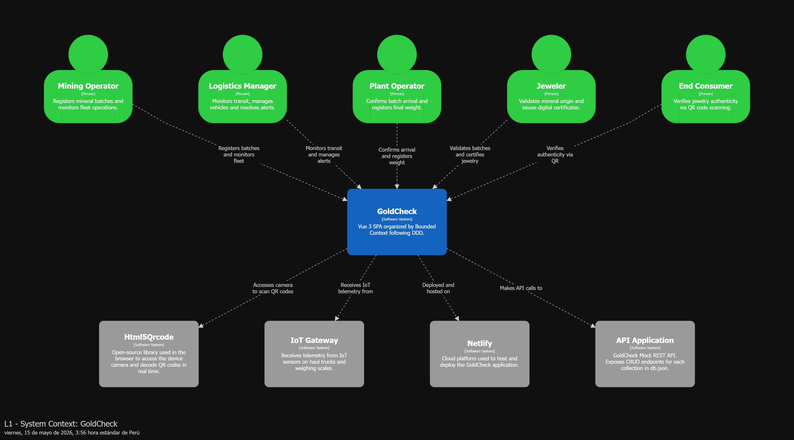
 
---
 
### 4.6.3. Software Architecture Container Diagrams
 
El diagrama de contenedores (L2) descompone GoldCheck en sus bloques de alto nivel: la **Landing Page** (HTML5/CSS3/JS) que dirige a los usuarios hacia la aplicación; el **Web Application** (Nginx) que sirve los archivos estáticos; y el **Single Page Application** (Vue 3 + PrimeVue) que provee todas las funcionalidades de trazabilidad y certificación directamente en el navegador. El SPA se comunica con la API Application mediante llamadas REST, y depende de Netlify para su hospedaje y de Html5Qrcode para el acceso a la cámara del dispositivo.
 
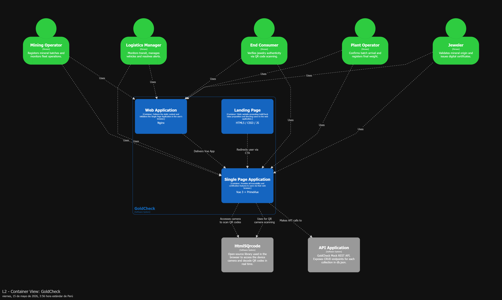
 
---
 
### 4.6.4. Software Architecture Components Diagrams
 
#### Mapa de Bounded Contexts (L3 — BC Map)
 
El mapa de bounded contexts ofrece una vista panorámica de los once contextos delimitados que conforman el SPA, siguiendo los principios de Domain-Driven Design: IAM, Fleet Operations, Material Operations, Jewelry Inventory & Certification, Consumer Traceability, Monitoring & Telemetry, Analytics, Incident Management, Reporting & Notifications, Asset Maintenance y Subscriptions & Billing.
 
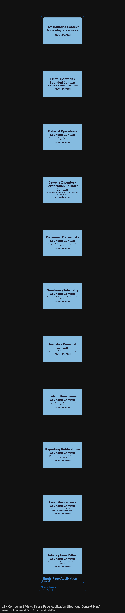
 
---
 
#### L3 — Visión General del SPA (todos los BCs con capas)
 
Esta vista muestra la totalidad de los once bounded contexts junto con sus cuatro capas internas (Presentation, Application, Domain e Infrastructure) y las dependencias cruzadas entre contextos, como la consulta de datos de Fleet e Inventory por parte de Analytics, o la integración de Consumer con Jewelry para la verificación de certificados.
 

 
---
 
#### BC1 — IAM Bounded Context
 
Gestiona la identidad y el acceso. La capa de presentación (Vue Components) expone las vistas de Login, Register y Profile; el servicio de aplicación orquesta la autenticación y la lógica de perfil en el cliente; el dominio define los modelos User y Credentials; y la infraestructura (Axios) se comunica con los endpoints de identidad de la API.
 
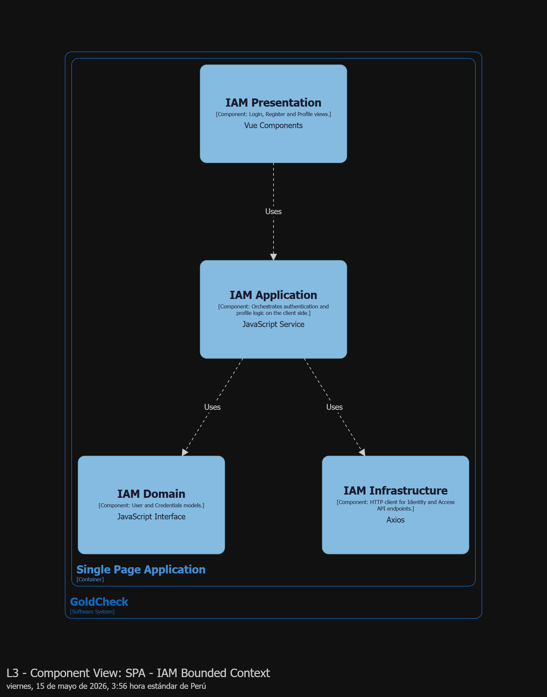
 
---
 
#### BC2 — Fleet Operations Bounded Context
 
Cubre el registro de lotes de mineral, el pesaje inicial y el monitoreo de flota. La presentación incluye el Dashboard, Operations, Fleet y Reports; la aplicación orquesta la creación de lotes y el seguimiento de alertas; el dominio expone los modelos MineralBatch y AnomalyAlert; y la infraestructura realiza las llamadas REST a los endpoints de Fleet Operations.
 
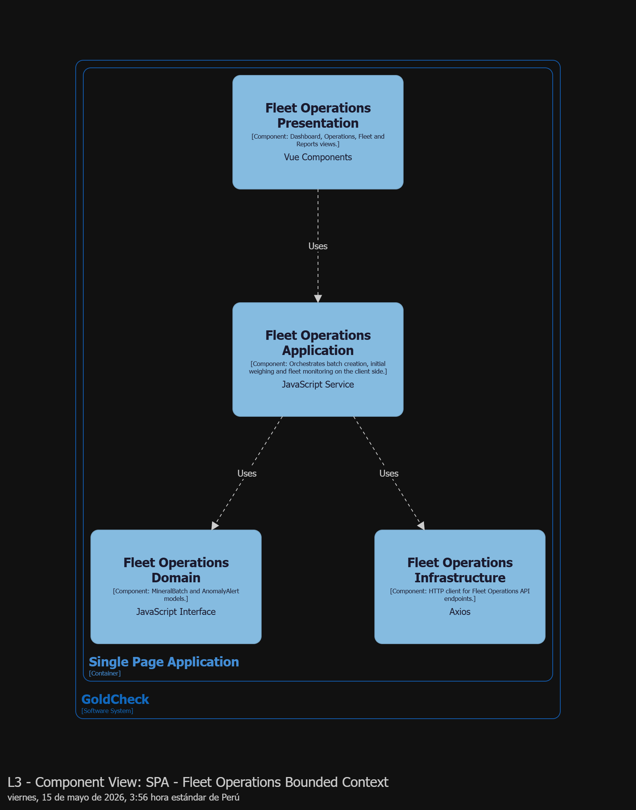
 
---
 
#### BC3 — Material Operations Bounded Context
 
Gestiona la recepción de lotes en planta, el pesaje final y el cálculo de merma (shrinkage). La capa de presentación concentra estas funciones en un único Dashboard; la aplicación y la infraestructura se integran con los endpoints de Material Operations de la API.
 
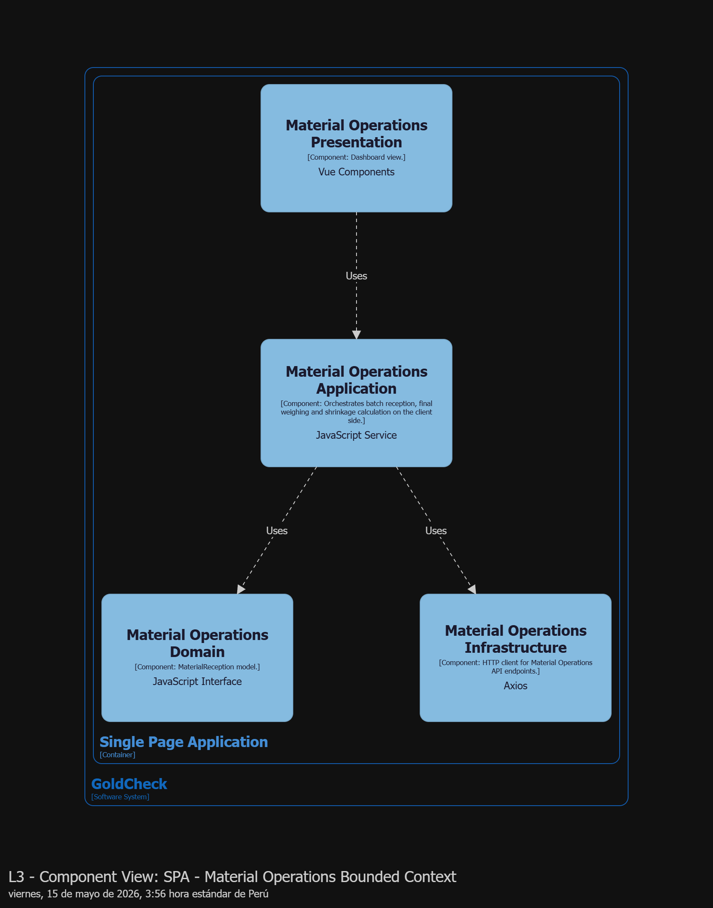
 
---
 
#### BC4 — Jewelry Inventory & Certification Bounded Context
 
Permite al joyero registrar piezas, validar lotes, emitir certificados digitales y consultar el origen mineral. La presentación agrupa Dashboard, Inventory, Register Jewelry, Certifications, Reports y Mineral Origin; el dominio define JewelryItem y JewelryCertificate; y la infraestructura se conecta a los endpoints de Jewelry de la API.
 
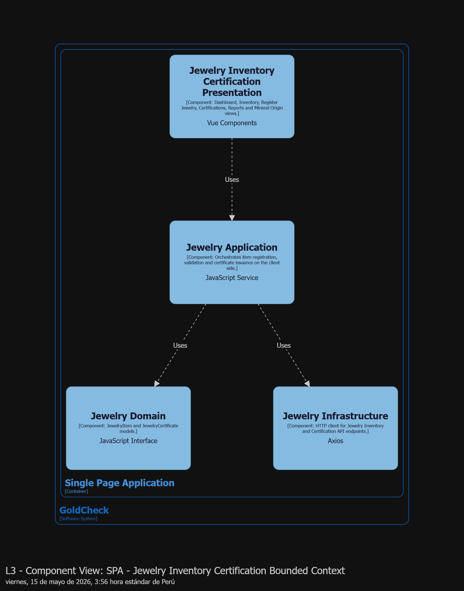
 
---
 
#### BC5 — Consumer Traceability Bounded Context
 
Habilita al consumidor final para verificar la autenticidad de sus joyas mediante código QR o entrada manual, vincular piezas a su colección y consultar certificados. La infraestructura de este contexto consume también los endpoints de Jewelry para obtener información de trazabilidad.
 
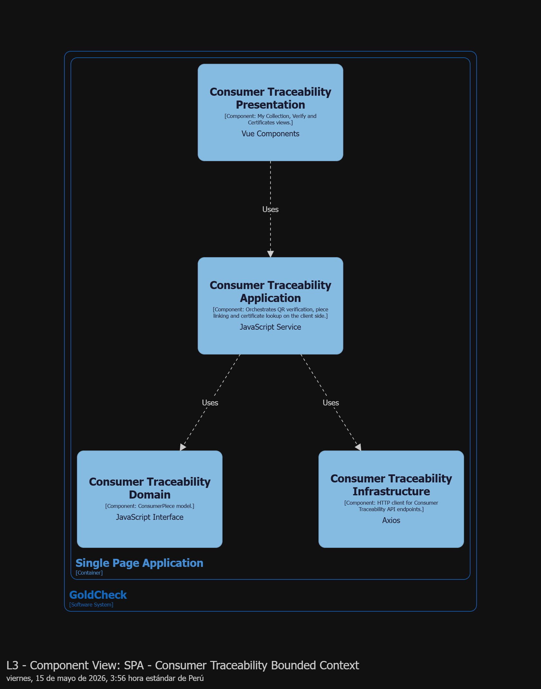
 
---
 
#### BC6 — Monitoring & Telemetry Bounded Context
 
Centraliza la gestión de alertas de anomalía y el monitoreo de lotes en tránsito. La presentación expone un Dashboard con KPIs de alertas activas, alertas críticas y lotes en tránsito; el dominio define el modelo AnomalyAlert; y la infraestructura se integra con los endpoints de Monitoring de la API.
 
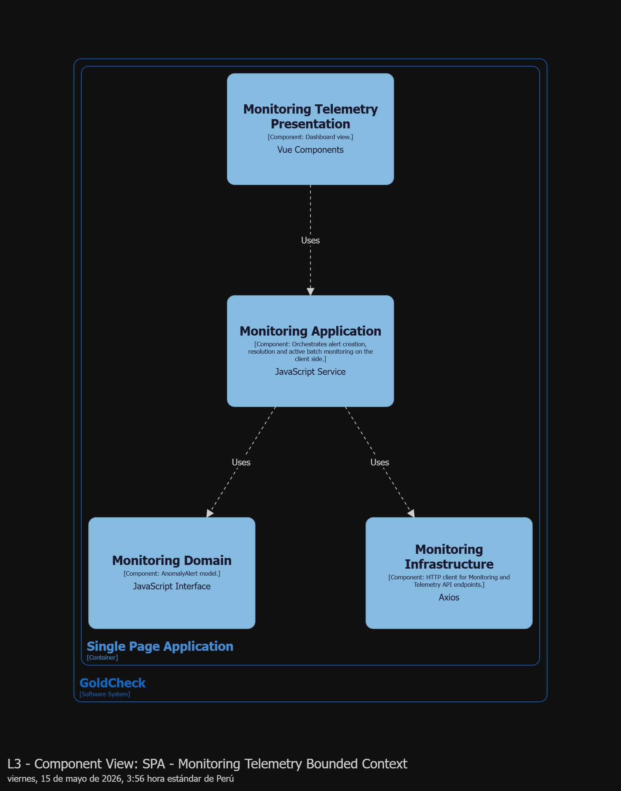
 
---
 
#### BC7 — Analytics Bounded Context
 
Agrega KPIs transversales de múltiples contextos (Fleet, Jewelry, Maintenance) para ofrecer métricas de merma, producción y certificación. La infraestructura de Analytics reutiliza los clientes HTTP de Fleet, Maintenance y Jewelry para consolidar la información.
 
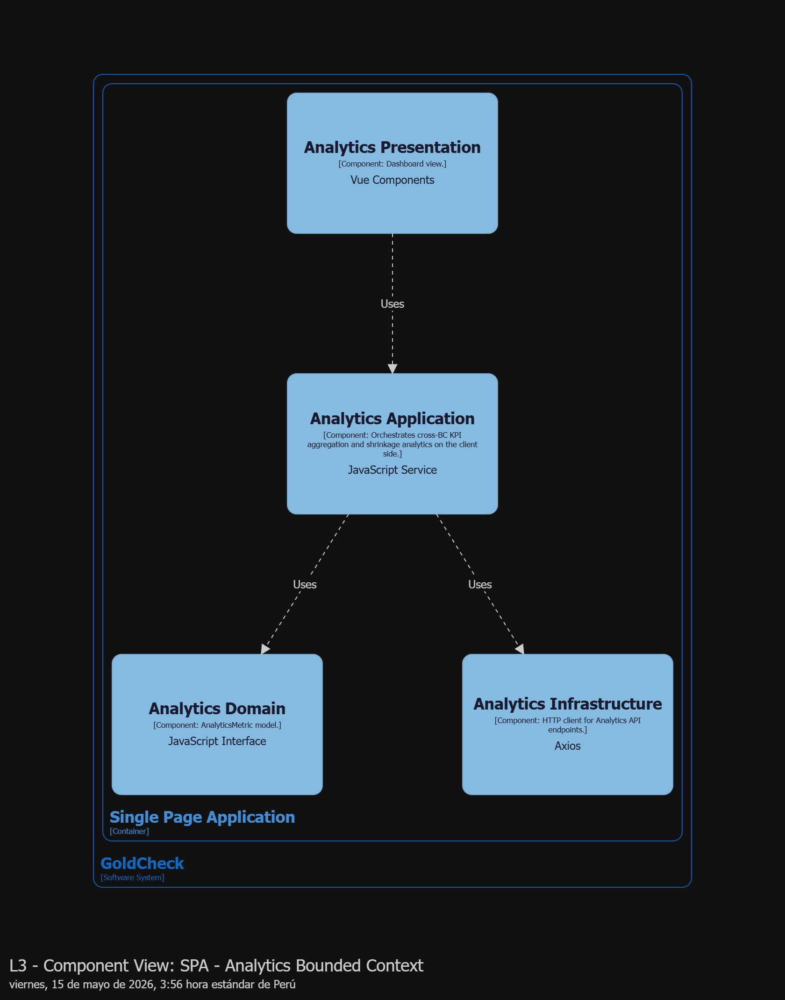
 
---
 
#### BC8 — Incident Management Bounded Context
 
Permite reportar, clasificar y cerrar incidentes operativos. El Dashboard muestra KPIs de incidentes abiertos y críticos, y expone una tabla con insignias de severidad. El dominio define el modelo Incident y la infraestructura se conecta a los endpoints de Incident Management de la API.
 
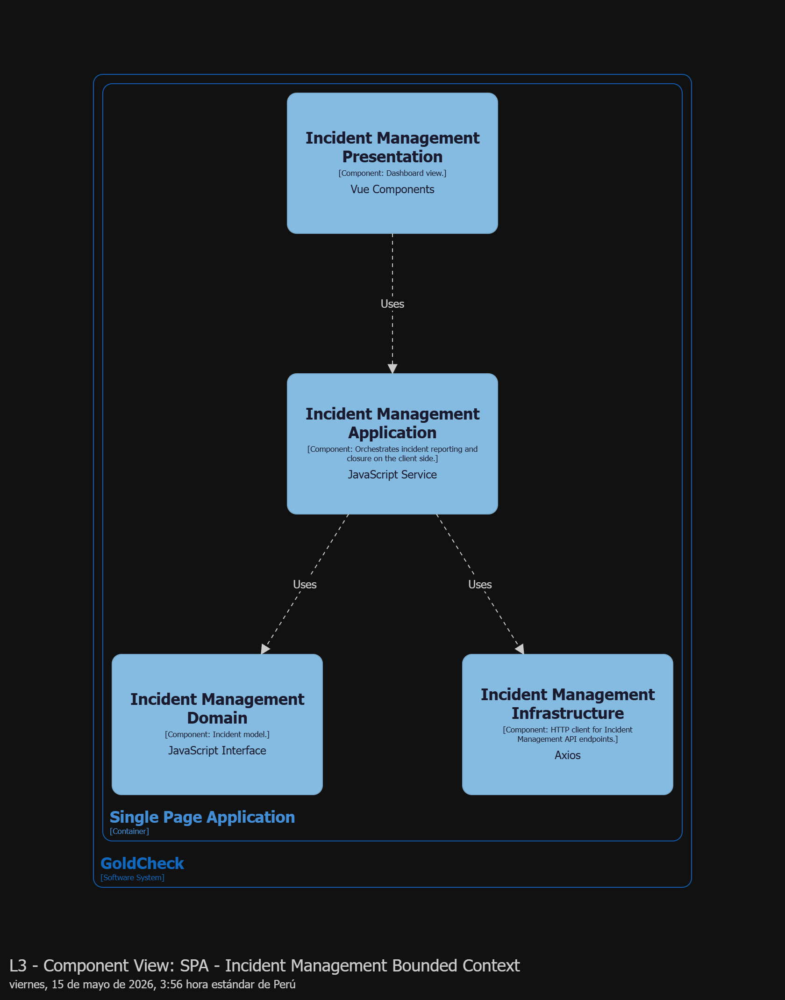
 
---
 
#### BC9 — Reporting & Notifications Bounded Context
 
Consolida reportes de lotes, joyas y alertas. La presentación muestra KPIs agregados y un placeholder de exportación a PDF; la infraestructura consume endpoints de Fleet, Jewelry y Monitoring para construir los reportes. El dominio expone el modelo Notification.
 
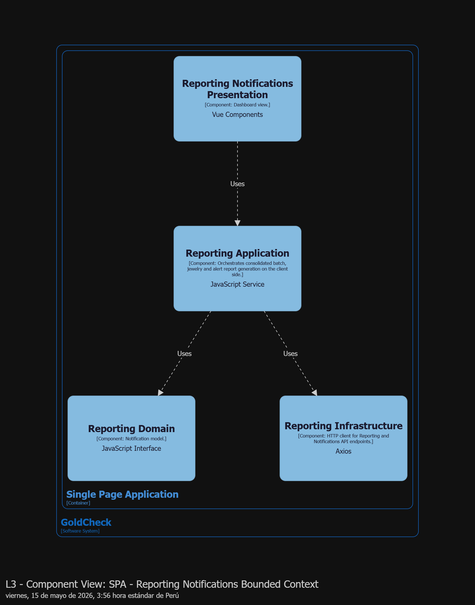
 
---
 
#### BC10 — Asset Maintenance Bounded Context
 
Gestiona el ciclo de vida de los vehículos de la flota, permitiendo enviarlos a mantenimiento o reactivarlos. El Dashboard muestra KPIs de vehículos activos y en mantenimiento; el dominio define MaintenanceRecord; y la infraestructura se comunica con los endpoints de Maintenance de la API.
 
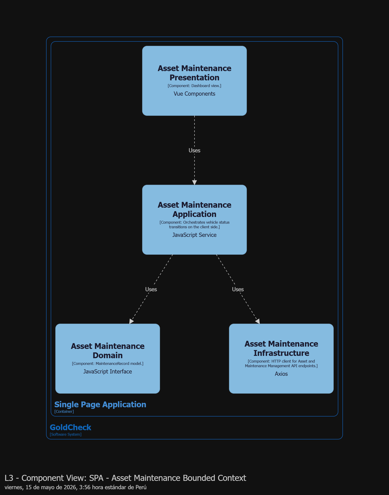
 
---
 
#### BC11 — Subscriptions & Billing Bounded Context
 
Expone los planes de suscripción (Bronze, Gold, Platinum) y el flujo de pago. La aplicación integra lógica de IAM para asociar el plan al usuario autenticado. El dominio define SubscriptionPlan y la infraestructura gestiona las llamadas a los endpoints de Subscriptions de la API.
 
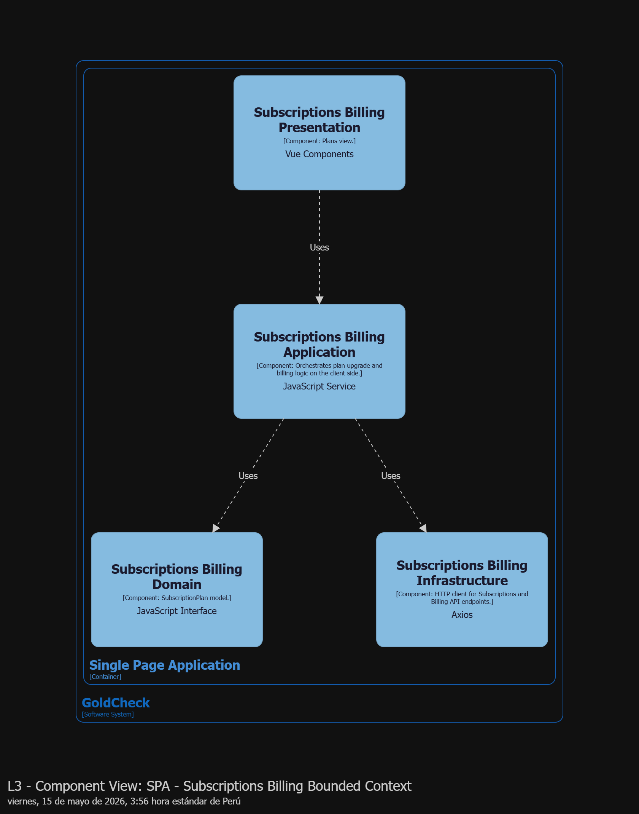
 
---
 
#### L4 — Vistas de Presentación por Bounded Context
 
Las vistas L4 detallan los componentes Vue individuales dentro de la capa de presentación de cada bounded context, sus relaciones internas (Contains, Opens, Uses) y sus tecnologías (PrimeVue, useVuelidate, Html5Qrcode, etc.).
 
##### BC1 — IAM: Login, Register, Profile
 
Tres componentes Vue: **Login** (formulario con FloatLabel, InputText, Password, Checkbox y Button; validación con useVuelidate; redirige por segmento tras autenticación), **Register** (formulario con SelectButton para selección de segmento) y **Profile** (layout de pestañas con secciones de perfil, notificaciones y ajustes).
 
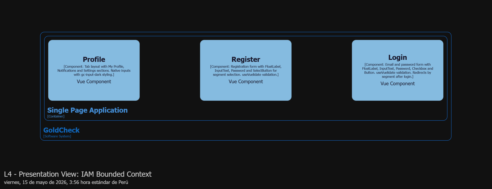
 
---
 
##### BC2 — Fleet Operations: Dashboard, Modals, Operations, Fleet, Reports
 
Seis componentes Vue: **Fleet Dashboard** (4 StatCards KPI, DataTable con Tag, panel de actividad IoT, abre New Batch Modal), **New Batch Modal** (PvDialog de 2 pasos: selección de depósito/vehículo y visualización de peso simulado a 38,50 t), **Operations** (3 KPIs, tabla de lotes, modal de peso final), **Fleet** (4 KPIs, tabla de vehículos), **Fleet Reports** (4 KPIs, historial de lotes) y el **Stat Card** compartido (label, value, trend, icon, alertActive).
 
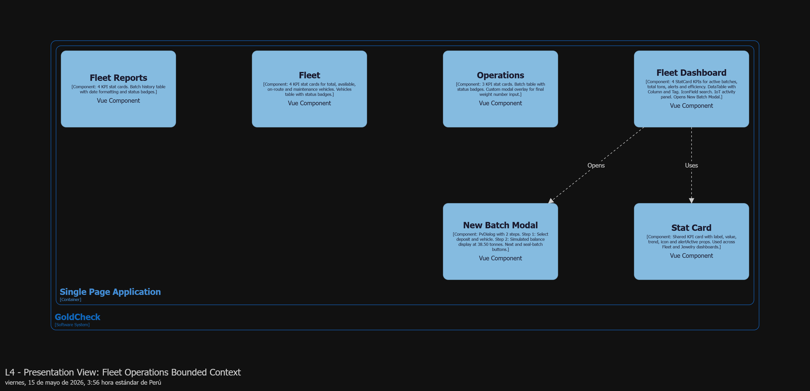
 
---
 
##### BC3 — Material Operations: Material Dashboard
 
Un único componente **Material Dashboard** con 3 KPI stat cards, tabla de recepciones con porcentaje de merma coloreado en rojo cuando supera el 5 %, botón de confirmación de llegada y modal de peso final.
 
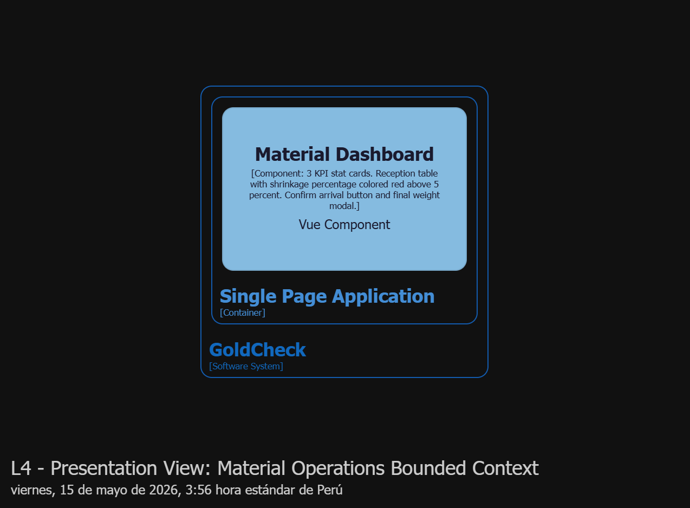
 
---
 
##### BC4 — Jewelry: Dashboard, Modals, Inventory, Register, Certifications, Origin, Reports
 
Siete componentes Vue: **Jewelry Dashboard** (4 StatCards, tabla de inventario con filtro de estado, abre Validate Lot Modal), **Validate Lot Modal** (checklist con 4 verificaciones de calidad, botón deshabilitado hasta completar todos), **Inventory** (4 KPIs, filtro de estado, acciones de validar/certificar/ver certificado), **Register Jewelry** (InputText, Select e InputNumber para los atributos de la pieza), **Certifications** (tabla de certificados con id, SKU, emisor, pureza, peso, fecha y estado), **Mineral Origin** (búsqueda por código de lote, línea de tiempo de trazabilidad: extracción → transporte → GPS → recibido) y **Jewelry Reports** (4 KPIs, tabla de piezas con columna de estado QR).
 
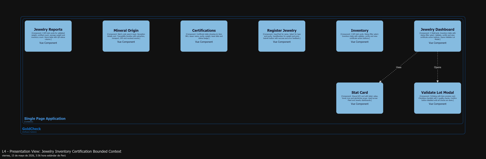
 
---
 
##### BC5 — Consumer Traceability: My Collection, Vincular Joya, Verify, Certificates
 
Cuatro componentes Vue: **My Collection** (grid de tarjetas de joya con imagen, SKU, metadata y badge de estado; abre Vincular Joya Modal), **Vincular Joya Modal** (PvDialog con campo de código de trazabilidad, nombre y tipo de joya), **Verify** (modo manual con campo de búsqueda oscuro + modo cámara con escáner Html5Qrcode, overlay de esquinas y línea de escaneo animada; resultado con línea de tiempo mineral) y **Consumer Certificates** (grid de tarjetas de certificado con ícono de escudo, pureza, peso, fechas y visualización de QR).
 
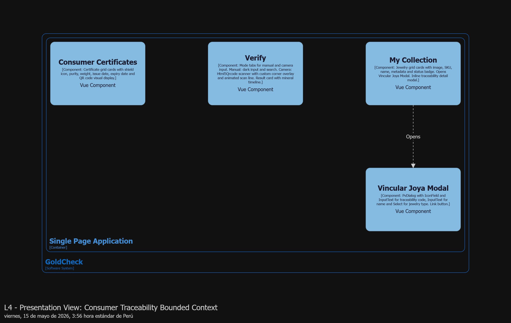
 
---
 
##### BC6 — Monitoring: Monitoring Dashboard
 
Un único componente **Monitoring Dashboard** con 3 KPI stat cards (alertas activas, alertas críticas, lotes en tránsito), tabla de alertas con badges de severidad y botón de resolución de alerta.
 

 
---
 
##### BC7 — Analytics: Analytics Dashboard
 
Un único componente **Analytics Dashboard** con 5 KPI stat cards (lotes totales, lotes activos, merma promedio, total de joyas, joyas certificadas) y tabla de merma con porcentajes codificados por color.
 
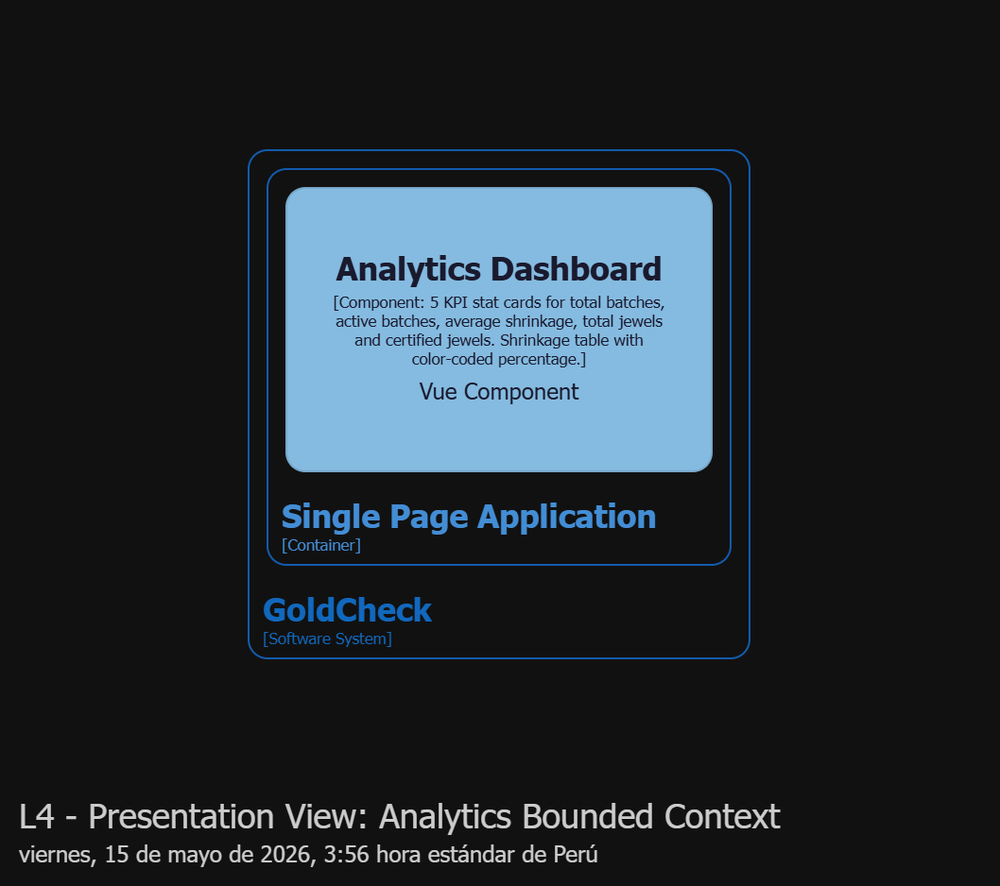
 
---
 
##### BC8 — Incident Management: Incident Dashboard
 
Un único componente **Incident Dashboard** con 2 KPI stat cards (incidentes abiertos e incidentes críticos), tabla de incidentes con badges de severidad y modal overlay para registrar nuevos incidentes.
 
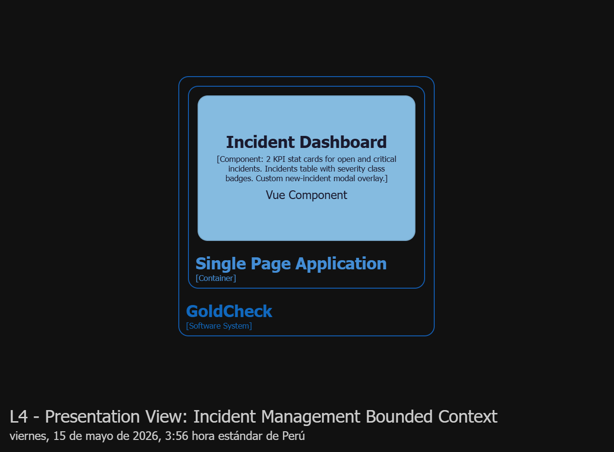
 
---
 
##### BC9 — Reporting: Reporting Dashboard
 
Un único componente **Reporting Dashboard** con 4 KPI stat cards (lotes totales, lotes procesados, alertas totales, ítems certificados) y un placeholder de exportación a PDF (próximamente).
 
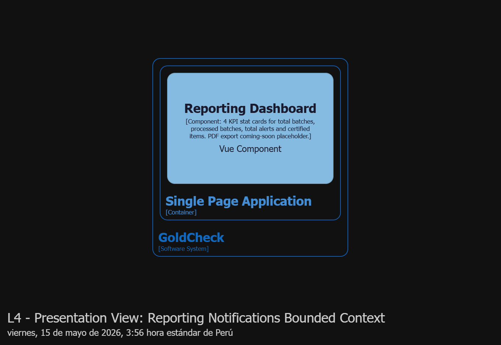
 
---
 
##### BC10 — Asset Maintenance: Maintenance Dashboard
 
Un único componente **Maintenance Dashboard** con 2 KPI stat cards (vehículos activos y en mantenimiento) y tabla de vehículos con botones de acción para enviar a mantenimiento o activar el vehículo.
 
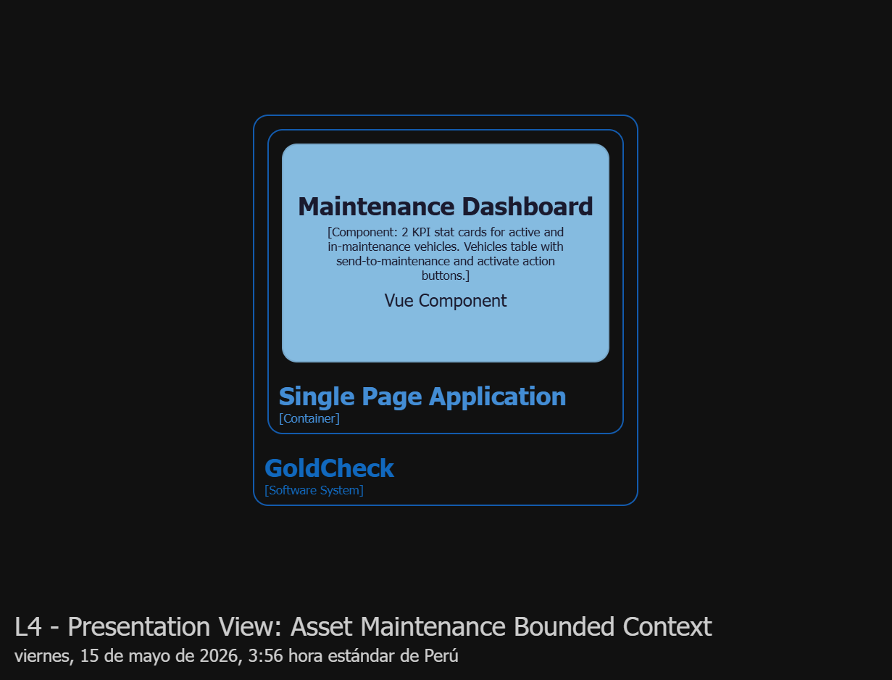
 
---
 
##### BC11 — Subscriptions: Plans
 
Un único componente **Plans** con 3 tarjetas de plan (Bronze, Gold y Platinum) con badges de "current" y "popular", lista de características por plan, tabla comparativa y modal de pago con visualización de tarjeta bancaria e inputs para número, titular, vencimiento y CVV.
 
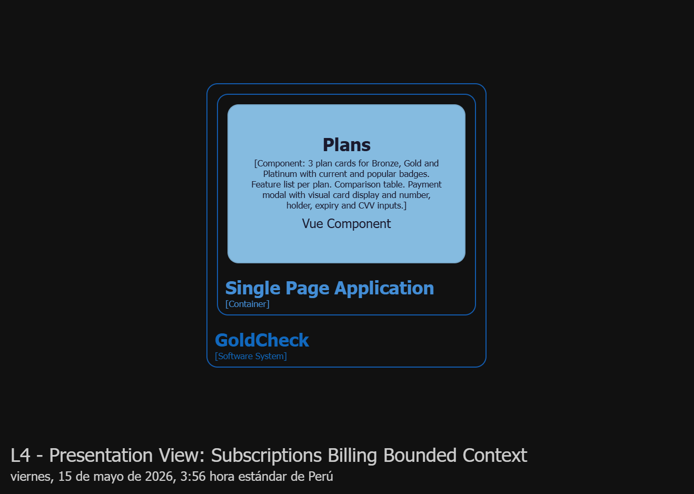

#### Mapa de Bounded Contexts — Backend (L3 — BE BC Map)

El mapa de bounded contexts del backend muestra los once contextos delimitados que componen la API Application (json-server + Express): IAM, Fleet Operations, Material Operations, Jewelry Inventory & Certification, Consumer Traceability, Monitoring & Telemetry, Analytics, Incident Management, Reporting & Notifications, Asset Maintenance y Subscriptions & Billing. Cada contexto encapsula sus propios endpoints REST sobre colecciones independientes del archivo `db.json`, siguiendo los principios de Domain-Driven Design.

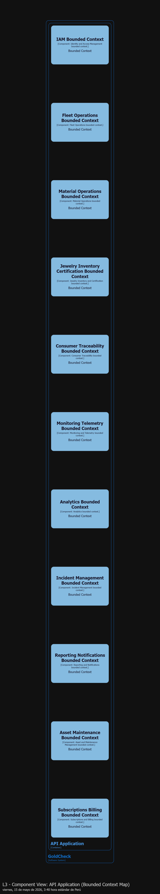

---

#### L3 — Visión General del API Application (todos los BCs con capas)

Esta vista despliega la totalidad de los once bounded contexts del backend junto con sus cuatro capas internas: Interfaces (colecciones json-server), Application (middleware), Domain (JSON Schema) e Infrastructure (db.json), además de las relaciones de lectura/escritura compartidas hacia la base de datos central. Permite identificar de un vistazo las dependencias cruzadas entre contextos y la colección de `db.json` que cada uno utiliza.

---

#### BC1 — IAM Bounded Context (Backend)

Gestiona la autenticación y actualización de perfil de usuario. La capa de Interfaces expone endpoints REST sobre `/users` (GET por email para login, POST para registro, PATCH para actualización de perfil); la Application procesa esas peticiones mediante middleware de json-server; el Domain define el recurso User con campos `id`, `email`, `username`, `segment`, `plan`, `location` y `phoneNumber`; y la Infrastructure persiste los registros en la colección `users` de `db.json`.

---

#### BC2 — Fleet Operations Bounded Context (Backend)

Cubre el ciclo de vida de lotes de mineral, vehículos, depósitos y alertas de anomalía. Las Interfaces exponen endpoints sobre `/mineralBatches`, `/deposits`, `/vehicles` y `/anomalyAlerts`; la Application procesa la creación de lotes y el registro de peso inicial; el Domain define `MineralBatch` (batchCode, depositId, vehicleId, initialWeight, mineralType, status) y `AnomalyAlert` (batchId, alertType, severity); y la Infrastructure persiste todos estos registros en `db.json`. El IoT Gateway envía telemetría directamente a las Fleet Interfaces.

---

#### BC3 — Material Operations Bounded Context (Backend)

Gestiona la recepción de lotes en planta, el pesaje final y el cálculo de merma. Las Interfaces exponen endpoints PATCH sobre `/mineralBatches` para registrar `finalWeight` y transiciones de estado; la Application orquesta la confirmación de llegada y el marcado de investigación de merma; el Domain proyecta `MineralBatch` como `MaterialReception` (receivedWeight, initialWeight, shrinkagePercent, status); y la Infrastructure persiste esos datos en la misma colección `mineralBatches` de `db.json`.

---

#### BC4 — Jewelry Inventory & Certification Bounded Context (Backend)

Permite registrar piezas de joyería y emitir certificados digitales. Las Interfaces exponen GET, POST y PATCH sobre `/jewelryItems` y `/jewelryCertificates`; la Application procesa el registro de ítems, la validación de estado y la emisión de certificados; el Domain define `JewelryItem` (sku, name, type, purity, weight, batchRef, status, certificationId) y `JewelryCertificate` (itemId, qrCode, issuerName); y la Infrastructure persiste ambos recursos en `db.json`.

---

#### BC5 — Consumer Traceability Bounded Context (Backend)

Habilita la vinculación de piezas al consumidor y la verificación por código QR. Las Interfaces exponen endpoints sobre `/consumerPieces` (GET por `ownerId` o `traceabilityCode`, POST para vincular una pieza); la Application cruza datos entre `consumerPieces` y `jewelryItems` para resolver la trazabilidad; el Domain define `ConsumerPiece` (ownerId, sku, traceabilityCode, purity, weight, certificationId, status); y la Infrastructure persiste los registros de piezas del consumidor en `db.json`.

---

#### BC6 — Monitoring & Telemetry Bounded Context (Backend)

Centraliza la gestión de alertas de anomalía en tránsito. Las Interfaces exponen GET, POST y PATCH sobre `/anomalyAlerts` para creación y resolución de alertas; la Application filtra alertas activas por estado y coordina su resolución; el Domain define `AnomalyAlert` (batchId, batchCode, vehicleId, alertType, severity, coordinates, status, detectedAt); y la Infrastructure persiste los registros en la colección `anomalyAlerts` de `db.json`.

---

#### BC7 — Analytics Bounded Context (Backend)

Agrega KPIs transversales para métricas de merma y certificación. Las Interfaces proveen acceso de solo lectura a `/mineralBatches`, `/vehicles` y `/jewelryItems`; la Application procesa solicitudes de lectura cruzada entre colecciones; el Domain expone proyecciones agregadas sobre los recursos `MineralBatch` y `JewelryItem`; y la Infrastructure lee directamente de las tres colecciones correspondientes en `db.json` sin escribir datos propios.

---

#### BC8 — Incident Management Bounded Context (Backend)

Gestiona el reporte y cierre de incidentes operativos, reutilizando la colección `anomalyAlerts`. Las Interfaces exponen GET, POST y PATCH sobre esa colección con semántica de incidente; la Application procesa el reporte y el cambio de estado a cerrado; el Domain proyecta `AnomalyAlert` como `Incident` (title, incidentType, severity, batchId, vehicleId, status); y la Infrastructure persiste los registros de incidente en `anomalyAlerts` dentro de `db.json`.

---

#### BC9 — Reporting & Notifications Bounded Context (Backend)

Consolida datos de lotes, joyas y alertas para la generación de reportes. Las Interfaces proveen acceso de lectura a `/mineralBatches`, `/jewelryItems` y `/anomalyAlerts`; la Application procesa solicitudes de lectura en paralelo sobre las tres colecciones; el Domain define proyecciones de reporte sobre esos recursos; y la Infrastructure lee desde las tres colecciones de `db.json` sin persistir datos adicionales.

---

#### BC10 — Asset Maintenance Bounded Context (Backend)

Gestiona el ciclo de vida y las transiciones de estado de los vehículos de flota. Las Interfaces exponen GET (todos los vehículos) y PATCH (transición de estado) sobre `/vehicles`; la Application procesa las actualizaciones entre los estados `Activo` y `Mantenimiento`; el Domain define el recurso `Vehicle` (id, name, plate, type, capacity, status); y la Infrastructure persiste los registros en la colección `vehicles` de `db.json`.

---

#### BC11 — Subscriptions & Billing Bounded Context (Backend)

Gestiona la actualización del plan de suscripción del usuario. Las Interfaces exponen PATCH sobre `/users` para modificar el campo `plan`; la Application procesa la solicitud de upgrade del plan; el Domain define los valores posibles del campo plan: `BRONZE`, `GOLD` y `PLATINUM`; y la Infrastructure persiste la actualización en la colección `users` de `db.json`, integrándose así con el contexto IAM a nivel de datos.

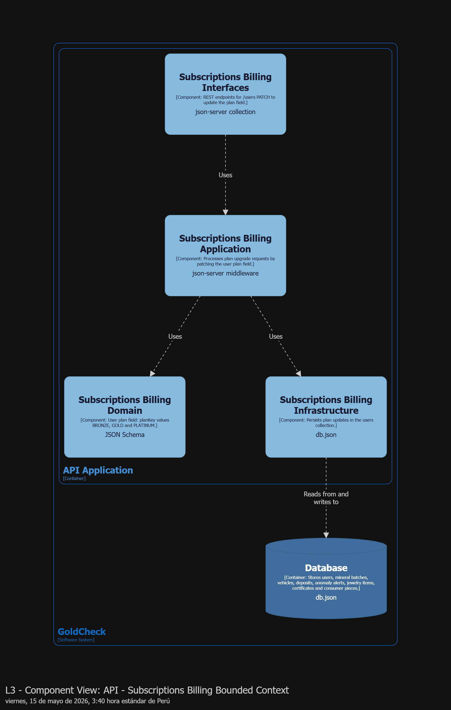

## 4.7. Software Object-Oriented Design

### 4.7.1. Class Diagrams

A continuación, se presentan los diagramas de clases back-end correspondientes a los distintos bounded contexts identificados en la arquitectura del sistema GoldCheck. Estos diagramas permiten visualizar la estructura interna de cada contexto delimitado, mostrando las principales entidades, relaciones, atributos y responsabilidades involucradas en la lógica de negocio.

Cada diagrama fue diseñado siguiendo principios de Domain-Driven Design (DDD), separación de responsabilidades y modularidad, permitiendo representar de manera clara la interacción entre entidades del dominio, servicios de aplicación, repositorios y componentes de soporte. Asimismo, estos diagramas sirven como apoyo para comprender la organización interna del sistema y facilitar futuras tareas de mantenimiento, escalabilidad y evolución de la plataforma.

## DIAGRAMAS FRONTEND

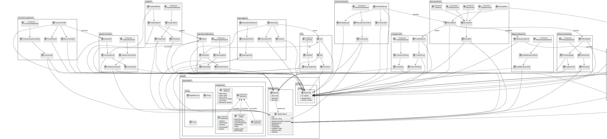
A continuación se presentaran los diagramas de clases de los respectivos bounded context.

**Analytics**

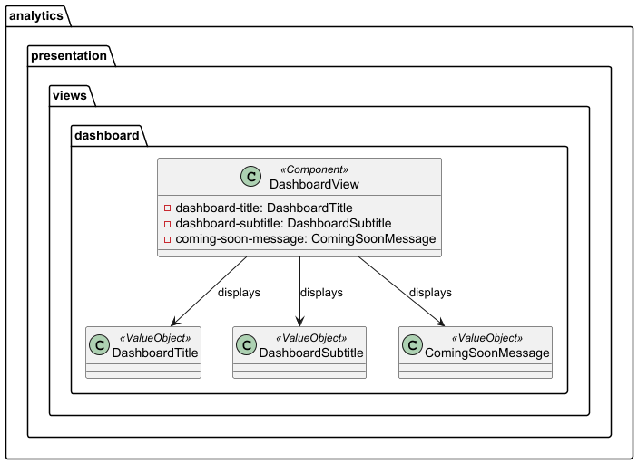

**Asset Maintenance**

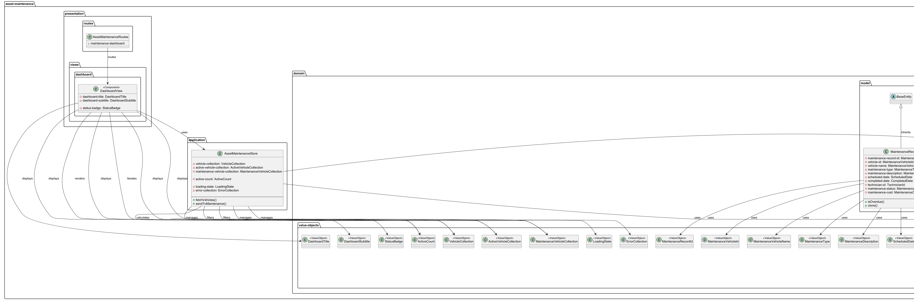

**Consumer Experience**

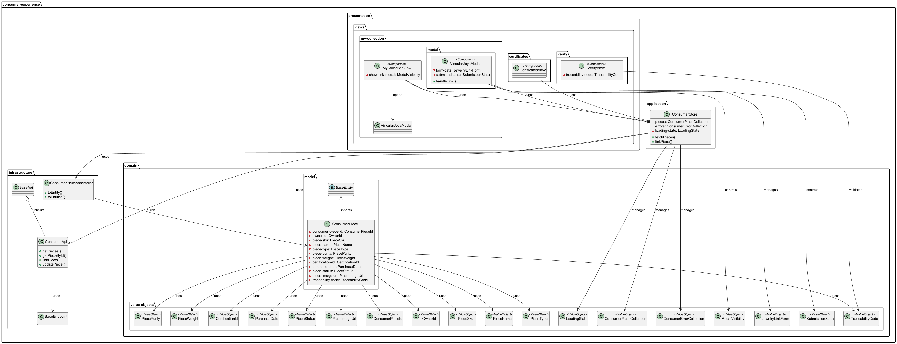

**Custody Chain**

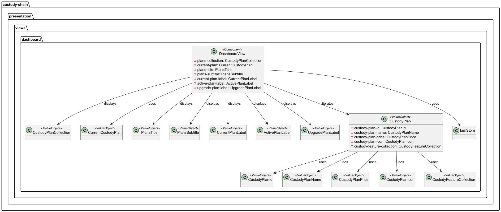

**Fleet Operations**

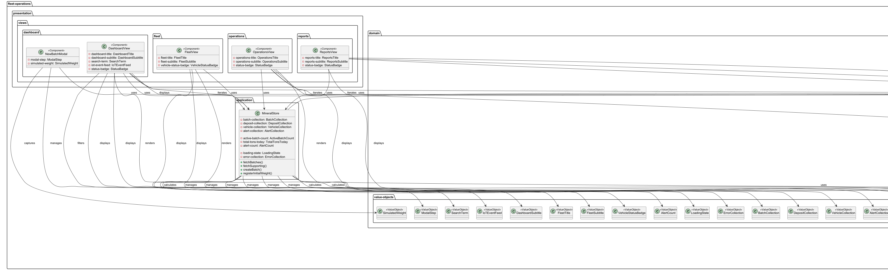

**Identity & Management**

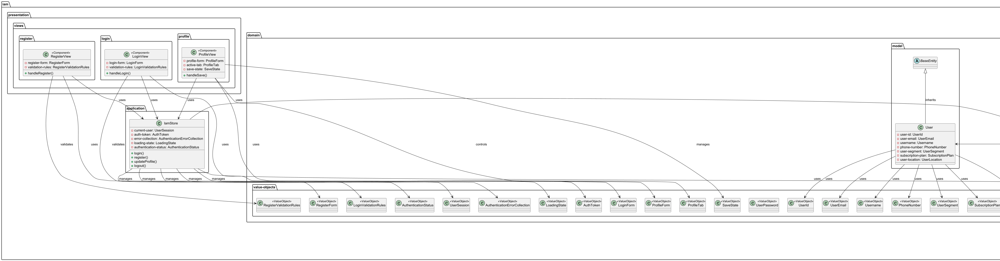

**Incident Management**

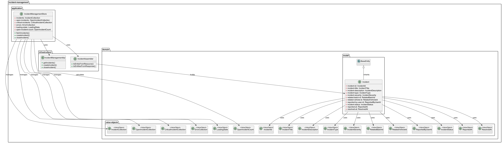

**Mineral Extraction**

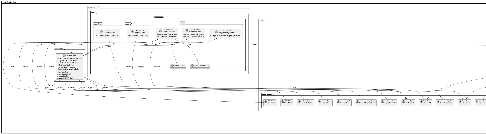

**Monitoring Telemetry**

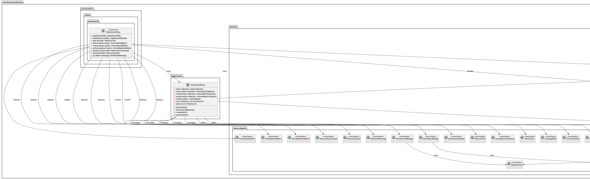

**Refinery Processing**

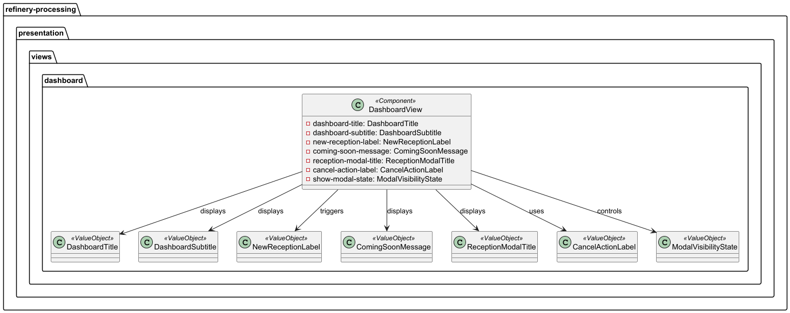

**Subscriptions**

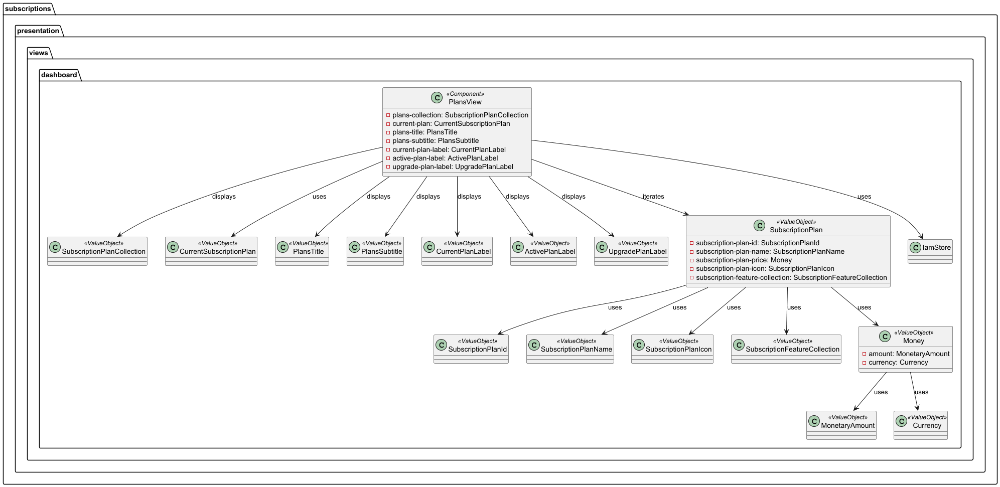

## DIAGRAMAS BACKEND:

#### BC1 - Identity Access Management

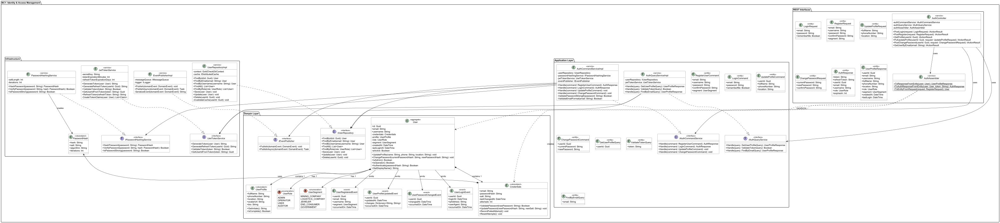

#### BC2 - Fleet Operations

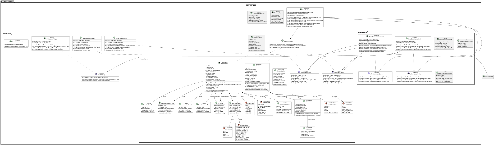

#### BC3 - Material Operations

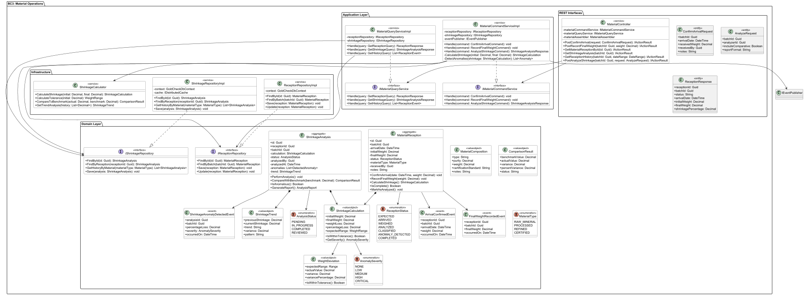

#### BC4 - Jewelry Inventory

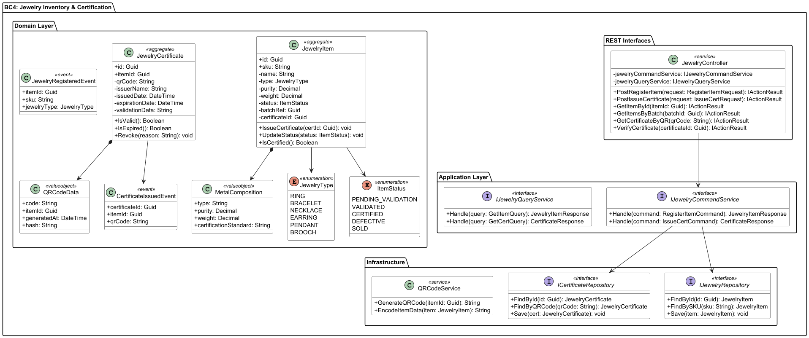

#### BC5 - Consumer Traceability

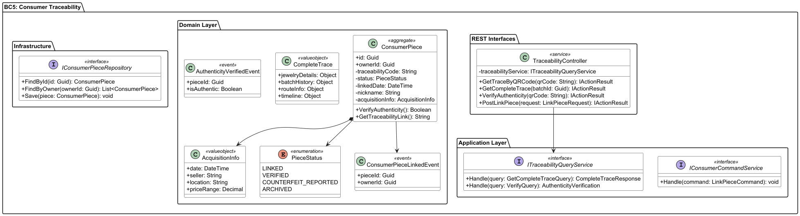

#### BC6 - Monitoring Telemetry

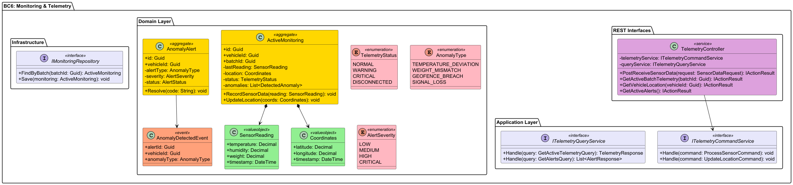

#### BC7 - Analytics

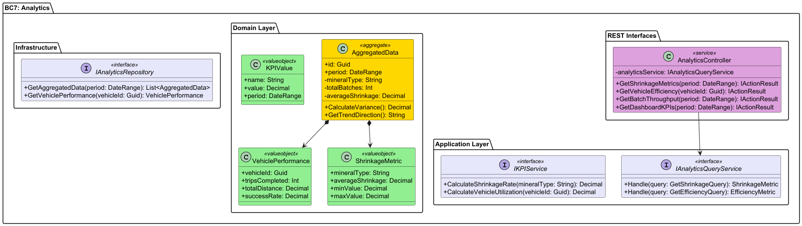

#### BC8 - Incident Management

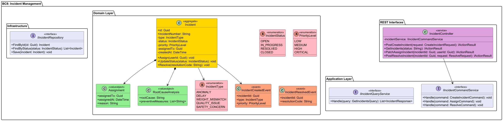

#### BC9 - Reporting Notifications


#### BC10 - Asset Maintenance


#### BC11 - Subscriptions Billing


## Diagramas de Clases por Aggregate

A continuación se presentan los diagramas de clases de los aggregates más relevantes del sistema GoldCheck, seleccionados por su centralidad en el dominio del negocio y la complejidad de su lógica interna.

---

### MineralBatch — Fleet Operations Bounded Context

El aggregate MineralBatch representa el núcleo del sistema de trazabilidad mineral. Es el artefacto central alrededor del cual gira todo el ciclo de vida del mineral, desde su extracción en la mina hasta su llegada a la planta de procesamiento. Su importancia radica en que es referenciado directamente por los bounded contexts de Material Operations, Monitoring & Telemetry, Jewelry Inventory e Incident Management, convirtiéndolo en el elemento de mayor cohesión del dominio.

Desde el punto de vista del diseño orientado al dominio, MineralBatch encapsula un ciclo de estados complejo (CREATED → PENDING_ASSIGNMENT → IN_TRANSIT → ARRIVED → PROCESSING → COMPLETED) y contiene value objects críticos como Location (origen y destino), Coordinates (posición GPS en tiempo real), DetectedAnomaly (lista de anomalías registradas durante el transporte) y SensorReading (datos de telemetría IoT). Además, emite cinco domain events que desencadenan procesos en otros bounded contexts: BatchCreatedEvent, BatchAssignedEvent, AnomalyDetectedEvent, BatchArrivedEvent y BatchCompletedEvent.


---

### JewelryCertificate — Jewelry Inventory & Certification Bounded Context

El aggregate JewelryCertificate representa el producto final de toda la cadena de trazabilidad del sistema. Es el artefacto que materializa la promesa de valor de GoldCheck: garantizar al consumidor final que la joya que adquiere proviene de una fuente verificada, ética y rastreable. Su diseño encapsula la lógica de emisión, validación, expiración y revocación de certificados digitales, asegurando la integridad del proceso de certificación.

Contiene el value object QRCodeData, que almacena el código generado, el identificador de la pieza y un hash criptográfico que garantiza la inmutabilidad del certificado. Adicionalmente, incorpora CertificationStandard para asegurar el cumplimiento de normativas de calidad. El aggregate emite tres domain events clave: CertificateIssuedEvent (notifica a Consumer Traceability que un nuevo certificado está disponible para ser vinculado), CertificateRevokedEvent y CertificateExpiredEvent. Es el punto de unión entre la cadena operativa minera y la experiencia del consumidor final.


## 4.8. Database Design

### 4.8.1. Database Diagrams
El diseño de base de datos de OpalTrace sigue una arquitectura relacional implementada en **Microsoft SQL Server** y **Verbatelo**, organizada en torno a los Bounded Contexts definidos en la arquitectura DDD. Cada Bounded Context posee sus propias tablas con un prefijo identificador (`iam_`, `mineral_`, `custody_`, `refinery_`, `jewelry_`, `consumer_`, `admin_`, `analytics_`, `billing_`), garantizando separación lógica de responsabilidades y bajo acoplamiento entre contextos.
 
Las principales características del diseño son las siguientes. Primero, los Value Objects del dominio se persisten como columnas embebidas dentro de la tabla de su Aggregate Root — por ejemplo, `GPSLocation` se almacena como `location_latitude` y `location_longitude` en `mineral_batches`, evitando joins innecesarios para datos que son parte intrínseca del aggregate. Segundo, los Enums del dominio se implementan como columnas con constraints `CHECK`, garantizando integridad referencial sin tablas adicionales de catálogo. Tercero, las relaciones entre Bounded Contexts se establecen únicamente a través de Foreign Keys hacia las tablas raíz (`iam_organizations`, `iam_user_accounts`, `mineral_batches`), respetando el principio DDD de que los BCs se referencian por identidad y no por objeto. Cuarto, la tabla `traceability_tracking_events` centraliza el historial completo de eventos de trazabilidad de cada Batch a lo largo de toda la cadena de suministro, permitiendo construir el `TraceabilityRecord` sin duplicar información entre contextos. Finalmente, todos los identificadores primarios son de tipo `UNIQUEIDENTIFIER` (UUID), eliminando dependencias de secuencias y facilitando la distribución futura del sistema.
 
A continuación se presentan los diagramas de base de datos para cada Bounded Context, mostrando tablas, columnas, constraints y relaciones.
 
---
 
#### BC: Identity & Access Management
 
El contexto de identidad gestiona las tablas `iam_organizations`, `iam_user_accounts` e `iam_role_assignments`. La tabla `iam_organizations` almacena los datos de cada empresa registrada en la plataforma, incluyendo su tipo (`MINERA`, `TRANSPORTISTA`, `REFINERIA`, `JOYERIA`), su estado de aprobación y el `plan_tier` contratado. La tabla `iam_user_accounts` centraliza las credenciales y el rol de cada usuario, almacenando el `hashed_password` y los claims `role`, `segment` y `plan_tier` que conforman el JWT emitido por este contexto. La tabla `iam_role_assignments` registra el historial de asignaciones de roles por cuenta.
 

 
 
---
 
#### BC: Mineral Extraction & Offline Ops
 
El contexto de extracción gestiona cuatro tablas. `mineral_batches` es la tabla central del sistema — almacena el Aggregate Root `MineralBatch` con el `traceability_code` único, el `qr_code`, el tipo de mineral, el peso, las coordenadas GPS embebidas (`location_latitude`, `location_longitude`) y el `status` del Batch a lo largo de su ciclo de vida. `mineral_anomaly_reports` registra cada anomalía detectada con su `alert_type` y estado de resolución. `mineral_extraction_records` persiste los registros de extracción con timestamp sellado e inmutable. `mineral_sync_queue_items` gestiona la cola de operaciones offline pendientes de sincronización. Adicionalmente, la tabla `traceability_tracking_events` inicia su historial en este BC con el evento `MINERAL_EXTRACTED`.
 

 
 
---
 
#### BC: Custody Chain & Logistics
 
El contexto de cadena de custodia gestiona cinco tablas. `custody_batches` referencia al `mineral_batches` padre y mantiene el estado de transporte (`EN_ORIGEN`, `EN_TRANSITO`, `ENTREGADO`, `BLOQUEADO`) junto con la última `Location` conocida embebida. `custody_qr_codes` almacena el hash de firma digital del QR Code generado para cada Batch. `custody_transport_operations` registra cada operación de transporte con la ruta, kilómetros estimados y tiempo máximo permitido. `custody_location_updates` persiste cada actualización GPS durante el transporte, asociada a la operación correspondiente. `custody_transfers` registra cada transferencia formal de custodia entre Organizations, constituyendo el `Domain Event` más crítico de la cadena.
 

 
---
 
#### BC: Refinery Processing
 
El contexto de refinería gestiona cuatro tablas. `refinery_batches` referencia al `mineral_batches` padre y almacena la invariante de conservación de masa mediante `mass_balance_tolerance_pct` y `mass_balance_is_valid`. El campo `inherited_traceability_code` garantiza que cada Batch en refinería conserve la trazabilidad de su origen. `refinery_child_batches` registra cada sublote generado en la división, con su peso y organización de destino. `refinery_processing_operations` persiste cada operación de procesamiento (`SMELTING`, `REFINING`, `ASSAYING`, `CASTING`). `refinery_shrinkage_records` almacena la merma en cada etapa, con `input_weight`, `output_weight` y `loss_pct`, datos consumidos por el BC8 para los reportes ESG.
 

 
 
---
 
#### BC: Jewelry Inventory & Certification
 
El contexto de joyería gestiona cinco tablas correspondientes a los dos Aggregate Roots del dominio. Para `JewelryProduct`: `jewelry_products` almacena la columna `stock_category` con constraint `CHECK ('CERTIFIED_OPALTRACE', 'EXTERNAL')` que implementa la invariante de segregación ética; `jewelry_inventory_items` gestiona el stock con `StorageLocation` embebida; `jewelry_fabrication_orders` registra las órdenes de fabricación con estado `BLOCKED` cuando se detecta mezcla de stocks; `jewelry_fabrication_order_components` persiste los componentes de cada orden. Para `JewelryCertificate`: `jewelry_certificates` almacena el estado de la Certification de Autenticidad, el `rejection_code` en caso de rechazo, y la URL del PDF almacenado en AWS S3.
 

 
---
 
#### BC: Consumer Experience
 
El contexto de experiencia del consumidor gestiona dos tablas de solo lectura que implementan el patrón CQRS. `consumer_certificates` es una proyección optimizada del estado de certificación de cada Product, indexada por `qr_code_hash` para consultas públicas de alta frecuencia sin autenticación. Almacena el `journey_map_json` con el recorrido geográfico completo del Mineral en formato JSON. `consumer_verification_events` registra cada intento de verificación vía QR Code con su resultado (`SUCCESS`, `FAILED`, `NOT_FOUND`) y el `failure_code` correspondiente si la verificación falló.
 

 
---
 
#### BC: Administration & Audit
 
El contexto de administración gestiona la tabla `admin_audit_records`, que implementa el Entity `AuditRecord` con carácter inmutable por diseño — ningún registro de auditoría puede ser modificado una vez creado. Almacena el `event_type` (`ACCOUNT_APPROVED`, `ACCOUNT_REJECTED`, `ORGANIZATION_SUSPENDED`, etc.), el `actor_id` responsable de la acción, la `ip_address` desde donde se ejecutó, y el payload en formato JSON con el estado anterior y posterior del objeto afectado (`payload_before`, `payload_after`). Este contexto referencia a `iam_organizations` e `iam_user_accounts` del BC1 para mantener la trazabilidad administrativa completa.
 

 
---
 
#### BC: Reporting & Analytics
 
El contexto de reportes gestiona cuatro tablas de solo lectura orientadas al análisis de datos. `analytics_reports` centraliza cada reporte generado con su tipo y período. `analytics_merma_indicators` persiste el Value Object `MermaIndicator` con `stage_origin`, `stage_destination`, `input_weight`, `output_weight` y `loss_pct` por etapa de procesamiento. `analytics_sustainability_records` almacena el Value Object `SustainabilityRecord` con los tres scores ESG: `environmental_score`, `social_score` y `ethical_score`. `analytics_dashboard_snapshots` captura el estado operativo del sistema en un momento dado, incluyendo `active_batches`, `pending_anomalies`, `certifications_granted` y `certification_rate` para el Dashboard de monitoreo en tiempo real.
 


---
 
#### BC: Subscriptions & Billing
 
El contexto de suscripciones gestiona tres tablas. `billing_subscriptions` almacena el Aggregate Root `Subscription` con el `plan_tier` contratado, el `billing_cycle` (`MONTHLY`, `ANNUAL`) y el Value Object `FeatureSet` embebido como columnas booleanas (`has_offline_mode`, `has_esg_reporting`, `has_advanced_analytics`, `has_api_access`) y límites numéricos (`max_batches_per_month`, `max_users`). También almacena el `stripe_customer_id` para la integración con Stripe API. `billing_records` persiste cada factura con su monto, moneda, estado (`PENDING`, `PAID`, `OVERDUE`, `CANCELLED`) y el `stripe_invoice_id` de referencia. `billing_plan_change_records` registra el historial de cambios de plan con el tier anterior y nuevo, implementando el Value Object `PlanChangeRecord` de forma inmutable.
 

 

# CAPÍTULO V: Product Implementation, Validation & Deployment

## 5.1. Software Configuration Management

**-Project Management:**
1. Herramienta: Trello
Propósito: Gestión de tareas, planificación de sprints y seguimiento del progreso del equipo mediante tableros Kanban. 

**-Requirements Management:**
1. Herramienta: UXPressia
Propósito: Creación de artefactos de needfinding como User Personas, User Journey Maps y Empathy Maps para comprender las necesidades del usuario.
2. Herramienta: Miro
Propósito: Desarrollo de Event Storming (Big Picture y Process Level) para el modelado de procesos y definición del alcance del sistema.
3. Herramienta: Gherkin
Propósito: Definición de criterios de aceptación y escenarios de prueba en formato Given–When–Then.

**-Product UX/UI Design:**
1. Herramienta: Figma
Propósito: Diseño de wireframes y mockups de la interfaz del sistema, incluyendo la landing page.

**-Software Development:**
1. Herramienta: Visual Studio Code
Propósito: Entorno de desarrollo utilizado para la programación del sistema.
2. Herramienta: GitHub
Propósito: Control de versiones y trabajo colaborativo mediante repositorios, commits y ramas. Cada miembro del equipo clonará el repositorio para desarrollar de manera distribuida sus features.
3. Tecnología Frontend: Vue.js  
Lenguaje: JavaScript  
Propósito: Desarrollo de interfaces web interactivas y responsivas del sistema, permitiendo una experiencia de usuario dinámica mediante componentes reutilizables.
4. Tecnología Backend:
Lenguaje: C#  
Propósito: Desarrollo de la lógica del servidor, implementación de servicios RESTful, manejo de peticiones HTTP y comunicación con la base de datos.
5. Base de Datos: Microsoft SQL Server  
Propósito: Almacenamiento, gestión y consulta eficiente de la información del sistema, garantizando integridad y consistencia de los datos.
6. Herramienta: WebStorm  
Propósito: Entorno de desarrollo especializado para aplicaciones JavaScript y TypeScript, utilizado como soporte para el desarrollo frontend junto con Vue.js.

**-Software Deployment:**
1. Herramienta: GitHub Pages
Propósito: Despliegue de la solución de cada producto digital de OpalTrace desde nuestro repositorio de Github.

**-Software Documentation:**
1. Herramienta: Markdown
Propósito: Documentación técnica del proyecto (README y documentación del código).
2. Herramienta: Structurizr
Propósito: Elaboración de diagramas de arquitectura del sistema utilizando el modelo C4 (contexto, contenedores, componentes y código).

### 5.1.2. Source Code Management
Para el control de versiones y la organización ordenada del código de nuestro proyecto GoldCheck, el equipo utiliza GitHub como plataforma principal. GitHub nos permite almacenar código fuente de la Landing Page, Front-End, Back-End llevar un registro histórico de cambios, colaborar de manera estructurada y garantizar trazabilidad durante todo el ciclo de desarrollo. Por ende, creamos la organización Minex-Organization, que incluye los siguientes repositorios:
| Solución  | Nombre del repositorio  |  Enlace  |
|---|---|---|
| report | goldcheck-report  | https://github.com/upc-pre-202610-1asi0730-11863-GoldMetri/goldcheck-report.git |
| website  | goldcheck-website  |  https://github.com/upc-pre-202610-1asi0730-11863-GoldMetri/goldcheck-website.git |
| webapp  |  goldcheck-webapp  | https://github.com/upc-pre-202610-1asi0730-11863-GoldMetri/goldcheck-webapp.git |
| platform  | goldcheck-platform   | https://github.com/upc-pre-202610-1asi0730-11863-GoldMetri/goldcheck-platform.git   |

NNuestro equipo de trabajo ha adoptado el flujo GitFlow, basado en el artículo “A successful Git branching model” de Vincent Driessen. La organización del repositorio se estructura en dos ramas principales y permanentes: master, que contiene las versiones estables listas para entrega, y develop, que funciona como la rama de integración continua del desarrollo. A partir de la rama develop, se crean ramas de tipo feature siguiendo la nomenclatura feature/chapter-#-description, por ejemplo: feature/chapter-ii-interviews. Estas ramas permiten que cada miembro del equipo desarrolle funcionalidades o secciones específicas de manera aislada. En casos donde un integrante desarrolla un capítulo completo, se utiliza una convención como feature/chapter-#-content. Una vez finalizado el trabajo, estas ramas se integran nuevamente en develop, asegurando una consolidación ordenada de los avances.

Cuando el producto se aproxima a una fecha de entrega, se genera una rama release a partir de develop. En esta etapa se realizan ajustes menores, como corrección de errores o mejoras finales. Posteriormente, la rama release se fusiona tanto en master como en develop, garantizando que los cambios aplicados se mantengan en futuras iteraciones del proyecto. En cuanto a la gestión de versiones, se utiliza Semantic Versioning mediante ramas con el formato release/vX.Y.Z. Asimismo, las correcciones críticas se gestionan a través de ramas hotfix, con la nomenclatura hotfix/vX.Y.Z, permitiendo resolver errores urgentes directamente sobre la versión en producción.

Adicionalmente, el equipo aplica la convención Conventional Commits, la cual estandariza los mensajes de confirmación para mejorar la trazabilidad y comprensión de los cambios. Cada commit sigue una estructura clara, por ejemplo:

git commit -m "docs(chapter-#): add ..."

Este enfoque facilita la generación automática de historiales de cambios y permite mantener un registro organizado y semántico del desarrollo.

En síntesis, cada nueva funcionalidad se desarrolla en una rama feature, las versiones listas para entrega se gestionan mediante release branches, y las correcciones urgentes a través de hotfix branches. Todo ello, junto con el uso de Conventional Commits, asegura un flujo de trabajo estructurado, colaborativo y alineado con buenas prácticas para el desarrollo del proyecto GoldCheck.

**Repositorio report**

**Repositorio  website**

**Repositorio webapp**

**Repositorio platform**

### 5.1.3. Source Code Style Guide & Conventions
Como norma general, todo el código desarrollado en GoldCheck deberá estar completamente redactado en inglés, incluyendo nombres de variables, funciones, clases, archivos y comentarios, esto garantiza consistencia, mantenibilidad y alineación con estándares internacionales. Asimismo, el equipo adopta convenciones basadas en guías reconocidas como Google Style Guide, Microsoft C# Guidelines y Gherkin Best Practices, adaptadas al contexto del dominio minero y de trazabilidad definido en el Ubiquitous Language del proyecto.

1. Principios Generales
- Uso obligatorio del idioma inglés en todo el código.
- Nombres descriptivos alineados al dominio (ubiquitous language), por ejemplo: haulTruck, payload, traceabilityData, oreBatch
- Evitar ambigüedad: los nombres deben reflejar claramente su propósito.
- Priorizar automatización sobre procesos manuales (alineado a insights del proyecto).
2. HTML
- Uso de etiquetas y atributos en minúsculas
`<section id="traceability-report"></section>`
- Cerrar correctamente todos los elementos
`
Gold traceability data
`
- Uso de comillas dobles para atributos
`<button class="primary-button"></button>`
- Incluir atributos de accesibilidad (alt, width, height)
``
- Sangría de 2 espacios
3. CSS
- Uso de kebab-case para clases e IDs
`.traceability-card {}`
`.mineral-data {}`
- Uso opcional de BEM para componentes complejos
`.traceability-card__status--active {}`
- Omitir unidades en valores cero
`margin: 0;`
- Ordenar propiedades (alfabético o por bloques)
- Separar bloques con líneas en blanco para legibilidad
4. JavaScript
- Uso de camelCase para variables y funciones
`function calculatePayload() {}`
- Declaración de variables con const y let
`const payloadWeight = 120;`
`let cycleTime = 0;`
- Uso de ES6+ (arrow functions, destructuring, etc.)
- Manejo de errores
`try {`
`  processTelemetryData();`
`} catch (error) {`
`  console.error(error);`
`}`
- Evitar funciones largas (máx. 20–30 líneas)
5. C# (.NET / Backend)
- PascalCase para clases y métodos
`public class TraceabilityService {`
`    public void CalculateProduction() { }`
`}`
- camelCase para variables y parámetros
`int payloadWeight;`
- UPPER_SNAKE_CASE para constantes
`const int MAX_PAYLOAD = 400;`
- Sangría de 4 espacios (sin tabs)
- Principios clave: Single Responsibility, código modular Y comentarios claros y concisos
6. Gherkin (BDD)

Se utilizará Gherkin para definir escenarios de negocio relacionados a trazabilidad minera y validación de oro.

- Estructura obligatoria: Given – When – Then
- Lenguaje entendible para negocio (no técnico)
`Feature: Gold Traceability Verification`
`Scenario: Verify origin of gold`
`Given a user scans a QR code`
`When the system retrieves traceability data`
`Then the user should see the origin mine and certification`
- Uso de Scenario Outline cuando aplique
- Escenarios claros, cortos y orientados a valor

7. Uso del Ubiquitous Language
Todos los términos del dominio deben respetar el lenguaje definido en el sistema para asegurar consistencia entre negocio y tecnología, para que tanto desarrolladores como stakeholders hablen el mismo idioma dentro del sistema..

Ejemplos aplicados:

`HaulTruck`
`Payload`
`Traceability`
`Ore`
`Refinery`
`Jeweler`
`EthicalGold`
`Telemetry`

Ejemplo en código:

`const haulTruckPayload = calculatePayload(haulTruckData);`

### 5.1.4. Software Deployment Configuration
- Creación de la Website (Landing Page):
1. Se crea un repositorio (goldcheck-website) desde upc-pre-202610-1asi0730-12053-goldmetri

2. Agregar a los miembros del equipo

3. Habilitar GitHub Pages en branch master y ruta "/(root)"

- Creación de WebApp
1. Creación del repositorio (goldcheck-webapp) dentro de la organización upc-pre-202610-1asi0730-12053-goldmetri

2. Agregar a los miembros del equipo

- Creación de Platform
1. Creación del repositorio (goldcheck-platform) dentro de la organización upc-pre-202610-1asi0730-12053-goldmetri

2. Agregar a los miembros del equipo

- Creación de Mockapi
1. Creación del repositorio (goldcheck-mockapi) dentro de la organización upc-pre-202610-1asi0730-12053-goldmetri


2. Agregar a los miembros del equipo

## 5.2. Landing Page, Services & Applications Implementation

### 5.2.1. Sprint 1

#### 5.2.1.1. Sprint Planning 1

El Sprint 1 está dedicado exclusivamente a establecer la presencia digital de la startup mediante el diseño, desarrollo y despliegue de la primera versión del Landing Page de GoldCheck.

| Campo | Detalle |
|:------|:--------|
| **Sprint #** | Sprint 1 |
| **Date** | `2026-04-15` |
| **Time** | `6:00 pm` |
| **Location** | Reunión virtual por Discord |
| **Prepared By** | `Philco Mota, Katty` |
| **Attendees** | Armestar Felipa, Adrian / García Paredes, Victor / Navarro Aldoradin, Carolina / Philco Mota, Katty / Tuesta Girón, Kiara |
| **Sprint n - 1 Review Summary** | No aplica. Este es el primer sprint del proyecto |
| **Sprint n - 1 Retrospective Summary** | No aplica. Este es el primer sprint del proyecto  |
| **Sprint 1 Goal** | **Our focus is on** delivering the first functional version of the Goldmetrics Landing Page. **We believe it delivers** a clear presentation of our value proposition regarding mineral traceability **to** our target segments (miners, jewelers, consumers). **This will be confirmed when** visitors can access the live website and understand the problem we solve and the features we offer. |
| **Sprint 1 Velocity** | 20 Story Points |
| **Sum of Story Points** | `16` |

#### 5.2.1.2. Aspect Leaders and Collaborators

Para este primer Sprint enfocado en el Landing Page y la configuración inicial de los proyectos, la distribución de liderazgo (L) y colaboración (C) es la siguiente:

| Team Member (Last Name, First Name) | GitHub Username | UI/UX Design (Figma) | Landing Page Layout (HTML/CSS) | Landing Page Interactivity (JS) | DevOps & Deployment |
|:-----------------------------------:|:---------------:|:-------------:|:-------------:|:-------------:|:-------------:|
| Armestar Felipa, Adrian Andres | `Adrian5102` | C | L | C | C |
| García Paredes, Victor Manuel | `vicmacode` | C | L | L | C |
| Navarro Aldoradin, Carolina Celeste | `genixmvp` | L | L | L | C |
| Philco Mota, Katty Yolanda | `kattyph` | C | C | C | L |
| Tuesta Girón, Kiara Lucia | `kitu05g` | L | C | L | C |

> **L** = Leader &nbsp;|&nbsp; **C** = Collaborator

#### 5.2.1.3. Sprint Backlog 1

El objetivo principal de este Sprint es contar con un sitio web estático desplegado que presente a Goldmetrics y sus beneficios.

| **Sprint 1** | **User Story** | | **Work-Item / Task** | | | | |
|:--------:|---|---|---|---|---|---|---|
| | **ID** | **Título** | **ID** | **Título** | **Descripción** | **Estimación (h)** | **Asignado a** | **Estado** |
| | US01 | Visualizar propuesta de valor | T01 | Diseñar UI en Figma | Elaborar los mockups de la sección Hero y features del LP. | 4 | Navarro, Carolina | Done |
| | US01 | Visualizar propuesta de valor | T02 | Maquetar HTML/CSS base | Convertir el diseño de Figma a código HTML5 y CSS3 semántico. | 5 | Armestar, Adrian | Done |
| | US02 | Visualizar los segmentos | T03 | Programar vistas interactivas | Agregar dinamismo a las tarjetas de segmentos con JavaScript. | 3 | Tuesta, Kiara | Done |
| | US03 | Contactar al equipo | T04 | Maquetar Footer y Contacto | Implementar la sección de contacto y redes sociales. | 3 | García, Victor | Done |
| | *Task* | Configurar Repositorios | T05 | Setup GitHub y Despliegue | Inicializar los repos en GitHub y conectar Vercel al Landing Page. | 2 | Philco, Katty | Done |

#### 5.2.1.4. Development Evidence for Sprint Review

#### 5.2.1.4. Development Evidence for Sprint Review

Durante el Sprint 1, el equipo se enfocó en establecer la base técnica de **GoldCheck** mediante el uso de estándares web modernos: HTML5 para la estructura y CSS3 para el diseño visual. Se priorizó una arquitectura de estilos modular, donde cada componente de la Landing Page cuenta con su propia hoja de estilos, facilitando el trabajo paralelo y evitando conflictos en el código.

| Repository | Branch | Commit ID | Commit Message | Commit Message Body | Committed on (Date) |
|:----------:|:------:|:---------:|:--------------:|:-------------------:|:-------------------:|
| `goldmetrics/website` | `main` | `14ca4e3` | `feat: add hero section` | `Implemented responsive hero section with main CTA` | `2026-04-25` |
| `goldmetrics/website` | `develop` | ` a1b2c3d` | `feat: add user segments cards` | `Created cards for miners, jewelers and consumers` | `2026-04-25` |
| `goldmetrics/website` | `main` | `9f8e7d6` | `style: update color palette` | `Applied Goldmetrics brand colors to the layout` | `2026-04-25` |

---

#### 5.2.1.5. Execution Evidence for Sprint Review

En este primer Sprint se ha logrado el diseño y codificación del Landing Page estático, el cual incluye las secciones de "Hero", "Beneficios/Características" y "Público Objetivo" (empresas mineras, joyerías y consumidores). La interfaz es 100% responsiva (adaptable a dispositivos móviles y escritorio).

#### 5.2.1.6. Services Documentation Evidence for Sprint Review

> *Para el Sprint 1, enfocado estrictamente en la implementación y despliegue del Landing Page, esta sección no aplica. La documentación de los Web Services mediante OpenAPI / Swagger se implementará en los sprints posteriores.*

#### 5.2.1.7. Software Deployment Evidence for Sprint Review

Durante el Sprint 1 se realizó el despliegue exitoso del Landing Page utilizando la plataforma GitHub Pages.
1. Se creó un repositorio en GitHub para alojar la landing page del proyecto.  
2. Se subió el código fuente de la landing al repositorio mediante Git y GitHub.  
3. Se instaló y configuró la dependencia `gh-pages` para realizar el despliegue automático.  
4. Se configuró el archivo `vite.config.js` con la propiedad `base` correspondiente al nombre del repositorio.  
5. Se añadieron los scripts `build` y `deploy` en el archivo `package.json`.  
6. Se generó la versión de producción de la landing mediante el comando `npm run build`.  
7. Se publicó la aplicación en GitHub Pages utilizando el comando `npm run deploy`.  
8. Se habilitó GitHub Pages desde la sección `Settings > Pages` del repositorio.  
9. Se configuró la rama `gh-pages` como fuente oficial de despliegue.  
10. Se verificó el correcto funcionamiento de la landing accediendo a la URL pública generada por GitHub Pages.


#### 5.2.1.8. Team Collaboration Insights during Sprint

Durante este sprint, la colaboración se gestionó íntegramente a través de GitHub. Se utilizaron Pull Requests (PRs) para integrar el trabajo de la rama `develop` a `main`.

### 5.2.2. Sprint 2

#### 5.2.2.1. Sprint Planning 2

El Sprint 2 está dedicado al desarrollo y despliegue de la primera versión del Frontend Web Application de GoldMetrics, integrada con una fake API que simula los endpoints de los bounded contexts principales.

| Campo | Detalle |
| :--- | :--- |
| Sprint # | Sprint 2 |
| Date | 2026-05-07 |
| Time | 8:00 pm |
| Location | Reunión virtual por Discord |
| Prepared By | Tuesta Girón, Kiara Lucia |
| Attendees | Armestar Felipa, Adrian / García Paredes, Victor / Navarro Aldoradin, Carolina / Philco Mota, Katty / Tuesta Girón, Kiara |
| Sprint 1 Review Summary | Se logró desplegar la primera versión del Landing Page de GoldMetrics con las secciones principales dirigidas a los tres segmentos objetivo. Se completó la documentación de los capítulos I al V incluyendo artefactos de UX/UI, diagramas de arquitectura C4, diagramas de clases y base de datos. Se recibieron observaciones del docente sobre la estructura orientada a objetos, los Hypothesis Statements y las Technical Stories. |
| Sprint 1 Retrospective Summary | El equipo identificó la necesidad de mejorar la coordinación en los tiempos de revisión de Pull Requests y establecer checkpoints más frecuentes. Se acordó realizar seguimiento diario por Discord para mayor visibilidad del avance individual. Se priorizó también resolver los problemas de formato del informe en PDF antes de la entrega del TB1. |
| Sprint 2 Goal | Our focus is on deploying a functional first version of the GoldMetrics Frontend Web Application integrated with a fake API. We believe it delivers a navigable and interactive experience to the three target segments (mining companies, jewelry stores, and final consumers), allowing them to explore traceability, verification and monitoring features. This will be confirmed when users can access and navigate the main views of the web application from a public URL without errors. |
| Sprint 2 Velocity | 30 Story Points |
| Sum of Story Points | 28 |

#### 5.2.2.2. Aspect Leaders and Collaborators

Para este Sprint 2 enfocado en el desarrollo del Frontend Web Application y la integración con MockAPI, la distribución de liderazgo (L) y colaboración (C) es la siguiente:

| Team Member (Last Name, First Name) | GitHub Username | Frontend Web App (Vue) | MockAPI / Fake API | Corrección Diagramas (Clases & BD) | Corrección Wireframes & User Flows | Sprint Documentation |
| :--- | :--- | :---: | :---: | :---: | :---: | :---: |
| Armestar Felipa, Adrian Andres | Adrian5102 | C | C | C | C | C |
| García Paredes, Victor Manuel | vicmacode | C | L | C | C | C |
| Navarro Aldoradin, Carolina Celeste | genixmvp | L | C | C | C | L |
| Philco Mota, Katty Yolanda | kattyph | L | C | L | C | C |
| Tuesta Girón, Kiara Lucia | kitu05g | C | C | L | L | C |

L = Leader  |  C = Collaborator

#### 5.2.2.3. Sprint Backlog 2

El objetivo principal de este Sprint es contar con una Web Application desplegada que permita a los tres segmentos objetivo explorar las funcionalidades principales de GoldMetrics integradas con datos de prueba.

| **Sprint 2** | **User Story** | | **Work-Item / Task** | | | | |
| :---: | :--- | :--- | :--- | :--- | :--- | :--- | :--- |
| **ID** | **Título** | **ID** | **Título** | **Descripción** | **Estimación (h)** | **Asignado a** | **Status** |
| US01 | Visualizar dashboard de trazabilidad | T01 | Implementar vista Dashboard | Desarrollar la vista principal del dashboard con KPIs de activos, alertas y mapa en tiempo real usando Vue y PrimeVue | 5 | Philco, Katty | Done |
| US01 | Visualizar dashboard de trazabilidad | T02 | Conectar dashboard con MockAPI | Integrar los endpoints de MockAPI para cargar datos de activos y alertas en el dashboard | 3 | García, Victor | Done |
| US02 | Monitorear traslado de mineral | T03 | Implementar vista de trazabilidad | Desarrollar la vista de trazabilidad con timeline de recorrido del mineral y estado de la carga | 5 | Philco, Katty | Done |
| US03 | Verificar autenticidad de mineral | T04 | Implementar vista de verificación QR | Desarrollar la vista de búsqueda por ID de lote con resultado de autenticidad para el segmento joyería | 4 | Tuesta, Kiara | Done |
| US04 | Consultar origen ético de producto | T05 | Implementar vista de producto para consumidor | Desarrollar la vista de detalle de producto con certificado de origen y timeline para consumidor final | 4 | Tuesta, Kiara | Done |
| US05 | Gestionar suscripción | T06 | Implementar vistas de suscripción | Desarrollar las vistas de selección de plan, método de pago y confirmación de suscripción | 4 | Navarro, Carolina | Done |
| US06 | Consultar historial de pagos | T07 | Implementar vista de historial de pagos | Desarrollar la vista de historial con tabla filtrable y opción de descarga de factura | 3 | Navarro, Carolina | Done |
| TS01 | Endpoints fake API | T08 | Configurar recursos en MockAPI | Crear y configurar los recursos de trazabilidad, activos y suscripciones en MockAPI con datos de prueba | 3 | García, Victor | Done |
| US07 | Actualizar perfil de usuario | T09 | Implementar vista de perfil | Desarrollar la vista de perfil de usuario con formulario de edición de datos | 2 | Navarro, Carolina | Done |
| - | Correcciones AV1 | T10 | Corregir diagramas de clases y BD | Actualizar diagramas de clases (4.7.1) y base de datos (4.8.1) según observaciones del docente | 3 | Philco, Katty / Tuesta, Kiara | Done |
| - | Despliegue Frontend | T11 | Desplegar Frontend Web Application | Configurar y ejecutar el despliegue de la aplicación Vue en Netlify | 2 | Navarro, Carolina | Done |

#### 5.2.2.4. Development Evidence for Sprint Review

Durante el Sprint 2 el equipo se enfocó en el desarrollo del Frontend Web Application utilizando Vue Framework con PrimeVue como biblioteca de componentes UI, siguiendo el Design System definido en el Capítulo IV. Se implementó la integración con MockAPI para simular los endpoints del RESTful API. Cada integrante trabajó en su rama correspondiente y realizó Pull Requests a `develop` al completar cada vista.

| Repository | Branch | Commit ID | Commit Message | Commit Message Body | Committed on (Date) |
| :--- | :--- | :--- | :--- | :--- | :--- |
| goldcheck-webapp | develop | 5dce6217bcbaf98cc0cb6a2402798c5910a8243e | feat: upload frontend app | Initial upload of the frontend application structure with Vue and PrimeVue setup | 2026-05-14 |
| goldcheck-webapp | develop | f7d3a2c357b3de18dd45a5a00840d3f674b4c58e | update src with bounded contexts | Restructures source folders following bounded contexts: traceability, subscriptions, IAM and asset management | 2026-05-14 |
| goldcheck-webapp | develop | f7d3a2c357b3de18dd45a5a00840d3f674b4c58e | modified colors and add subscriptions views | Updates color palette to match GoldMetrics brand guidelines and adds subscription plan selection and confirmation views | 2026-05-14 |
| goldcheck-webapp | develop | cce9917f21383b2f108b9bffccc9a8331a80cc49 | modify entities | Updates entity models to align with domain-driven design definitions and bounded context structure | 2026-05-14 |
| goldcheck-mockapi | main | cce9917f21383b2f108b9bffccc9a8331a80cc49 | upload mockapi goldcheck | Uploads MockAPI configuration with resources for traceability, assets, subscriptions and payment history endpoints | 2026-05-13 |

#### 5.2.2.5. Execution Evidence for Sprint Review

En el Sprint 2 se logró desarrollar y desplegar la primera versión funcional del Frontend Web Application de GoldMetrics. La aplicación cuenta con vistas diferenciadas para cada segmento objetivo: el dashboard de trazabilidad y monitoreo de flota para empresas mineras, el panel de verificación de autenticidad y origen para joyerías, y la vista de consulta de origen ético del producto para consumidores finales. Todas las vistas son responsivas y están integradas con la capa mock configurada en MockAPI.

A continuación se presentan las principales vistas implementadas durante este Sprint:

**GOLDCHECK Mockapi:**


**GOLDCHECK Frontend Web App :**


URL del video de navegación (Microsoft Stream):
https://upcedupe-my.sharepoint.com/:v:/g/personal/u202416107_upc_edu_pe/IQCM0Lx_OtVUQJrTSpTY9SswAQF1q1ZwS6fIq6fIxeQgPnw?nav=eyJyZWZlcnJhbEluZm8iOnsicmVmZXJyYWxBcHAiOiJTdHJlYW1XZWJBcHAiLCJyZWZlcnJhbFZpZXciOiJTaGFyZURpYWxvZy1MaW5rIiwicmVmZXJyYWxBcHBQbGF0Zm9ybSI6IldlYiIsInJlZmVycmFsTW9kZSI6InZpZXcifX0%3D&e=SXCbMZ

---

#### 5.2.2.6. Services Documentation Evidence for Sprint Review

El Sprint 2 tuvo como alcance exclusivo la construcción del Frontend Web Application de GoldMetrics. Todos los datos son servidos mediante una capa mock con MockAPI a partir de recursos configurados con datos de prueba, sin conexión a endpoints reales de backend. Por esta razón, no se generó documentación OpenAPI ni se desplegaron Web Services durante esta iteración.

La especificación completa de los endpoints RESTful que el frontend consumirá en producción se encuentra documentada en las Technical Stories del Product Backlog del Capítulo III. Su implementación está planificada para el Sprint 3 dentro del repositorio goldcheck-backend, cubriendo los siguientes bounded contexts: Identity & Access Management con autenticación JWT, Subscriptions & Billing con gestión de planes y facturación, Asset & Maintenance Management con registro y monitoreo de maquinaria, Traceability con seguimiento del recorrido del mineral desde extracción hasta comercialización, y Consumer Experience con verificación pública de autenticidad mediante código QR.

---

#### 5.2.2.7. Software Deployment Evidence for Sprint Review

Durante el Sprint 2 se realizó el despliegue exitoso del Frontend Web Application de GoldMetrics. A continuación:
1. Se creó una cuenta en Netlify.
2. Se vinculó la cuenta de Netlify con la organización/repositorio de GitHub del proyecto.  
3. Se importó el repositorio de la landing page desde GitHub hacia Netlify.  
4. Se configuró el comando de build (`npm run build`) y la carpeta de publicación (`dist`).  
5. Se seleccionó la rama principal (`main`) como fuente de despliegue automático.  
6. Se ejecutó el primer despliegue de la aplicación desde la plataforma Netlify.  
7. Se habilitó el autodespliegue para actualizar automáticamente la landing en cada push realizado al repositorio.  
8. Se verificó el correcto funcionamiento de la landing mediante la URL pública generada por Netlify.

URL de la Mockapi desplegado: https://goldcheck-mockapi-production.up.railway.app

URL del Frontend Web Application desplegado: https://luxury-beignet-b30759.netlify.app/

URL del Landing Page integrado con nuestro Frontend: https://upc-pre-202610-1asi0730-12053-goldmetri.github.io/goldcheck-website/

#### 5.2.2.8. Team Collaboration Insights during Sprint

Durante este Sprint la colaboración se gestionó íntegramente a través de GitHub. Se utilizaron Pull Requests para integrar el trabajo de las ramas de feature a `develop` y posteriormente a `main`. La coordinación diaria se realizó por Discord.

## Anexos Importantes
URL de la Mockapi desplegado: https://goldcheck-mockapi-production.up.railway.app

URL del Frontend Web Application desplegado: https://luxury-beignet-b30759.netlify.app/

URL del Landing Page integrado con nuestro Frontend: https://upc-pre-202610-1asi0730-12053-goldmetri.github.io/goldcheck-website/

URL upc-pre-202610-1asi0730-12053-goldmetrics-expo-tb1: https://upcedupe-my.sharepoint.com/:v:/g/personal/u202416107_upc_edu_pe/IQB4rryG93n3TJmOjq45RPFXAXI5UyXcV4nDgKvH_Tpa_eU?nav=eyJyZWZlcnJhbEluZm8iOnsicmVmZXJyYWxBcHAiOiJTdHJlYW1XZWJBcHAiLCJyZWZlcnJhbFZpZXciOiJTaGFyZURpYWxvZy1MaW5rIiwicmVmZXJyYWxBcHBQbGF0Zm9ybSI6IldlYiIsInJlZmVycmFsTW9kZSI6InZpZXcifX0%3D&e=wAYu8R 

## Conclusiones:
**AV1**
- Validación del problema con usuarios reales: A través de las entrevistas realizadas a los tres segmentos objetivo (empresas mineras, joyerías y consumidores finales), se confirmó que la falta de trazabilidad en la cadena mineral es un problema tangible y costoso. El 100% de los entrevistados mostró interés en herramientas digitales que permitan verificar el origen y autenticidad de los minerales, lo que validó la propuesta de valor de GoldCheck como solución viable para el mercado peruano.

- Definición arquitectónica basada en DDD: La aplicación del enfoque Domain-Driven Design permitió identificar once bounded contexts con responsabilidades claramente delimitadas, desde la extracción del mineral hasta la certificación de la joya. Esta decisión arquitectónica sentó una base sólida y escalable para el desarrollo del producto, evitando acoplamientos innecesarios entre módulos y facilitando el trabajo distribuido del equipo.
- Alineación entre necesidades del usuario y funcionalidades del sistema: El proceso de Needfinding, junto con la elaboración del Impact Mapping y el Product Backlog, permitió conectar directamente las necesidades identificadas en las entrevistas con las User Stories priorizadas. Cada funcionalidad definida responde a un problema real de alguno de los segmentos, garantizando que el producto tenga orientación al valor desde sus primeras etapas.

**TB1**

- Implementación frontend coherente con la arquitectura DDD: El desarrollo del Single Page Application en Vue 3 respetó fielmente la estructura de bounded contexts definida en el AV1. Cada módulo del frontend sigue una arquitectura de cuatro capas (Presentation, Application, Domain e Infrastructure), lo que facilitó el trabajo paralelo entre integrantes, redujo conflictos en el código y produjo un sistema organizado y mantenible desde la primera iteración funcional.
- Trazabilidad completa del ciclo mineral demostrada en el producto: Al finalizar el TB1, GoldCheck cuenta con flujos funcionales que cubren el recorrido completo del mineral: desde el registro del lote en la mina, el monitoreo del transporte, la recepción en planta con cálculo de merma, la validación y certificación en la joyería, hasta el escaneo QR por parte del consumidor final. Esto demuestra que el equipo logró traducir la visión del producto en funcionalidades reales y desplegadas, cerrando el ciclo de trazabilidad que motivó el proyecto desde su inicio.
- Durante el TB1, el equipo generó una documentación arquitectónica completa bajo el modelo C4, abarcando desde el diagrama de contexto del sistema hasta el zoom-in de la capa de presentación por cada bounded context. Esta documentación no solo refleja las decisiones técnicas tomadas durante el desarrollo, sino que garantiza la mantenibilidad y escalabilidad del proyecto hacia futuras iteraciones, estableciendo un estándar de calidad arquitectónica alineado con las buenas prácticas de Domain-Driven Design.

## Bibliografia:
Canchari, J. (2025). Las pérdidas económicas por minería ilegal equivalen al 2,5% del PBI peruano. Fiscalías Especializadas en Materia Ambiental.

Cruz, R. (2024). Minería ilegal incorpora más de un millón de onzas de oro al mercado formal. Sociedad Nacional de Minería, Petróleo y Energía.

DesdeAdentro. (2025). Trazabilidad del oro: el desafío de separar el mercado informal del formal. Revista DesdeAdentro.

Ministerio de Energía y Minas. (2024). Anuario Minero 2024. Gobierno del Perú. https://www.minem.gob.pe

Núñez, R. (2025). Análisis de producción y exportación de oro en el Perú: brecha de 100 mil toneladas. Anuario Minero 2024, Minem.
